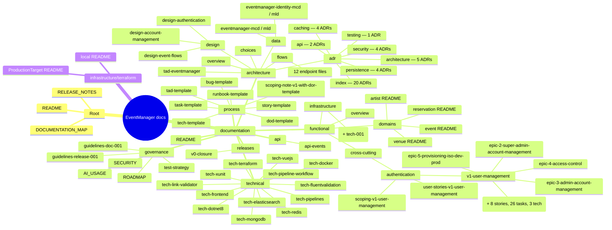

# Documentation Map

Inventory of every Markdown file in this repository (`node_modules`, `bin`, `obj`, `.vs` excluded), organized by folder. Generated as a navigation aid — regenerate manually if files are added, moved, or removed; this is a snapshot, not a live index.

---

## Overview

*(If this doesn't render in your viewer, the full listing below is the reliable fallback — see the VS Code Mermaid preview note from earlier in this project's history if diagrams show a blank frame.)*

---

## Full listing

### Root

| File | Notes |
|---|---|
| [`README.md`](README.md) | Project entry point |
| [`RELEASE_NOTES.md`](RELEASE_NOTES.md) | Public-facing release notes |
| [`DOCUMENTATION_MAP.md`](DOCUMENTATION_MAP.md) | This file |

### `documentation/`

| File | Notes |
|---|---|
| [`README.md`](documentation/README.md) | Reading paths by role; points into `governance/`, `functional/`, `architecture/`, `technical/`, `releases/` |

### `documentation/api/`

| File | Notes |
|---|---|
| [`api-events.md`](documentation/api/api-events.md) | API contracts for the Event Management domain; points to `design-event-flows.md` for flows and `adr/index.md` for tech choices |

### `documentation/architecture/`

| File | Notes |
|---|---|
| [`overview.md`](documentation/architecture/overview.md) | Implemented architecture (components, data flows) |
| [`choices.md`](documentation/architecture/choices.md) | Technical choices and rationale |
| [`tad-eventmanager.md`](documentation/architecture/tad-eventmanager.md) | Technical Architecture Document — living reference, system view + per-version view, updated at each version |

### `documentation/architecture/data/`

| File | Notes |
|---|---|
| [`eventmanager-mcd.md`](documentation/architecture/data/eventmanager-mcd.md) | Conceptual data model (MCD) — `EventManager` database |
| [`eventmanager-mld.md`](documentation/architecture/data/eventmanager-mld.md) | Logical/physical data model (MLD) — SQL Server 2022, EF Core 8.0; derived from the MCD |
| [`eventmanager-identity-mcd.md`](documentation/architecture/data/eventmanager-identity-mcd.md) | Conceptual data model (MCD) — `EventManager_Identity` database |
| [`eventmanager-identity-mld.md`](documentation/architecture/data/eventmanager-identity-mld.md) | Logical/physical data model (MLD) — Identity schema |
| `eventmanager-mcd.drawio`, `eventmanager-mld.drawio`, `eventmanager-identity-mcd.drawio`, `eventmanager-identity-mld.drawio` | Draw.io source diagrams (not Markdown) |

### `documentation/architecture/design/`

| File | Notes |
|---|---|
| [`design-event-flows.md`](documentation/architecture/design/design-event-flows.md) | Technical flows and diagrams for the Event Management domain |
| [`design-authentication.md`](documentation/architecture/design/design-authentication.md) | V1 authentication flows — use case, component, state, activity, sequence diagrams; links ADR-014 to ADR-017, ADR-019, ADR-020 |
| [`design-account-management.md`](documentation/architecture/design/design-account-management.md) | V1 account management flows (creation, modification, deactivation, promotion, provisioning); links ADR-016, ADR-017 |

### `documentation/architecture/flows/`

| File | Notes |
|---|---|
| [`DELETE-event.md`](documentation/architecture/flows/DELETE-event.md) | Per-endpoint request flow |
| [`GET-categories.md`](documentation/architecture/flows/GET-categories.md) | Per-endpoint request flow |
| [`GET-comments.md`](documentation/architecture/flows/GET-comments.md) | Per-endpoint request flow |
| [`GET-event.md`](documentation/architecture/flows/GET-event.md) | Per-endpoint request flow |
| [`GET-events.md`](documentation/architecture/flows/GET-events.md) | Per-endpoint request flow |
| [`GET-full.md`](documentation/architecture/flows/GET-full.md) | Per-endpoint request flow |
| [`GET-health.md`](documentation/architecture/flows/GET-health.md) | Per-endpoint request flow |
| [`GET-search.md`](documentation/architecture/flows/GET-search.md) | Per-endpoint request flow |
| [`POST-comment.md`](documentation/architecture/flows/POST-comment.md) | Per-endpoint request flow |
| [`POST-event.md`](documentation/architecture/flows/POST-event.md) | Per-endpoint request flow |
| [`POST-reindex.md`](documentation/architecture/flows/POST-reindex.md) | Per-endpoint request flow |
| [`PUT-event.md`](documentation/architecture/flows/PUT-event.md) | Per-endpoint request flow |

### `documentation/architecture/adr/` — Architecture Decision Records

ADRs are organized into subfolders by theme (`architecture`, `persistence`, `caching`, `api`, `testing`, `security`).

| File | Title (from `index.md`) | Version |
|---|---|---|
| [`index.md`](documentation/architecture/adr/index.md) | Index of all ADRs — status values, themes, version column | — |
| [`architecture/adr-001-repository-structure.md`](documentation/architecture/adr/architecture/adr-001-repository-structure.md) | Mono-Repository Structure with Path-Scoped Pipelines | V0 |
| [`persistence/adr-002-primary-key-strategy.md`](documentation/architecture/adr/persistence/adr-002-primary-key-strategy.md) | GUID as Primary Key Strategy | V0 |
| [`architecture/adr-003-clean-architecture.md`](documentation/architecture/adr/architecture/adr-003-clean-architecture.md) | Clean Architecture for .NET Solution Structure | V0 |
| [`caching/adr-004-cache-aside-pattern.md`](documentation/architecture/adr/caching/adr-004-cache-aside-pattern.md) | Cache-Aside Pattern for Application Caching | V0 |
| [`caching/adr-005-decorator-pattern-caching.md`](documentation/architecture/adr/caching/adr-005-decorator-pattern-caching.md) | Decorator Pattern for Caching Layer | V0 |
| [`caching/adr-006-redis-list-cache-invalidation.md`](documentation/architecture/adr/caching/adr-006-redis-list-cache-invalidation.md) | Redis List Cache Invalidation Strategy | V0 |
| [`persistence/adr-007-cross-database-orchestration.md`](documentation/architecture/adr/persistence/adr-007-cross-database-orchestration.md) | Cross-Database Orchestration for Event and Comment Operations | V0 |
| [`api/adr-008-rate-limiter-algorithm.md`](documentation/architecture/adr/api/adr-008-rate-limiter-algorithm.md) | Rate Limiting Algorithm Selection | V0 |
| [`api/adr-009-category-list-source-of-truth.md`](documentation/architecture/adr/api/adr-009-category-list-source-of-truth.md) | Category List — Single Source of Truth | V0 |
| [`testing/adr-010-test-database-strategy.md`](documentation/architecture/adr/testing/adr-010-test-database-strategy.md) | Migration from SQLite component tests to SQL Server integration tests | V0 |
| [`caching/adr-011-cache-invalidation-on-mutation.md`](documentation/architecture/adr/caching/adr-011-cache-invalidation-on-mutation.md) | Cache invalidation strategy for PUT and DELETE mutations | V0 |
| [`persistence/adr-012-remove-db-connection-factory.md`](documentation/architecture/adr/persistence/adr-012-remove-db-connection-factory.md) | Remove IDbConnectionFactory | V0 |
| [`architecture/adr-013-containerisation-strategy.md`](documentation/architecture/adr/architecture/adr-013-containerisation-strategy.md) | Containerisation Strategy | V1 |
| [`security/adr-014-authentication-mechanism.md`](documentation/architecture/adr/security/adr-014-authentication-mechanism.md) | Authentication Mechanism | V1 |
| [`architecture/adr-015-identity-schema-isolation.md`](documentation/architecture/adr/architecture/adr-015-identity-schema-isolation.md) | Identity Schema Isolation | V1 |
| [`security/adr-016-authorisation-model.md`](documentation/architecture/adr/security/adr-016-authorisation-model.md) | Authorisation Model | V1 |
| [`security/adr-017-first-super-admin-provisioning.md`](documentation/architecture/adr/security/adr-017-first-super-admin-provisioning.md) | First Super Admin Provisioning | V1 |
| [`persistence/adr-018-migration-dapper-to-ef-core.md`](documentation/architecture/adr/persistence/adr-018-migration-dapper-to-ef-core.md) | Migration from Dapper to Entity Framework Core | V1 |
| [`security/adr-019-rate-limiting-auth-endpoints.md`](documentation/architecture/adr/security/adr-019-rate-limiting-auth-endpoints.md) | Rate limiting on authentication endpoints | V1 |
| [`architecture/adr-020-session-restoration-endpoint.md`](documentation/architecture/adr/architecture/adr-020-session-restoration-endpoint.md) | Session restoration endpoint — GET /auth/me | V1 |

All 20 are `Accepted`. None `Draft`, `Deprecated`, or `Superseded` as of this snapshot.

### `documentation/functional/`

| File | Notes |
|---|---|
| [`overview.md`](documentation/functional/overview.md) | Vision, personas, MVP user stories, business rules; data model pointer → `architecture/data/eventmanager-mld.md` |
| [`domains/event/README.md`](documentation/functional/domains/event/README.md) | Stub — content to be extracted from `overview.md` during V1 scoping |
| [`domains/reservation/README.md`](documentation/functional/domains/reservation/README.md) | Stub — content to be extracted from `overview.md` during V1 scoping |
| [`domains/artist/README.md`](documentation/functional/domains/artist/README.md) | Stub — content to be extracted from `overview.md` during V1 scoping |
| [`domains/venue/README.md`](documentation/functional/domains/venue/README.md) | Stub — content to be extracted from `overview.md` during V1 scoping |

### `documentation/functional/infrastructure/`

| File | Notes |
|---|---|
| [`story-001-project-infrastructure-setup.md`](documentation/functional/infrastructure/story-001-project-infrastructure-setup.md) | Technical story — no end-user actor; CI/branch-protection prerequisites for all V1 stories; links TECH-001 |
| [`tech-001-ci-source-branch-check-infra.md`](documentation/functional/infrastructure/tech-001-ci-source-branch-check-infra.md) | Adds `check-source-branch` job to `ci.yml`, enforcing `guidelines-release-001.md` branch patterns on PRs to `main`/`develop` |

### `documentation/functional/cross-cutting/authentication/`

| File | Notes |
|---|---|
| [`scoping-v1-user-management.md`](documentation/functional/cross-cutting/authentication/scoping-v1-user-management.md) | Scoping note — V1: User Management & Containerisation; in/out of scope |
| [`user-stories-v1-user-management.md`](documentation/functional/cross-cutting/authentication/user-stories-v1-user-management.md) | User story index for V1, `US-XXX-[Domain]-[Feature]` naming convention |

### `documentation/functional/cross-cutting/authentication/v1-user-management/`

| File | Notes |
|---|---|
| [`epic-1-authentication.md`](documentation/functional/cross-cutting/authentication/v1-user-management/epic-1-authentication.md) | Epic 1 user stories (US-001 to US-008) — status `Splitted` into the `epic-1-authentication/` story/task/tech tree below |
| [`epic-2-super-admin-account-management.md`](documentation/functional/cross-cutting/authentication/v1-user-management/epic-2-super-admin-account-management.md) | Epic 2 user stories (US-009+) — super admin account management |
| [`epic-3-admin-account-management.md`](documentation/functional/cross-cutting/authentication/v1-user-management/epic-3-admin-account-management.md) | Epic 3 user stories (US-016+) — admin account management |
| [`epic-4-access-control.md`](documentation/functional/cross-cutting/authentication/v1-user-management/epic-4-access-control.md) | Epic 4 user stories (US-022+) — organizer/admin access control |
| [`epic-5-provisioning-iso-dev-prod.md`](documentation/functional/cross-cutting/authentication/v1-user-management/epic-5-provisioning-iso-dev-prod.md) | Epic 5 user stories (US-025+) — first super admin provisioning, dev/prod parity |

### `documentation/functional/cross-cutting/authentication/v1-user-management/epic-1-authentication/`

Epic 1 (Authentication) split into 8 stories, each with linked tech tasks (`tech/`) and implementation tasks (`task/`).

| File | Notes |
|---|---|
| [`story-001-login.md`](documentation/functional/cross-cutting/authentication/v1-user-management/epic-1-authentication/story-001-login.md) | Login — depends on TECH-001/002/003; links TASK-001 to TASK-005 |
| [`story-002-forced-password-reset-gate.md`](documentation/functional/cross-cutting/authentication/v1-user-management/epic-1-authentication/story-002-forced-password-reset-gate.md) | Forced password reset gate — links TASK-006 to TASK-008 |
| [`story-003-password-reset-completion.md`](documentation/functional/cross-cutting/authentication/v1-user-management/epic-1-authentication/story-003-password-reset-completion.md) | Password reset completion — links TASK-009 to TASK-011 |
| [`story-004-silent-session-renewal.md`](documentation/functional/cross-cutting/authentication/v1-user-management/epic-1-authentication/story-004-silent-session-renewal.md) | Silent session renewal — links TASK-012 to TASK-014 |
| [`story-005-logout.md`](documentation/functional/cross-cutting/authentication/v1-user-management/epic-1-authentication/story-005-logout.md) | Logout — links TASK-015 to TASK-017 |
| [`story-006-session-persistence.md`](documentation/functional/cross-cutting/authentication/v1-user-management/epic-1-authentication/story-006-session-persistence.md) | Session persistence (`GET /auth/me`) — links TASK-018 to TASK-020 |
| [`story-007-route-protection.md`](documentation/functional/cross-cutting/authentication/v1-user-management/epic-1-authentication/story-007-route-protection.md) | Route protection / RBAC — links TASK-021 to TASK-023 |
| [`story-008-session-expiry.md`](documentation/functional/cross-cutting/authentication/v1-user-management/epic-1-authentication/story-008-session-expiry.md) | Session expiry — links TASK-024 to TASK-026 |
| `tech/tech-001-identity-setup-back.md` | Configure ASP.NET Core Identity — links ADR-014 |
| `tech/tech-002-efcore-migrations-db.md` | EF Core setup + initial Identity schema migrations — links ADR-015 |
| `tech/tech-003-superadmin-provisioning-back.md` | First super admin provisioning at startup — links ADR-017 |
| `task/task-001-auth-login-back.md` → `task-005-auth-login-test.md` | STORY-001 tasks — back/front/test breakdown for login; TASK-001 links ADR-014, TASK-002 links ADR-019 |
| `task/task-006-auth-reset-gate-back.md` → `task-008-auth-reset-gate-test.md` | STORY-002 tasks — forced password reset gate |
| `task/task-009-auth-reset-completion-back.md` → `task-011-auth-reset-completion-test.md` | STORY-003 tasks — password reset completion |
| `task/task-012-auth-refresh-back.md` → `task-014-auth-refresh-test.md` | STORY-004 tasks — silent session renewal |
| `task/task-015-auth-logout-back.md` → `task-017-auth-logout-test.md` | STORY-005 tasks — logout |
| `task/task-018-auth-me-back.md` → `task-020-auth-me-test.md` | STORY-006 tasks — session persistence (`/auth/me`); TASK-018 links ADR-019, ADR-020 |
| `task/task-021-auth-rbac-back.md` → `task-023-auth-rbac-test.md` | STORY-007 tasks — route protection / RBAC; TASK-021 links ADR-016 |
| `task/task-024-auth-expiry-back.md` → `task-026-auth-expiry-test.md` | STORY-008 tasks — session expiry |

*(26 task files and 3 tech files in total; each links back to its parent story via `../story-XXX-*.md`.)*

### `documentation/governance/`

| File | Notes |
|---|---|
| [`AI_USAGE.md`](documentation/governance/AI_USAGE.md) | — |
| [`ROADMAP.md`](documentation/governance/ROADMAP.md) | Planned versions + per-milestone rationale; also tracks architecture-level technical debt |
| [`SECURITY.md`](documentation/governance/SECURITY.md) | — |
| [`test-strategy.md`](documentation/governance/test-strategy.md) | Referenced from `technical/tech-elasticsearch.md` (component-test strategy) and ADR-010 |
| [`guidelines-doc-001.md`](documentation/governance/guidelines-doc-001.md) | Naming conventions, folder structure, and expected content for every documentation file; `Check-DocLinks.ps1` enforces link integrity on push to `main` |
| [`guidelines-release-001.md`](documentation/governance/guidelines-release-001.md) | Branching strategy, release process, and release gates |

### `documentation/process/`

Fill-in-the-blank templates (`[NNN]`, `[Title]`, `[V X]` placeholders) — excluded from `Check-DocLinks.ps1` since their links illustrate fictitious documents, not real cross-references.

| File | Notes |
|---|---|
| [`bug-template.md`](documentation/process/bug-template.md) | Bug report template |
| [`dod-template.md`](documentation/process/dod-template.md) | Definition of Done template |
| [`runbook-template.md`](documentation/process/runbook-template.md) | Operational runbook template |
| [`scoping-note-v1-with-dor-template.md`](documentation/process/scoping-note-v1-with-dor-template.md) | Scoping note template with Definition of Ready |
| [`story-template.md`](documentation/process/story-template.md) | User story template |
| [`tad-template.md`](documentation/process/tad-template.md) | Technical Architecture Document template |
| [`task-template.md`](documentation/process/task-template.md) | Implementation task template |
| [`tech-template.md`](documentation/process/tech-template.md) | Technical task template |

### `documentation/releases/`

| File | Notes |
|---|---|
| [`v0-closure.md`](documentation/releases/v0-closure.md) | V0 scope closure — what was planned vs. implemented, known gaps |

### `documentation/technical/`

| File | Notes |
|---|---|
| [`tech-docker.md`](documentation/technical/tech-docker.md) | Concepts + Testcontainers |
| [`tech-dotnet8.md`](documentation/technical/tech-dotnet8.md) | Minimal APIs, Rate Limiting; Output Caching rejection rationale points to `choices.md` |
| [`tech-elasticsearch.md`](documentation/technical/tech-elasticsearch.md) | Indexing, search, reindex; component-test strategy pointer |
| [`tech-fluentvalidation.md`](documentation/technical/tech-fluentvalidation.md) | — |
| [`tech-frontend.md`](documentation/technical/tech-frontend.md) | Delete flow, store, apiService, edit-form mapping |
| [`tech-link-validator.md`](documentation/technical/tech-link-validator.md) | Why/how/usage of `scripts/Check-DocLinks.ps1` |
| [`tech-mongodb.md`](documentation/technical/tech-mongodb.md) | Builders\<T\>, ObjectId, Writing/CreatedAt flow |
| [`tech-pipelines.md`](documentation/technical/tech-pipelines.md) | Azure DevOps pipeline registration + overview |
| [`tech-pipeline-workflow.md`](documentation/technical/tech-pipeline-workflow.md) | Why the CD pipeline is manually triggered; full deployment flow |
| [`tech-redis.md`](documentation/technical/tech-redis.md) | TTL config, dual invalidation strategy, connection pooling |
| [`tech-terraform.md`](documentation/technical/tech-terraform.md) | — |
| [`tech-vuejs.md`](documentation/technical/tech-vuejs.md) | Coverage config, Pinia example |
| [`tech-xunit.md`](documentation/technical/tech-xunit.md) | xUnit v3 lifecycle and isolation patterns |

### `infrastructure/terraform/`

| File | Notes |
|---|---|
| [`local/README.md`](infrastructure/terraform/local/README.md) | Local (null-provider) Terraform module |
| [`ProductionTarget/README.md`](infrastructure/terraform/ProductionTarget/README.md) | Azure-targeting Terraform module |
