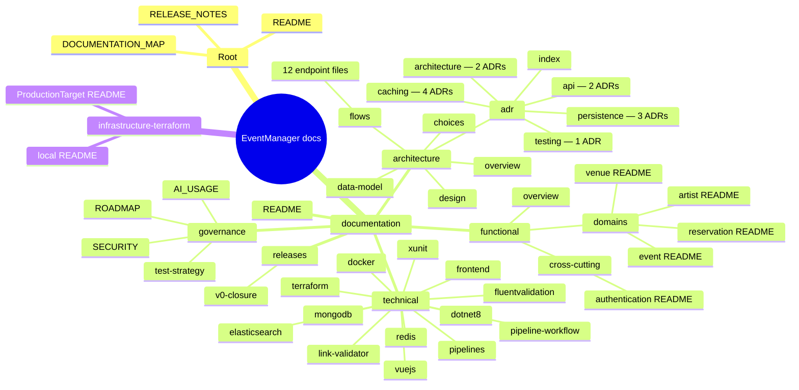

# Documentation Map

Inventory of every Markdown file in this repository (`node_modules`, `bin`, `obj`, `.vs` excluded), organized by folder. Generated as a navigation aid — regenerate manually if files are added, moved, or removed; this is a snapshot, not a live index.

---

## Overview

*(If this doesn't render in your viewer, the full listing below is the reliable fallback — see the VS Code Mermaid preview note from earlier in this project's history if diagrams show a blank frame.)*

---

## Full listing

### Root

| File | Notes |
|---|---|
| [`README.md`](README.md) | Project entry point |
| [`RELEASE_NOTES.md`](RELEASE_NOTES.md) | Public-facing release notes |
| [`DOCUMENTATION_MAP.md`](DOCUMENTATION_MAP.md) | This file |

### `documentation/`

| File | Notes |
|---|---|
| [`README.md`](documentation/README.md) | Reading paths by role; points into `governance/`, `functional/`, `architecture/`, `technical/`, `releases/` |

### `documentation/architecture/`

| File | Notes |
|---|---|
| [`overview.md`](documentation/architecture/overview.md) | Implemented architecture (components, data flows) |
| [`choices.md`](documentation/architecture/choices.md) | Technical choices and rationale |
| [`data-model.md`](documentation/architecture/data-model.md) | SQL Server + MongoDB data model |
| [`design/design.md`](documentation/architecture/design/design.md) | Pre-implementation design intent document — not updated to reflect what was actually built; see `overview.md` for that |

### `documentation/architecture/flows/`

| File | Notes |
|---|---|
| [`DELETE-event.md`](documentation/architecture/flows/DELETE-event.md) | Per-endpoint request flow |
| [`GET-categories.md`](documentation/architecture/flows/GET-categories.md) | Per-endpoint request flow |
| [`GET-comments.md`](documentation/architecture/flows/GET-comments.md) | Per-endpoint request flow |
| [`GET-event.md`](documentation/architecture/flows/GET-event.md) | Per-endpoint request flow |
| [`GET-events.md`](documentation/architecture/flows/GET-events.md) | Per-endpoint request flow |
| [`GET-full.md`](documentation/architecture/flows/GET-full.md) | Per-endpoint request flow |
| [`GET-health.md`](documentation/architecture/flows/GET-health.md) | Per-endpoint request flow |
| [`GET-search.md`](documentation/architecture/flows/GET-search.md) | Per-endpoint request flow |
| [`POST-comment.md`](documentation/architecture/flows/POST-comment.md) | Per-endpoint request flow |
| [`POST-event.md`](documentation/architecture/flows/POST-event.md) | Per-endpoint request flow |
| [`POST-reindex.md`](documentation/architecture/flows/POST-reindex.md) | Per-endpoint request flow |
| [`PUT-event.md`](documentation/architecture/flows/PUT-event.md) | Per-endpoint request flow |

### `documentation/architecture/adr/` — Architecture Decision Records

| File | Title (from `index.md`) |
|---|---|
| [`index.md`](documentation/architecture/adr/index.md) | Index of all ADRs — status values, themes, version column |
| [`architecture/ADR-001-repository-structure.md`](documentation/architecture/adr/architecture/ADR-001-repository-structure.md) | Mono-Repository Structure with Path-Scoped Pipelines |
| [`persistence/ADR-002-primary-key-strategy.md`](documentation/architecture/adr/persistence/ADR-002-primary-key-strategy.md) | GUID as Primary Key Strategy |
| [`architecture/ADR-003-clean-architecture.md`](documentation/architecture/adr/architecture/ADR-003-clean-architecture.md) | Clean Architecture for .NET Solution Structure |
| [`caching/ADR-004-cache-aside-pattern.md`](documentation/architecture/adr/caching/ADR-004-cache-aside-pattern.md) | Cache-Aside Pattern for Application Caching |
| [`caching/ADR-005-decorator-pattern-caching.md`](documentation/architecture/adr/caching/ADR-005-decorator-pattern-caching.md) | Decorator Pattern for Caching Layer |
| [`caching/ADR-006-redis-list-cache-invalidation.md`](documentation/architecture/adr/caching/ADR-006-redis-list-cache-invalidation.md) | Redis List Cache Invalidation Strategy |
| [`persistence/ADR-007-cross-database-orchestration.md`](documentation/architecture/adr/persistence/ADR-007-cross-database-orchestration.md) | Cross-Database Orchestration for Event and Comment Operations |
| [`api/ADR-008-rate-limiter-algorithm.md`](documentation/architecture/adr/api/ADR-008-rate-limiter-algorithm.md) | Rate Limiting Algorithm Selection |
| [`api/ADR-009-category-list-source-of-truth.md`](documentation/architecture/adr/api/ADR-009-category-list-source-of-truth.md) | Category List — Single Source of Truth |
| [`testing/ADR-010-test-database-strategy.md`](documentation/architecture/adr/testing/ADR-010-test-database-strategy.md) | Migration from SQLite component tests to SQL Server integration tests |
| [`caching/ADR-011-cache-invalidation-on-mutation.md`](documentation/architecture/adr/caching/ADR-011-cache-invalidation-on-mutation.md) | Cache invalidation strategy for PUT and DELETE mutations |
| [`persistence/ADR-012-remove-db-connection-factory.md`](documentation/architecture/adr/persistence/ADR-012-remove-db-connection-factory.md) | Remove IDbConnectionFactory |

All 12 are `Accepted`. None `Draft`, `Deprecated`, or `Superseded` as of this snapshot.

### `documentation/functional/`

| File | Notes |
|---|---|
| [`overview.md`](documentation/functional/overview.md) | Vision, personas, MVP user stories, business rules, data model pointer |
| [`domains/event/README.md`](documentation/functional/domains/event/README.md) | Stub — content to be extracted from `overview.md` during V1 scoping |
| [`domains/reservation/README.md`](documentation/functional/domains/reservation/README.md) | Stub — content to be extracted from `overview.md` during V1 scoping |
| [`domains/artist/README.md`](documentation/functional/domains/artist/README.md) | Stub — content to be extracted from `overview.md` during V1 scoping |
| [`domains/venue/README.md`](documentation/functional/domains/venue/README.md) | Stub — content to be extracted from `overview.md` during V1 scoping |
| [`cross-cutting/authentication/README.md`](documentation/functional/cross-cutting/authentication/README.md) | Stub — content to be extracted from `overview.md` during V1 scoping |

### `documentation/governance/`

| File | Notes |
|---|---|
| [`AI_USAGE.md`](documentation/governance/AI_USAGE.md) | — |
| [`ROADMAP.md`](documentation/governance/ROADMAP.md) | Planned versions + per-milestone rationale; also tracks architecture-level technical debt |
| [`SECURITY.md`](documentation/governance/SECURITY.md) | — |
| [`test-strategy.md`](documentation/governance/test-strategy.md) | Referenced from `technical/elasticsearch.md` (component-test strategy) and ADR-010 |

### `documentation/releases/`

| File | Notes |
|---|---|
| [`v0-closure.md`](documentation/releases/v0-closure.md) | V0 scope closure — what was planned vs. implemented, known gaps |

### `documentation/technical/`

| File | Notes |
|---|---|
| [`docker.md`](documentation/technical/docker.md) | Concepts + Testcontainers |
| [`dotnet8.md`](documentation/technical/dotnet8.md) | Minimal APIs, Rate Limiting; Output Caching rejection rationale points to `choices.md` |
| [`elasticsearch.md`](documentation/technical/elasticsearch.md) | Indexing, search, reindex; component-test strategy pointer |
| [`fluentvalidation.md`](documentation/technical/fluentvalidation.md) | — |
| [`frontend.md`](documentation/technical/frontend.md) | Delete flow, store, apiService, edit-form mapping |
| [`link-validator.md`](documentation/technical/link-validator.md) | Why/how/usage of `scripts/Check-DocLinks.ps1` |
| [`mongodb.md`](documentation/technical/mongodb.md) | Builders\<T\>, ObjectId, Writing/CreatedAt flow |
| [`pipelines.md`](documentation/technical/pipelines.md) | Azure DevOps pipeline registration + overview |
| [`pipeline-workflow.md`](documentation/technical/pipeline-workflow.md) | Why the CD pipeline is manually triggered; full deployment flow |
| [`redis.md`](documentation/technical/redis.md) | TTL config, dual invalidation strategy, connection pooling |
| [`terraform.md`](documentation/technical/terraform.md) | — |
| [`vuejs.md`](documentation/technical/vuejs.md) | Coverage config, Pinia example |
| [`xunit.md`](documentation/technical/xunit.md) | xUnit v3 lifecycle and isolation patterns |

### `infrastructure/terraform/`

| File | Notes |
|---|---|
| [`local/README.md`](infrastructure/terraform/local/README.md) | Local (null-provider) Terraform module |
| [`ProductionTarget/README.md`](infrastructure/terraform/ProductionTarget/README.md) | Azure-targeting Terraform module |
