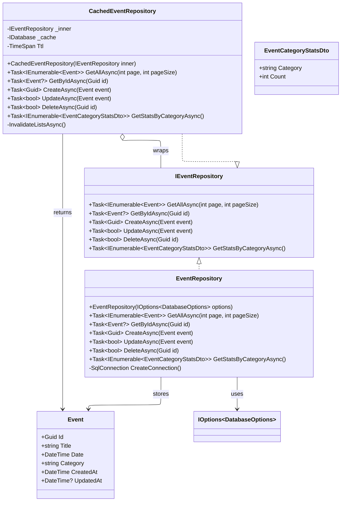

# ADR-005: Decorator Pattern for Caching Layer

## Status
Accepted

## Context
The `EventManager` application uses multiple data sources (SQL Server for events, MongoDB for comments, Elasticsearch for search) and requires a consistent caching strategy. Redis caching must be added to the data access layer without modifying existing repository implementations.

Key requirements:
- Add caching transparently without changing existing repository interfaces
- Maintain separation of concerns between data access and caching logic
- Enable easy testing and mocking of cache behavior
- Allow runtime configuration changes (enable/disable cache)
- Support multiple cache implementations if needed

## Alternatives Considered

### Alternative 1: Cache Logic Inside Repository

**Approach:** Add caching logic directly in repository classes.

```csharp
public class EventRepository : IEventRepository
{
    public EventRepository(IOptions<DatabaseOptions> options)
    {
        // Mix data access + caching in same class
    }
}
```

**Rejected because:**
- Violates Single Responsibility Principle
- Makes repositories harder to test
- Couples infrastructure concerns with business logic
- Cannot easily disable caching

### Alternative 2: AOP/Attributes

**Approach:** Use attributes or middleware for caching.

```csharp
[Cached("event:{id}", ttl: 600)]
public async Task<Event?> GetByIdAsync(Guid id) { ... }
```

**Rejected because:**
- Implicit behavior that is hard to debug
- Limited flexibility for complex invalidation logic
- Requires additional frameworks (AspectCore, Castle Windsor)
- Cache logic scattered across methods

### Alternative 3: Cache in Service Layer

**Approach:** Add caching in application services.

```csharp
public class EventService : IEventService
{
    public EventService(IEventRepository repo) { }
}
```

**Rejected because:**
- Services should focus on business logic, not infrastructure
- Creates tight coupling between business and caching layers
- Makes service testing more complex
- Less reusable across different service implementations

### Alternative 4: Proxy Pattern

**Approach:** Use dynamic proxies to intercept method calls.

**Rejected because:**
- Requires additional libraries (Castle DynamicProxy)
- Runtime performance overhead
- Complex debugging and maintenance
- Less explicit than decorator pattern

## Decision

The Decorator pattern wraps existing repository implementations with caching functionality:

1. **Create decorator classes** that implement the same interfaces as the repositories they wrap
2. **Use constructor injection** to receive both the inner repository and cache dependencies
3. **Apply cache-aside pattern** for read operations (check cache first, fallback to repository)
4. **Implement cache invalidation** on write operations to maintain data consistency
5. **Register decorators in DI container** using factory methods for flexibility

### Schema



### Implementation Example

```csharp
public class CachedEventRepository(IEventRepository inner)
    : IEventRepository
{
    private readonly IEventRepository _inner = inner;

    public async Task<Event?> GetByIdAsync(Guid id)
    {
        // Get cache
        if (cached.HasValue)
            // Return cache

        // Select from database
        if (@event != null)
            // Set cache

        return @event;
    }

    public async Task<bool> UpdateAsync(Event @event)
    {
        // Update database
        if (updated)
            // Invalidate cache
        return updated;
    }
}
```

### Dependency Injection Configuration

```csharp
// Register concrete implementations
builder.Services.AddScoped<EventRepository>();

// Register decorators
builder.Services.AddScoped<IEventRepository>(sp =>
    new CachedEventRepository(
        sp.GetRequiredService<EventRepository>()));
```

## Consequences

### Positive

1. **Separation of concerns** — cache logic isolated in dedicated classes; repository classes remain focused on data access.
2. **Testability** — each layer testable independently; cache behavior can be mocked without affecting repository tests.
3. **Flexibility** — cache can be enabled or disabled by changing the DI registration; different cache implementations are possible (Redis, Memory, None).
4. **Transparency** — controllers and services are unaware of caching; interface contracts are maintained.
5. **Performance** — cache hits provide sub-millisecond response times; lazy loading prevents unnecessary cache population.

### Negative

1. **Increased complexity** — additional classes to maintain; more complex DI setup; learning curve for new developers.
2. **Debugging challenges** — harder to trace execution flow through decorators; cache behavior may mask underlying issues.
3. **Cache consistency risks** — requires careful invalidation logic; race conditions possible in high-concurrency scenarios — addressed by ADR-006.

## Related Decisions

- ADR-003: Clean Architecture — caching isolated in the Infrastructure layer, not in Domain or Api
- ADR-004: Cache-Aside Pattern for Application Caching
