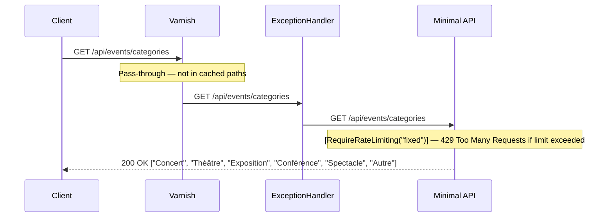

**Notes:**
- No database call — `EventCategories.All` is a static in-memory constant defined in `EventManager.Domain`
- Categories are the single source of truth for validation (FluentValidation) and for the frontend dropdown — see ADR-009
