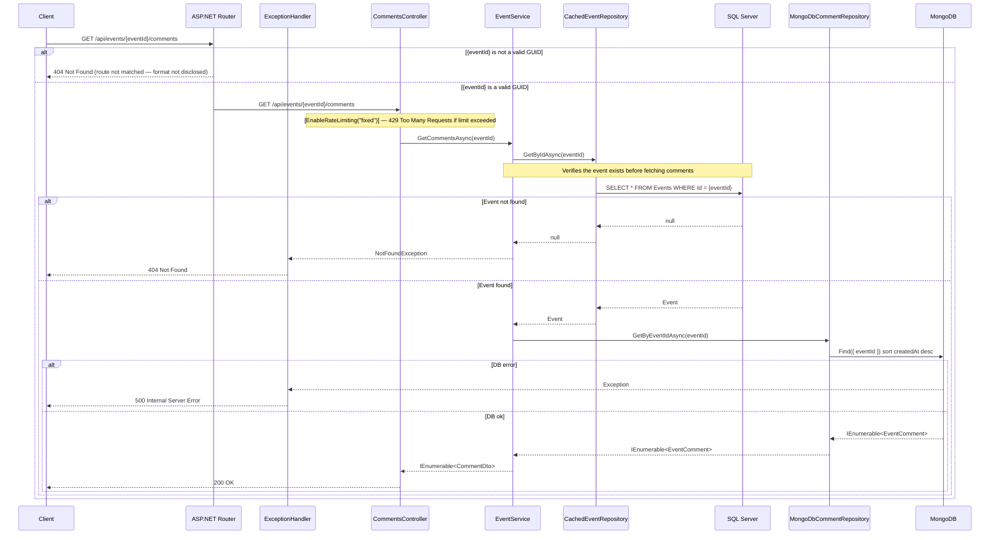

```mermaid
sequenceDiagram
    participant Client
    participant Router as ASP.NET Router
    participant EH as ExceptionHandler
    participant API as CommentsController
    participant Service as EventService
    participant Cache as CachedEventRepository
    participant DB as SQL Server
    participant Repo as MongoDbCommentRepository
    participant Mongo as MongoDB

    Client->>Router: GET /api/events/{eventId}/comments
    alt {eventId} is not a valid GUID
        Router-->>Client: 404 Not Found (route not matched — format not disclosed)
    else {eventId} is a valid GUID
        Router->>API: GET /api/events/{eventId}/comments
        note over API: [EnableRateLimiting("fixed")] — 429 Too Many Requests if limit exceeded
        API->>Service: GetCommentsAsync(eventId)
        Service->>Cache: GetByIdAsync(eventId)
        note over Service,DB: Verifies the event exists before fetching comments
        Cache->>DB: SELECT * FROM Events WHERE Id = {eventId}
        alt Event not found
            DB-->>Cache: null
            Cache-->>Service: null
            Service-->>EH: NotFoundException
            EH-->>Client: 404 Not Found
        else Event found
            DB-->>Cache: Event
            Cache-->>Service: Event
            Service->>Repo: GetByEventIdAsync(eventId)
            Repo->>Mongo: Find({ eventId }) sort createdAt desc
            alt DB error
                Mongo-->>EH: Exception
                EH-->>Client: 500 Internal Server Error
            else DB ok
                Mongo-->>Repo: IEnumerable<EventComment>
                Repo-->>Service: IEnumerable<EventComment>
                Service-->>API: IEnumerable<CommentDto>
                API-->>Client: 200 OK
            end
        end
    end
```
