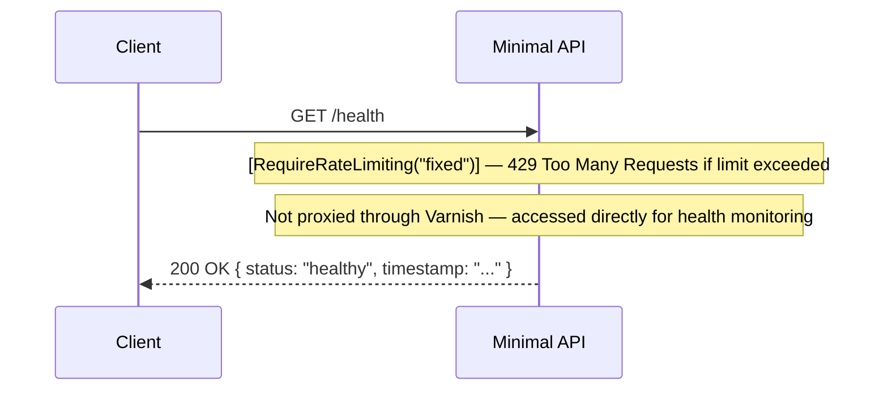

**Notes:**
- No database or external service call — response is computed in-process
- Intended for health probes (load balancer, Docker healthcheck, monitoring) — direct access on port 5000 bypasses Varnish intentionally
