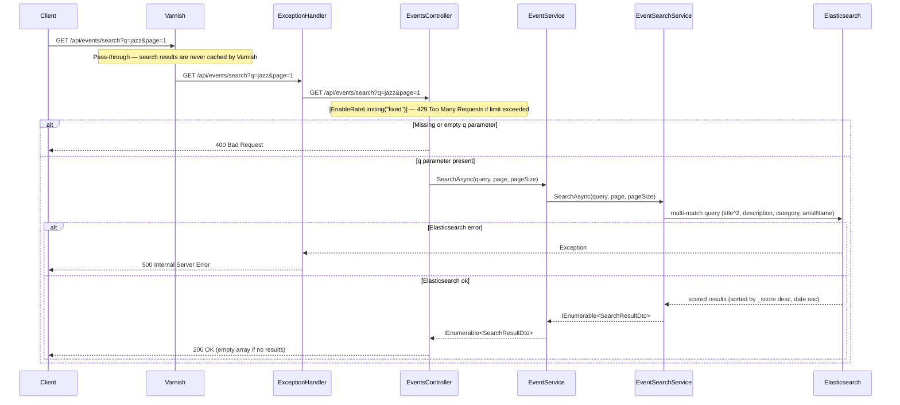

**Notes:**
- Search results are not cached at the application level (no Redis layer) — Elasticsearch response latency is acceptable for the current volume
- Varnish pass-through is intentional: search results change as events are indexed or updated, and vary by query string — HTTP-level caching would require `Vary: *`, which defeats the purpose
- Title field is boosted ×2 relative to description, category, and artistName — a search for "jazz" ranks events with "jazz" in the title above those with "jazz" only in the description
