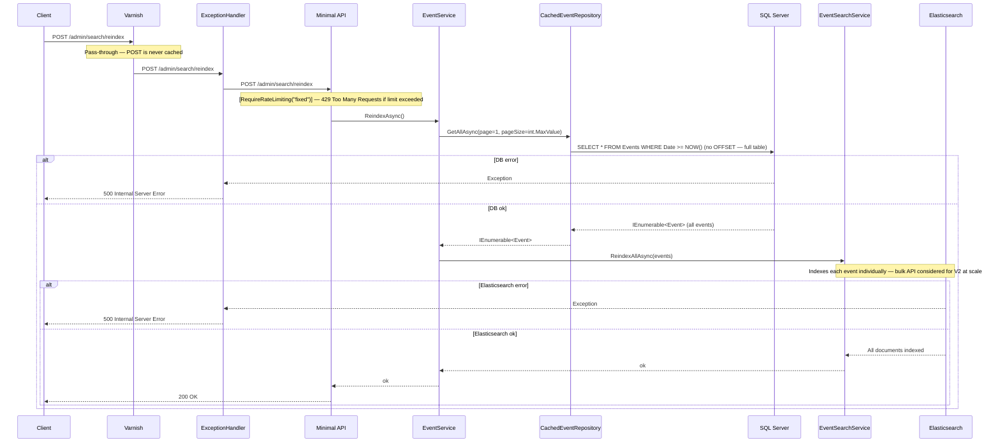

**When to use:**
- SQL Server and Elasticsearch have diverged (e.g., after a failed indexing operation, manual DB correction, or data migration)
- Not part of normal operation — each mutation (POST/PUT/DELETE) maintains the index incrementally

**Known limitation:**
- `Results.Ok()` return value is discarded in the handler (`MinimalApiEndpoints.cs` line 21) — the endpoint returns 200 implicitly via Minimal API void semantics, but the intent is not explicit. Low-risk in practice; noted for V2 cleanup.
- `pageSize: int.MaxValue` bypasses the standard 50-item page cap — acceptable for an admin operation; not exposed to end users
