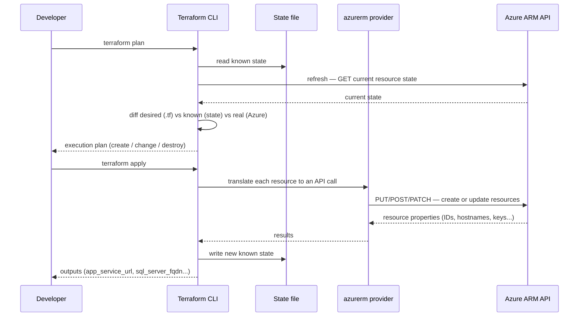
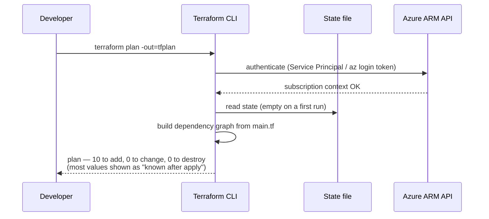
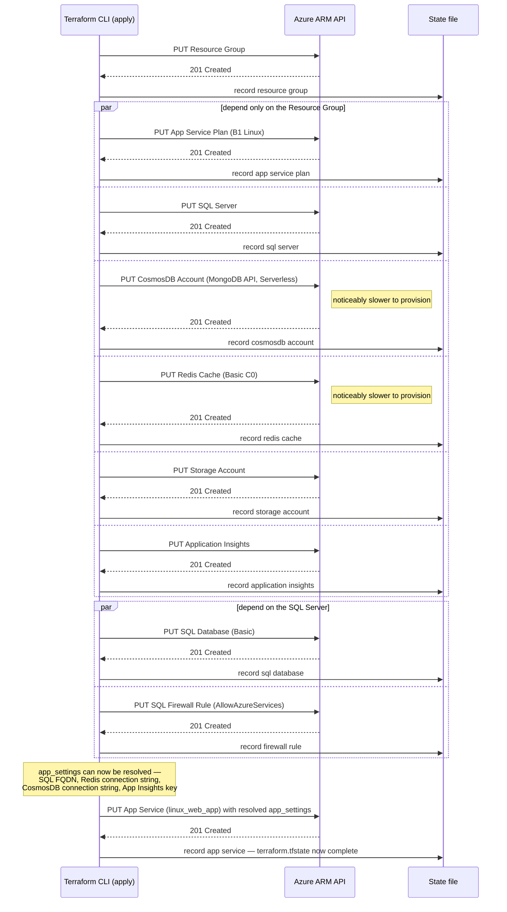

# Terraform — Infrastructure as Code

**Author:** Laurent Condoure
**Date:** 2026-07-03  
**Status:** Draft
**Project:** EventManager — Cultural Events Management Application  
**Objective:** Describes Terraform and it's usage in the project.

## What Is Terraform

Terraform is an **Infrastructure as Code (IaC)** tool — it describes the desired infrastructure
in `.tf` files and creates, updates, or destroys it through cloud provider APIs.

```
.tf code  →  terraform plan   →  terraform apply  →  Real Azure infrastructure
              (preview)            (execute)
```

## Core Concepts

| Concept | Role |
|---|---|
| **Provider** | Plugin that translates HCL into API calls (azurerm → ARM, null → no-op, local → filesystem) |
| **Resource** | Declared infrastructure unit (`azurerm_linux_web_app`, `azurerm_redis_cache`…) |
| **State file** | Snapshot of what was created — Terraform compares HCL + state to compute the delta |
| **Variables** | Parameters injected at plan/apply time (via `terraform.tfvars`, `-var`, or `TF_VAR_*` env vars) |
| **Outputs** | Values exposed after apply (hostname, IP, connection string…) |
| **Locals** | Values computed at compile time, not parameterizable |
| **templatefile()** | Function that injects Terraform variables into a text file at plan time |
| **depends_on** | Explicit dependency between resources when Terraform cannot infer it |
| **Backend** | Where the state file is stored (local by default, Azure Storage for team/CI-CD use) |

---

## Key Mechanics

### State File — Desired vs. Known State

Terraform keeps a local record (`terraform.tfstate`) of the infrastructure it last created. On
`plan`/`apply`, it compares the **desired** state (the `.tf` code) against the **known** state
(the state file) to compute what needs to change.

```
.tf code   →  desired state
State file →  known state (as of the last apply)
```

**Important**: by default Terraform also refreshes against the real Azure state before comparing
(`terraform plan -refresh=true`). If a resource is changed directly in the Azure portal without
going through Terraform, the known state and the real state diverge — this is called **drift**.

```bash
terraform plan -refresh=true   # default — queries Azure before comparing
terraform refresh              # updates the state file only, without applying
```

In production, the state should live in Azure Storage rather than on a developer's machine, so it
can be shared across the team and the CI/CD pipeline:

```hcl
backend "azurerm" {
  resource_group_name  = "rg-terraform-state"
  storage_account_name = "sttfstate001"
  container_name       = "tfstate"
  key                  = "eventmanagement.tfstate"
}
```

### State Locking

Two simultaneous `terraform apply` runs without locking can corrupt the state file or leave
resources half-created.

| Backend | Locking mechanism |
|---|---|
| Local (`terraform.tfstate` on disk) | None — race condition risk |
| Azure Storage | Automatic blob lease — a second `apply` waits or fails with `state blob is already locked` |

This is the **second reason** (after team sharing) to centralize state in Azure Storage.

### The Bootstrap (Chicken-and-Egg) Problem

The `azurerm` backend requires the Storage Account to already exist **before** `terraform init`
can use it — Terraform cannot use itself to create the very Storage Account that will hold its
own state.

Correct sequence:
```bash
# 1. Create the Storage Account manually (or via a one-off bootstrap script)
az storage account create --name sttfstate001 ...

# 2. Uncomment the backend block in main.tf
# 3. Only then:
terraform init  # connects to the Azure Storage backend
```

This is why the `backend "azurerm"` block is **commented out** in `terraform/azure/` (the Storage
Account it would point to hasn't been bootstrapped) but **active** in `terraform/ProductionTarget/`.

### Idempotence

If `terraform apply` is interrupted mid-run (network drop, timeout):
- Resources already created are recorded in the state file
- The next `terraform apply` is a **no-op** on existing resources and only **creates** the missing
  ones
- It can be re-run as many times as needed — Terraform always converges toward the desired state

**Exception**: non-idempotent operations (e.g. rotating a SQL Server admin password) can have side
effects if replayed.

### Dependencies

Terraform resolves most dependencies automatically from references between resources:

```hcl
resource "azurerm_mssql_database" "main" {
  server_id = azurerm_mssql_server.main.id  # ← implicit dependency
}
```

When there is no direct attribute reference, the dependency must be declared explicitly with
`depends_on` — as in `terraform/local/main.tf`:

```hcl
resource "null_resource" "app_service" {
  depends_on = [null_resource.app_service_plan]  # ← explicit dependency
}
```

### The `null` Provider — Why Use It

`terraform/local/` deliberately uses the `null` provider instead of `azurerm`. `null_resource`
creates nothing — it only stores whatever is put in its `triggers` map — but it still goes
through the full Terraform lifecycle (`init` → `validate` → `plan` → `apply` → `destroy`) and
respects the same dependency graph as real resources:

```hcl
resource "null_resource" "app_service" {
  depends_on = [null_resource.app_service_plan]  # exercised exactly like a real dependency
  triggers = {
    name    = var.app_service_name
    runtime = "DOTNETCORE|8.0"
  }
}
```

That makes it a zero-cost, zero-subscription way to exercise everything that isn't provider-
specific:
- HCL syntax and resource structure
- The dependency graph between resources
- Variables without a default (Terraform prompts interactively, or fails cleanly in CI)
- Naming conventions, before they're ever sent to a real API

It is deliberately not a mock of `azurerm` — the `triggers` are plain strings, not real Azure
resource schemas, so it cannot catch a provider-specific error (wrong SKU, invalid region, name
already taken). Those are only caught once the same structure is applied through `azurerm` in
`azure/` or `ProductionTarget/`.

---

## Workflow — Plan & Apply



With the `null` provider, the same sequence runs end to end, except the "Azure ARM API" lane never
exists — `terraform plan`/`apply` diff and write the `triggers` map directly, with no network call.

---

## Authentication

| Context | Method |
|---|---|
| Local | `az login` — token stored in `~/.azure/` |
| CI/CD | Service Principal (client_id + client_secret + tenant_id + subscription_id) injected as pipeline secret variables |

---

## Prerequisites

To run anything beyond `terraform/local/` (the `null` provider needs nothing but Terraform
itself), you need:

- **Terraform CLI** — a recent 1.x release. No `required_version` is pinned in the code yet, so
  install whatever the [official releases page](https://developer.hashicorp.com/terraform/install)
  currently ships.
- **Azure CLI** (`az`) — used for `az login` (see Authentication above).
- **Sufficient Azure RBAC permissions** on the target subscription — at minimum `Contributor`, to
  create resource groups, SQL servers, CosmosDB accounts, Redis caches, Storage accounts, and (for
  `ProductionTarget/`) Container Instances.
- **A `terraform.tfvars` file** in `azure/` or `ProductionTarget/` — see the `terraform.tfvars.example`
  in each of those directories for the variables to fill in (`sql_admin_username`,
  `sql_admin_password`, `storage_name`). Copy it, fill in real values, never commit the copy.

---

## Project Structure

```
terraform/
├── local/              ← null provider — validation without Azure
├── azure/              ← Azure free-tier deployment (gaps assumed)
└── ProductionTarget/   ← Full Azure deployment with Docker containers
```

---

## 1. Local Deployment — null provider

### Purpose

Validate resource structure, naming conventions, and dependencies **without an Azure subscription**.
The `null` provider creates fictitious resources; the `local` provider generates a summary file.

### Declared Resources

9 simulated resources (null_resource) + 1 output file (local_file):
resource group, app service plan, app service, SQL server, SQL database, CosmosDB, Redis, storage account, application insights.

### Running

```bash
cd terraform/local
terraform init
terraform validate
terraform plan
terraform apply
```

Output: `terraform/local/infrastructure.txt` — summary of all resources with their parameters.

### What It Validates

- Consistent naming (`rg-`, `asp-`, `app-`, `sql-`, `cosmos-`…)
- Dependencies between resources
- Variables without defaults (Terraform prompts interactively)
- Syntactically correct HCL

---

## 2. Azure Deployment — Concrete (`terraform/azure/`)

### Purpose

Functional Azure deployment within free-tier constraints.

### Deployed Resources (8)

| Terraform Resource | Azure Service | SKU |
|---|---|---|
| `azurerm_resource_group` | Resource Group | — |
| `azurerm_service_plan` | App Service Plan | Linux B1 |
| `azurerm_linux_web_app` | App Service (.NET 8) | — |
| `azurerm_mssql_server` + `azurerm_mssql_database` | Azure SQL | Basic |
| `azurerm_cosmosdb_account` | CosmosDB MongoDB API | Serverless |
| `azurerm_redis_cache` | Azure Cache for Redis | Basic C0 |
| `azurerm_storage_account` | Storage Account | Standard LRS |
| `azurerm_application_insights` | Application Insights | — |


### Sensitive Variables

`sql_admin_username`, `sql_admin_password`, and `storage_name` have no default values.

| Context | Recommended Method |
|---|---|
| Local | `terraform.tfvars` (gitignored) — copy `terraform.tfvars.example` and fill in real values |
| CI/CD | Azure DevOps secret variables, injected via `-var` at plan time |

### Running

```bash
cd terraform/azure
terraform init
terraform validate
terraform plan -out=tfplan
terraform show -json tfplan > tfplan.json   # technical proof
terraform apply tfplan
# After validation:
terraform destroy -auto-approve
```

### Plan & Apply — API Call Sequence

`terraform plan` mostly works against local state and the dependency graph built from `main.tf`;
it only calls Azure to validate credentials and refresh resources already known in state (none,
on a first run):



`terraform apply` then walks that graph and calls the Azure ARM API resource by resource,
running everything that only depends on the resource group **in parallel**, exactly as declared
in `azure/main.tf`:



The state file (`State` above) is written **after each individual resource**, not once at the
end — this is what makes `apply` idempotent (see [Idempotence](#idempotence)): if it's
interrupted after the parallel batch but before the App Service, the next `apply` sees six
resources already in state and only creates the remaining ones.

The App Service is always created last: its `app_settings` interpolate
`azurerm_mssql_server.main.fully_qualified_domain_name`,
`azurerm_redis_cache.main.primary_connection_string`,
`azurerm_cosmosdb_account.main.primary_mongodb_connection_string`, and
`azurerm_application_insights.main.connection_string` — Terraform infers the dependency from
those references and cannot create it before the values exist.

---

## 3. Azure Deployment — Ideal (`terraform/ProductionTarget/`)

### Purpose

Complete infrastructure that mirrors the local Docker stack with no service gaps.

### Deployed Resources (13)

| Terraform Resource | Azure Service | Role |
|---|---|---|
| `azurerm_resource_group` | Resource Group | — |
| `azurerm_service_plan` | App Service Plan | Linux B1 |
| `azurerm_linux_web_app` | App Service (.NET 8) | API |
| `azurerm_mssql_server` + `azurerm_mssql_database` | Azure SQL | Structured data |
| `azurerm_cosmosdb_account` | CosmosDB MongoDB API | Comments |
| `azurerm_redis_cache` | Azure Cache for Redis | Application cache |
| `azurerm_storage_account` | Storage Account | ACI volumes |
| `azurerm_storage_share` × 2 | Azure Files | ES data + Varnish VCL |
| `azurerm_container_group` Elasticsearch | ACI | Same Docker image as local |
| `azurerm_container_group` Varnish | ACI | Same Docker image as local |
| `azurerm_application_insights` | Application Insights | Observability |

### Local → Azure Mapping

| Local (Docker) | Azure (ProductionTarget) |
|---|---|
| `elasticsearch:8.11.0` | ACI `azurerm_container_group.elasticsearch` |
| `varnish:7` | ACI `azurerm_container_group.varnish` |
| SQL Server | Azure SQL Database |
| MongoDB | CosmosDB MongoDB API |
| Redis | Azure Cache for Redis |

### Dynamic Varnish VCL Generation

The Varnish VCL must point to the App Service backend. The hostname is known at compile time
because it is derived from `var.app_service_name`. Terraform resolves it without manual intervention:

```
azure.vcl.tpl               ← template with ${backend_host} and ${backend_port}
    ↓ templatefile()
local_file                  ← rendered VCL written to .generated/default.vcl
    ↓ source
azurerm_storage_share_file  ← uploaded to Azure Files
    ↓ volume mount
azurerm_container_group.varnish  ← Varnish starts with the correct backend
```

### Sensitive Variables

Same three variables as `azure/`: `sql_admin_username`, `sql_admin_password`, `storage_name` —
see its own `terraform.tfvars.example`.

### Remote Backend (Shared State)

The azurerm backend is enabled in this version (commented out in `terraform/azure/`).
It stores the state in Azure Storage — required for team collaboration and CI/CD:

```hcl
backend "azurerm" {
  resource_group_name  = "rg-terraform-state"
  storage_account_name = "sttfstate001"
  container_name       = "tfstate"
  key                  = "eventmanagement-prod.tfstate"
}
```

---

## Deployment Comparison

| Criterion | local/ | azure/ | ProductionTarget/ |
|---|---|---|---|
| Azure required | ❌ | ✅ | ✅ |
| Elasticsearch | simulated | ❌ gap | ✅ ACI |
| Varnish | simulated | ❌ absent | ✅ ACI |
| State backend | local | local | Azure Storage |
| Estimated cost | free | ~5–10 €/h | ~10–15 €/h |
| Purpose | structure validation | technical proof | production reference |

---

## Verifying a Deployment

Terraform in this project provisions **infrastructure only** — it never deploys the API or
frontend code. After `terraform apply` on `azure/` or `ProductionTarget/`, verification is
therefore manual and scoped to infrastructure, not application behaviour:

1. `terraform output` — prints the resource endpoints (`app_service_url`, `sql_server_fqdn`,
   `cosmosdb_endpoint`, `redis_hostname`, and on `ProductionTarget/` also `varnish_url` and
   `elasticsearch_url`).
2. Azure Portal — confirm the resource group and every resource inside it were created as
   expected (SKU, region, naming).

There is no automated smoke test at this stage. Actually exercising the API (creating an event,
searching, etc.) only becomes meaningful once application code is deployed on top of this
infrastructure — a separate step (the `DeployApi` / `DeployFrontend` stages in
`azure-pipelines-cd.yml`, or a manual `az webapp up`), not something `terraform apply` does.

---

## Workspaces — Multi-Environment

Workspaces isolate the state file per environment within the **same backend**:

```bash
terraform workspace new staging
terraform workspace new production
terraform workspace select staging
terraform apply
```

**When to use them**: same provider, different configurations of the *same* infrastructure
(e.g. a staging and a production copy of `azure/` or of `ProductionTarget/`).

**When not to use them**: across providers, or across fundamentally different infrastructures.
`local/` (`null` provider), `azure/` (`azurerm`, free-tier, Elasticsearch/Varnish gap), and
`ProductionTarget/` (`azurerm`, full parity) are three different deployment tiers, not
environments of one stack — keeping them as separate directories is the right call; workspaces
would not make sense between them.

If staging/production variants are needed for one tier, workspaces apply **inside that directory
only**:

```bash
cd terraform/azure   # or terraform/ProductionTarget
terraform workspace new staging
terraform workspace new production
```

with resource names made dynamic:

```hcl
resource "azurerm_resource_group" "main" {
  name = "rg-eventmanagement-${terraform.workspace}"
}
```

---

## Terraform in the CI/CD Pipeline

Terraform validation and planning run in `infrastructure/azure pipelines/azure-pipelines-terraform.yml`,
triggered on changes under `terraform/**` on `main`:

1. **Validate** — `terraform init` + `terraform validate`, authenticated via a Service Principal
   (`ARM_CLIENT_ID`, `ARM_CLIENT_SECRET`, `ARM_TENANT_ID`, `ARM_SUBSCRIPTION_ID` from an Azure
   DevOps variable group).
2. **Plan** — `terraform plan -out=tfplan`, exported as `tfplan.json` and published as a build
   artifact (technical proof, reviewable in the PR).

`terraform apply` is **not** part of this pipeline. It runs separately in
`azure-pipelines-cd.yml`, gated behind a **manual approval** on the `production` environment in
Azure DevOps, and only after the backend and frontend CI pipelines are green.

**Rule**: `terraform plan` is automatic on every change; `terraform apply` always requires a human
approval. Infrastructure is never deployed to production without a reviewed plan.

---

## Troubleshooting

### `Error: Error acquiring the state lock`

A previous `apply` crashed or was killed before releasing its Azure Storage blob lease. The lock
ID is printed in the error. Confirm no other `apply` is actually running, then:

```bash
terraform force-unlock <LOCK_ID>
```

### `Error: ... is already in use` / naming conflicts

Several variables must be **globally unique across all of Azure**, not just within this
subscription: `storage_name`, `app_service_name`, `sql_server_name`, `cosmosdb_name`,
`redis_name` (see the `description` field on each in `variables.tf`). If `apply` fails with a
"name already taken" style error, change the corresponding value in `terraform.tfvars` and
re-plan.

### `Error: ... SKU is not available in this region` / quota errors

Free/Basic SKUs (App Service B1, SQL Basic, Redis Basic C0) are not available in every Azure
region, and free-tier quotas are capped per subscription. Either switch `location` to a region
where the SKU is offered, or request a quota increase in the Azure Portal.
