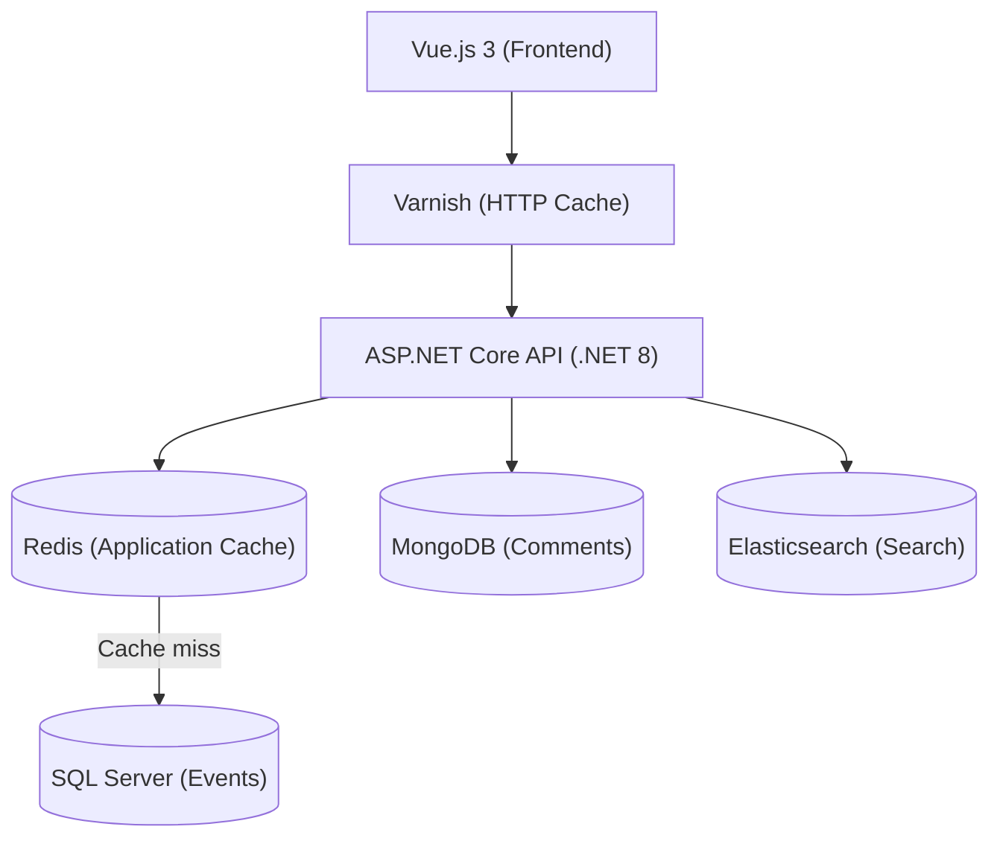

# Events Management

A cultural events management platform enabling organizers to publish events (concerts, shows, exhibitions) and users to discover them, book seats, and share their reviews.

Technical demonstration project built as part of an intensive 52-hour training program.

---
## Target Architecture


---
## Tech Stack

**Backend** — .NET 8, ASP.NET Core, C#, Dapper, SQL Server, MongoDB, Redis, Elasticsearch  
**Frontend** — Vue.js 3, Pinia  
**Infrastructure** — Docker, Varnish, Terraform, Azure  
**DevOps** — Azure DevOps, xUnit, Serilog

---

## Repository Structure

```
events-management/
├── backend/
│   ├── EventManager.Domain/
│   ├── EventManager.Infrastructure/
│   └── EventManager.Api/
├── frontend/
├── terraform/
├── docs/
│   ├── adr/
│   ├── functionnal/
│   └── technical/
├── azure-pipelines.yml
└── README.md
```

> See [ADR-001](documents/adr/ADR-001-repository-structure.md) — mono-repository decision and component-scoped pipelines.

---

## Getting Started

### Prerequisites

- [.NET SDK 8](https://dotnet.microsoft.com/download) or later
- [Docker Desktop](https://www.docker.com/products/docker-desktop) with WSL 2 backend

### Environment

Create the `.env` file from the example and fill in the passwords:

```bash
cp .env.example .env
```

| Variable | Description |
|---|---|
| `SA_PASSWORD` | SQL Server SA password (used by Docker to initialise the container) |
| `APP_PASSWORD` | Application user password — must match the password in your user secrets |

Both passwords must meet SQL Server complexity requirements: uppercase, lowercase, digit, special character, minimum 8 characters.

### Configuration

SQL Server connection string via User Secrets:

```bash
dotnet user-secrets set "ConnectionStrings:DefaultConnection" \
  "Server=localhost,1433;Database=EventManagement;User Id=eventmanagement_user;Password=<APP_PASSWORD>;TrustServerCertificate=True" \
  --project backend/EventManager.Api
```

### Infrastructure

Start all services and apply database migrations:

```bash
docker compose up -d
```

The `sql-init` container runs all scripts in `database/migrations/` in order once SQL Server is healthy, then exits.

Once running, the Varnish HTTP cache is available on port `8080` and proxies requests to the API. See [DOCKER.md](documents/Technical/DOCKER.md) for service details and verification commands.

### Run

```bash
dotnet run --project backend/EventManager.Api
```


---

## API Endpoints


| HTTP VERB | Endpoint | Description | HTTP Status |
|---|---|---|---|
| `GET` | `/api/events` | Liste paginée (`page`, `pageSize`) | `200` |
| `GET` | `/api/events/{id}` | Détail d'un événement | `200`, `404` |
| `GET` | `/api/events/{id}/full` | Événement + commentaires | `200`, `404` |
| `POST` | `/api/events` | Créer un événement | `201`, `400` |
| `GET` | `/api/events/search?q=` | Recherche full-text (Elasticsearch) | `200` |
| `GET` | `/api/events/{id}/comments` | Liste des commentaires d'un événement | `200` |
| `POST` | `/api/events/{id}/comments` | Ajouter un commentaire | `201`, `400` |

Test endpoint available through Swagger at `https://localhost:{port}/swagger`.

---

## Tests

```bash
dotnet test backend/EventManager.slnx
```

Current coverage: tracked via [Codecov](https://app.codecov.io/github/laurentcondoure/eventmanager).

Test strategy documentation: [TEST_STRATEGY](documents/Technical/TEST_STRATEGY.md)

| Version | Date | Description |
|---|---|---|
| v1.0 | 2026-04-27 | Initial strategy — unit and integration tests |
| v2.0 | 2026-05-05 | Revised — infrastructure tests added (Testcontainers), Varnish fixture, 3-layer strategy |

---

## Documentation

| Document | Description |
|----------|-------------|
| [ADR Index](documents/adr/00-index.md) | Architecture decision records |
| [Specifications](documents/functionnal/) | Project definition, user stories, acceptance criteria and business rules |
| [Data Model](documents/technical/DATA_MODEL.md) | Database schema (SQL Server, MongoDB) and key design decisions |
| [Technical Design](documents/technical/TECHNICAL_DESIGN.md) | Target architecture, planned endpoints, technical decisions |
| [Architecture](documents/technical/Architecture.md) | Implemented component diagrams, project dependencies, data flows |
| Deployment | _Next Steps_ |
| AI Usage | _Next Steps_ |
