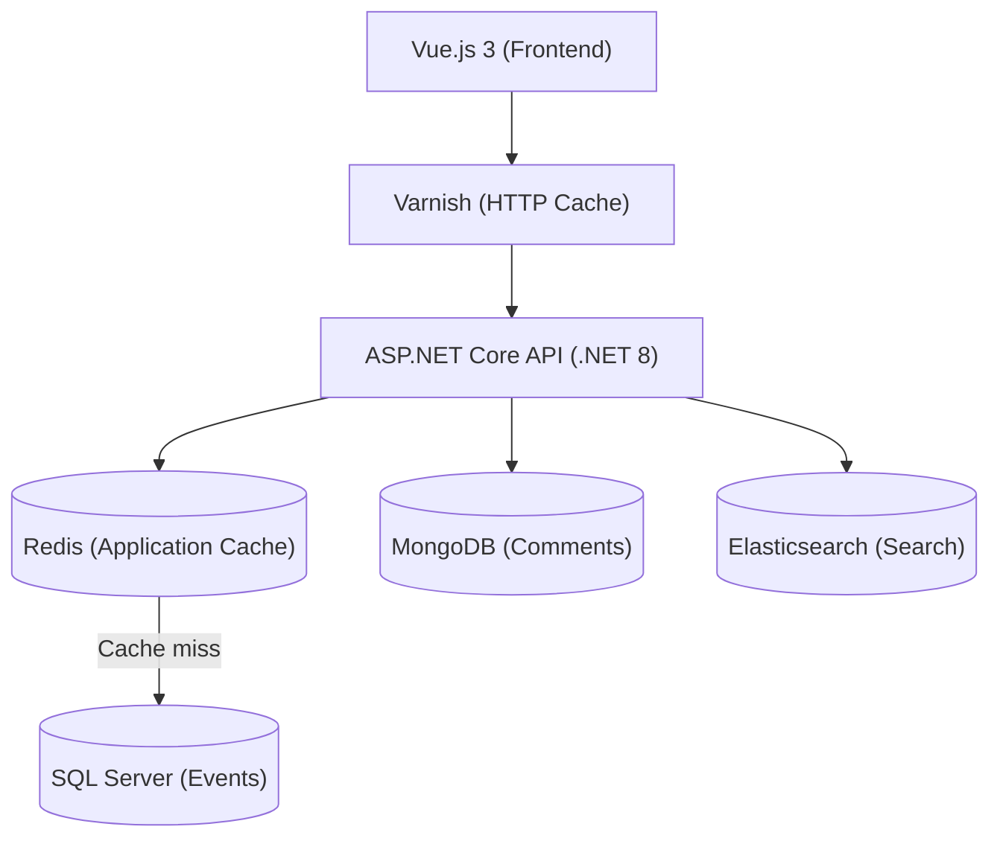

# Events Management

A cultural events management platform enabling organizers to publish events (concerts, shows, exhibitions) and users to discover them, book seats, and share their reviews.

Technical demonstration project built as part of an intensive 52-hour training program.

---
## Target Architecture


---
## Tech Stack

**Backend** — .NET 8, ASP.NET Core, C#, Dapper, SQL Server, MongoDB, Redis, Elasticsearch  
**Frontend** — Vue.js 3, Pinia  
**Infrastructure** — Docker, Varnish, Terraform, Azure  
**DevOps** — Azure DevOps, xUnit, Serilog

---

## Repository Structure

```
events-management/
├── backend/
│   ├── EventsManager.Domain/
│   ├── EventsManager.Infrastructure/
│   └── EventsManager.Api/
├── frontend/
├── terraform/
├── docs/
│   ├── adr/
│   ├── functionnal/
│   └── technical/
├── azure-pipelines.yml
└── README.md
```

> See [ADR-001](documents/adr/ADR-001-repository-structure.md) — mono-repository decision and component-scoped pipelines.

---

## Getting Started

### Prerequisites

- [.NET SDK 8](https://dotnet.microsoft.com/download) or later
- SQL Server (local instance)
- Redis (local instance)

### Configuration

SQL Server connection string via User Secrets:

```bash
cd backend/EventManager.Api
dotnet user-secrets set "ConnectionStrings:DefaultConnection" "Server=localhost;Database=EventManager;User Id=sa;Password=<password>;TrustServerCertificate=True"
```

### Database

Create the `EventManager` database and apply the initial schema:

```bash
sqlcmd -S localhost -i database/migrations/001_InitialSchema.sql
```

### Run

```bash
dotnet run --project backend/EventManager.Api
```


---

## API Endpoints


| HTTP VERB | Endpoint | Description | HTTP Status |
|---|---|---|---|
| `GET` | `/api/events` | Liste paginée (`page`, `pageSize`) | `200` |
| `GET` | `/api/events/{id}` | Détail d'un événement | `200`, `404` |
| `POST` | `/api/events` | Créer un événement | `201`, `400` |

Test endpoint available through Swagger at `https://localhost:{port}/swagger`.

---

## Tests

```bash
dotnet test backend/EventManager.slnx
```

Current coverage: **38%** — tracked via [Codecov](https://codecov.io).

---

## Documentation

| Document | Description |
|----------|-------------|
| [ADR Index](documents/adr/00-index.md) | Architecture decision records |
| [Specifications](documents/functionnal/) | Project definition, user stories, acceptance criteria and business rules |
| [Data Model](documents/technical/DATA_MODEL.md) | Database schema (SQL Server, MongoDB) and key design decisions |
| [Technical Design](documents/technical/TECHNICAL_DESIGN.md) | Target architecture, planned endpoints, technical decisions |
| [Architecture](documents/technical/Architecture.md) | Implemented component diagrams, project dependencies, data flows |
| Deployment | _To be completed_ |
| AI Usage | _To be completed_ |
