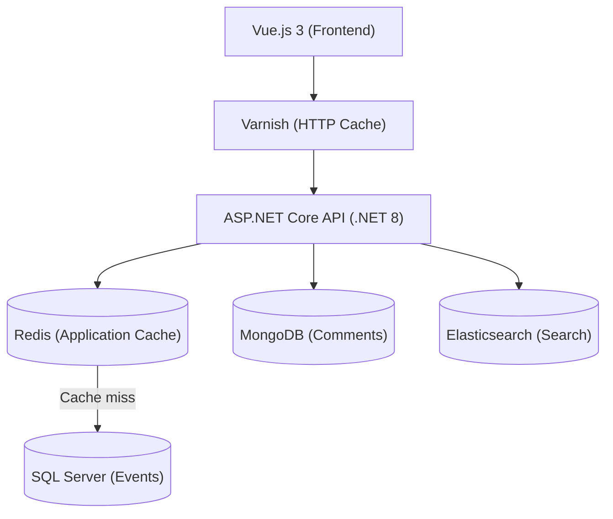

# Events Management [](https://codecov.io/github/laurentcondoure/eventmanager)

A cultural events management platform enabling organizers to publish events (concerts, shows, exhibitions) and users to discover them, book seats, and share their reviews.

This project supported an intensive practice period designed to complete the hands-on coverage of my .NET ecosystem stack. It is designed to become a portfolio-grade demonstration across the full .NET ecosystem, with production-grade standards in mind.


---

## Table of Contents
- [What this project demonstrates](#What-this-project-demonstrates)
- [Target Architecture](#target-architecture)
- [Tech Stack](#tech-stack)
- [Repository Structure](#repository-structure)
- [Getting Started](#getting-started)
- [API Endpoints](#api-endpoints)
- [Tests](#tests)
- [Documentation](#documentation)
---

## What this project demonstrates

### Lead practices
- Architecture Decision Records written at each relevant project step
- Technical debt register documenting gaps, rationale and resolution paths
- Iteration-based roadmap with explicit V1/V2 separation
- AI usage statement describing how Claude Code was used and where ownership remained

### Engineering practices
- Multi-layer testing strategy with Testcontainers
- Test strategy versioned (v1.0 → v2.0) as the practice evolved
- 96% coverage tracked via Codecov
- Environment-aware error responses (production vs development)

### System design
- Versioned-key cache invalidation strategy on Redis — atomic, O(1), cluster-compatible
- Full-text search with Elasticsearch and field-weighted relevance scoring
- HTTP-level caching with Varnish in front of the API
- Infrastructure-as-Code with Terraform (local deployment, Azure deployment in roadmap)

### Backend depth
- .NET 8 / ASP.NET Core API with clean architecture boundaries
- EF Core data access and migrations on SQL Server
- MongoDB document modeling for evolving comment structures
- Serilog structured logging
---

## Target Architecture


```mermaid
graph TD
    Frontend["Vue.js 3 (Frontend)"]
    Varnish["Varnish (HTTP Cache)"]
    API["ASP.NET Core API (.NET 8)"]
    Redis[("Redis (Application Cache)")]
    SQL[("SQL Server (Events)")]
    Mongo[("MongoDB (Comments)")]
    ES[("Elasticsearch (Search)")]

    Frontend --> Varnish
    Varnish --> API
    API --> Redis
    Redis -->|Cache miss| SQL
    API --> Mongo
    API --> ES
```
---
## Tech Stack

**Backend** — .NET 8, ASP.NET Core, C#, EF Core, SQL Server, MongoDB, Redis, Elasticsearch  
**Frontend** — Vue.js 3, Pinia  
**Infrastructure** — Docker, Varnish, Terraform  
**DevOps** — Azure DevOps (pipelines — V2), xUnit, Serilog

---

## Repository Structure

```
EventManager/
├── .github/
├── backend/
│   ├── EventManager.Domain/
│   ├── EventManager.Infrastructure/
│   ├── EventManager.Api/
│   └── tests/
├── frontend/
│   └── EventManagement.UI/
├── terraform/
│   ├── local/
│   ├── azure/
│   └── ProductionTarget/
├── documents/
│   ├── 01-functional/
│   ├── 02-adr/
│   ├── 03-technical/
│   │   └── flows/
│   └── 04-handover/
├── infrastructure/
├── docker/
│    ├── database/
│    │  └── migrations/
│    └── varnish/
├── terraform/
├── azure pipelines/
└── README.md
```

> See [ADR-001](documents/adr/ADR-001-repository-structure.md) — mono-repository decision and component-scoped pipelines.

---

## Getting Started

### Prerequisites

- [.NET SDK 8](https://dotnet.microsoft.com/download) or later
- [Docker Desktop](https://www.docker.com/products/docker-desktop) with WSL 2 backend

### Environment

Create `infrastructure/docker/.env` and set a strong SQL Server `SA_PASSWORD` (minimum 8 characters with uppercase, lowercase, digit and special character):

```text
SA_PASSWORD=<local-sql-server-password>
```

The `.env` file is used only by Docker Compose and must not be committed.

### Configuration

The API uses separate runtime and migration connections. Configure the four connection strings with User Secrets locally; use environment variables in deployed environments. The migration accounts need DDL permissions, while runtime accounts should only have data access. See the [database deployment runbook](documentation/process/runbook-database-deployment-v1.md) for provisioning.

```powershell
dotnet user-secrets set "ConnectionStrings:DefaultConnection" "Server=localhost,1433;Database=EventManager;User Id=eventmanagement_user;Password=<runtime-password>;TrustServerCertificate=True" --project backend/EventManager.Api
dotnet user-secrets set "ConnectionStrings:IdentityConnection" "Server=localhost,1433;Database=EventManager_Identity;User Id=identity_user;Password=<runtime-password>;TrustServerCertificate=True" --project backend/EventManager.Api
dotnet user-secrets set "ConnectionStrings:DefaultMigrationConnection" "Server=localhost,1433;Database=EventManager;User Id=eventmanager_migrator;Password=<migration-password>;TrustServerCertificate=True" --project backend/EventManager.Api
dotnet user-secrets set "ConnectionStrings:IdentityMigrationConnection" "Server=localhost,1433;Database=EventManager_Identity;User Id=identity_migrator;Password=<migration-password>;TrustServerCertificate=True" --project backend/EventManager.Api
```

When using PowerShell, prefer single quotes around a connection string if a password contains `$`, so PowerShell does not expand it.

JWT signing secret and the system API key (ADR-014, ADR-021) — never hardcoded, local-only values here:

```bash
dotnet user-secrets set "Jwt:Secret" "<a random string, 32+ characters>" --project backend/EventManager.Api
dotnet user-secrets set "ApiKey:Value" "<a random string>" --project backend/EventManager.Api
```

First super admin seed (ADR-017) — provisioned automatically at startup from these two flat environment variables (no nested section) if no super admin account exists yet. **Required:** the API fails to start if either is unset.

```bash
dotnet user-secrets set "SEED_ADMIN_EMAIL" "admin@example.com" --project backend/EventManager.Api
dotnet user-secrets set "SEED_ADMIN_PASSWORD" "<a strong local password>" --project backend/EventManager.Api
```

### Infrastructure

Start all services:

```bash
docker compose -f infrastructure/docker/docker-compose.yml up -d
```

The SQL Server container must be healthy before the API starts. The API applies the EF Core migrations for `EventManager` and `EventManager_Identity` through its migration hosted service, using the two migration connection strings.

Once running, the Varnish HTTP cache is available on port `8080` and proxies requests to the API. The frontend development server runs on port `5173`.

### Run

```bash
dotnet run --project backend/EventManager.Api --launch-profile https
```

The API is available on `https://localhost:7029` and `http://localhost:5256` with the default launch profile. Migration progress is written to the API logs; applied migrations are also recorded in `__EFMigrationsHistory` in each database.

On a fresh database, the same startup sequence also seeds the three static roles (`organizer`, `admin`, `super_admin` — ADR-016, via migration) and provisions the first super admin account from `SEED_ADMIN_EMAIL`/`SEED_ADMIN_PASSWORD` (ADR-017, via a hosted service that runs after migrations). Both are skipped silently on subsequent runs. The provisioned account has `MustResetPassword = true`; there is no working login endpoint yet to exercise it (`/auth/login` is a TECH-001 placeholder pending TASK-001).


---

## API Endpoints


### Events

| HTTP Verb | Endpoint | Description | HTTP Status |
|---|---|---|---|
| `GET` | `/api/events` | Paginated list (`page`, `pageSize`) | `200` |
| `GET` | `/api/events/{id}` | Event detail | `200`, `404` |
| `GET` | `/api/events/{id}/full` | Event + comments | `200`, `404` |
| `POST` | `/api/events` | Create an event | `201`, `400` |
| `PUT` | `/api/events/{id}` | Update an event | `200`, `400`, `404` |
| `DELETE` | `/api/events/{id}` | Delete an event | `204`, `404` |
| `GET` | `/api/events/search?q=` | Full-text search (Elasticsearch) | `200` |
| `GET` | `/api/events/categories` | List of valid categories | `200` |

### Comments

| HTTP Verb | Endpoint | Description | HTTP Status |
|---|---|---|---|
| `GET` | `/api/events/{id}/comments` | List comments for an event | `200`, `404` |
| `POST` | `/api/events/{id}/comments` | Add a comment | `201`, `400`, `404` |

### System

| HTTP Verb | Endpoint | Description | HTTP Status |
|---|---|---|---|
| `GET` | `/health` | Health check — requires JWT cookie or system API key (ADR-021) | `200`, `401` |
| `POST` | `/admin/search/reindex` | Rebuild Elasticsearch index from SQL Server | `200` |

Full contract available through Swagger at `https://localhost:{port}/swagger`.

---

## Tests

```bash
dotnet test backend/EventManager.slnx
```

Current coverage: tracked via [Codecov](https://app.codecov.io/github/laurentcondoure/eventmanager).

Test strategy documentation: [TEST_STRATEGY](documents/03-technical/TEST_STRATEGY.md)

| Version | Date | Description |
|---|---|---|
| v1.0 | 2026-04-27 | Initial strategy — unit and integration tests |
| v2.0 | 2026-05-05 | Revised — infrastructure tests added (Testcontainers), Varnish fixture, 3-layer strategy |

---

## Documentation

| Document | Description |
|----------|-------------|
| [Release Notes](RELEASE_NOTES.md) | V1 scope, delivered features, known limitations |
| [V0 Closure](V0_CLOSURE.md) | closure decision, remaining work |
| [Roadmap](ROADMAP.md) | Next Step |
| [Specifications](documents/01-functional/) | Project definition, user stories, acceptance criteria and business rules |
| [Technical Choices](documents/03-technical/TECHNICAL_CHOISES.md) | Technology comparisons — why each technology was chosen over alternatives |
| [Technical Design](documents/03-technical/TECHNICAL_DESIGN.md) | Initial design intent — written before implementation |
| [Data Model](documents/03-technical/DATA_MODEL.md) | Database schema (SQL Server, MongoDB) and key design decisions |
| [ADR Index](documents/02-adr/00-index.md) | Architecture decision records (12 ADRs) |
| [Architecture](documents/03-technical/Architecture.md) | Implemented component diagrams, data flows (all endpoints) |
| [Pipelines](documents/03-technical/PIPELINES.md) | Azure DevOps CI/CD pipeline setup and configuration |
| [Pipeline Workflow](documents/03-technical/PIPELINE_WORKFLOW.md) | Deployment workflow and operator checklist |
| [Database Deployment Runbook](documentation/process/runbook-database-deployment-v1.md) | SQL Server provisioning and EF Core migration deployment |
| [AI Usage](AI_USAGE.md) | Transparency statement — how AI was used in this project |
