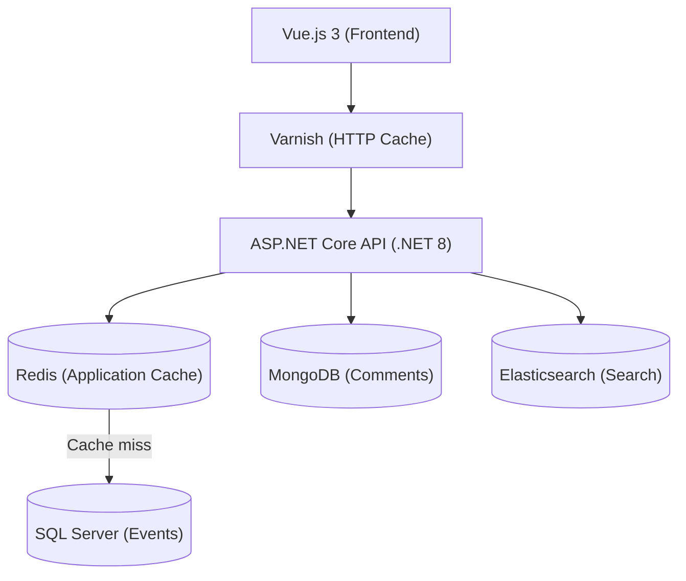

# Events Management [](https://codecov.io/github/laurentcondoure/eventmanager)

A cultural events management platform enabling organizers to publish events (concerts, shows, exhibitions) and users to discover them, book seats, and share their reviews.

This project supported an intensive practice period designed to complete the hands-on coverage of my .NET ecosystem stack. It is designed to become a portfolio-grade demonstration across the full .NET ecosystem, with production-grade standards in mind.


---

## Table of Contents
- [What this project demonstrates](#What-this-project-demonstrates)
- [Target Architecture](#target-architecture)
- [Tech Stack](#tech-stack)
- [Repository Structure](#repository-structure)
- [Getting Started](#getting-started)
- [API Endpoints](#api-endpoints)
- [Tests](#tests)
- [Documentation](#documentation)
---

## What this project demonstrates

### Lead practices
- Architecture Decision Records written at each relevant project step
- Technical debt register documenting gaps, rationale and resolution paths
- Iteration-based roadmap with explicit V1/V2 separation
- AI usage statement describing how Claude Code was used and where ownership remained

### Engineering practices
- Multi-layer testing strategy with Testcontainers
- Test strategy versioned (v1.0 → v2.0) as the practice evolved
- 96% coverage tracked via Codecov
- Environment-aware error responses (production vs development)

### System design
- Versioned-key cache invalidation strategy on Redis — atomic, O(1), cluster-compatible
- Full-text search with Elasticsearch and field-weighted relevance scoring
- HTTP-level caching with Varnish in front of the API
- Infrastructure-as-Code with Terraform (local deployment, Azure deployment in roadmap)

### Backend depth
- .NET 8 / ASP.NET Core API with clean architecture boundaries
- Dapper data access on SQL Server with explicit query control
- MongoDB document modeling for evolving comment structures
- Serilog structured logging
---

## Target Architecture


```mermaid
graph TD
    Frontend["Vue.js 3 (Frontend)"]
    Varnish["Varnish (HTTP Cache)"]
    API["ASP.NET Core API (.NET 8)"]
    Redis[("Redis (Application Cache)")]
    SQL[("SQL Server (Events)")]
    Mongo[("MongoDB (Comments)")]
    ES[("Elasticsearch (Search)")]

    Frontend --> Varnish
    Varnish --> API
    API --> Redis
    Redis -->|Cache miss| SQL
    API --> Mongo
    API --> ES
```
---
## Tech Stack

**Backend** — .NET 8, ASP.NET Core, C#, Dapper, SQL Server, MongoDB, Redis, Elasticsearch  
**Frontend** — Vue.js 3, Pinia  
**Infrastructure** — Docker, Varnish, Terraform  
**DevOps** — Azure DevOps (pipelines — V2), xUnit, Serilog

---

## Repository Structure

```
EventManager/
├── .github/
├── backend/
│   ├── EventManager.Domain/
│   ├── EventManager.Infrastructure/
│   ├── EventManager.Api/
│   └── tests/
├── frontend/
│   └── EventManagement.UI/
├── terraform/
│   ├── local/
│   ├── azure/
│   └── ProductionTarget/
├── documents/
│   ├── 01-functional/
│   ├── 02-adr/
│   ├── 03-technical/
│   │   └── flows/
│   └── 04-handover/
├── infrastructure/
├── docker/
│    ├── database/
│    │  └── migrations/
│    └── varnish/
├── terraform/
├── azure pipelines/
└── README.md
```

> See [ADR-001](documents/adr/ADR-001-repository-structure.md) — mono-repository decision and component-scoped pipelines.

---

## Getting Started

### Prerequisites

- [.NET SDK 8](https://dotnet.microsoft.com/download) or later
- [Docker Desktop](https://www.docker.com/products/docker-desktop) with WSL 2 backend

### Environment

Create the `.env` file from the example and fill in the passwords:

```bash
cp .env.example .env
```

| Variable | Description |
|---|---|
| `SA_PASSWORD` | SQL Server SA password (used by Docker to initialise the container) |
| `APP_PASSWORD` | Application user password — must match the password in your user secrets |

Both passwords must meet SQL Server complexity requirements: uppercase, lowercase, digit, special character, minimum 8 characters.

### Configuration

SQL Server connection string via User Secrets:

```bash
dotnet user-secrets set "ConnectionStrings:DefaultConnection" \
  "Server=localhost,1433;Database=EventManagement;User Id=eventmanagement_user;Password=<APP_PASSWORD>;TrustServerCertificate=True" \
  --project backend/EventManager.Api
```

### Infrastructure

Start all services and apply database migrations:

```bash
docker-compose -f infrastructure/docker/docker-compose.yml up -d
```

The `sql-init` container runs all scripts in `database/migrations/` in order once SQL Server is healthy, then exits.

Once running, the Varnish HTTP cache is available on port `8080` and proxies requests to the API. See [DOCKER.md](documents/technical/DOCKER.md) for service details and verification commands.

### Run

```bash
dotnet run --project backend/EventManager.Api
```


---

## API Endpoints


### Events

| HTTP Verb | Endpoint | Description | HTTP Status |
|---|---|---|---|
| `GET` | `/api/events` | Paginated list (`page`, `pageSize`) | `200` |
| `GET` | `/api/events/{id}` | Event detail | `200`, `404` |
| `GET` | `/api/events/{id}/full` | Event + comments | `200`, `404` |
| `POST` | `/api/events` | Create an event | `201`, `400` |
| `PUT` | `/api/events/{id}` | Update an event | `200`, `400`, `404` |
| `DELETE` | `/api/events/{id}` | Delete an event | `204`, `404` |
| `GET` | `/api/events/search?q=` | Full-text search (Elasticsearch) | `200` |
| `GET` | `/api/events/categories` | List of valid categories | `200` |

### Comments

| HTTP Verb | Endpoint | Description | HTTP Status |
|---|---|---|---|
| `GET` | `/api/events/{id}/comments` | List comments for an event | `200`, `404` |
| `POST` | `/api/events/{id}/comments` | Add a comment | `201`, `400`, `404` |

### System

| HTTP Verb | Endpoint | Description | HTTP Status |
|---|---|---|---|
| `GET` | `/health` | Health check | `200` |
| `POST` | `/admin/search/reindex` | Rebuild Elasticsearch index from SQL Server | `200` |

Full contract available through Swagger at `https://localhost:{port}/swagger`.

---

## Tests

```bash
dotnet test backend/EventManager.slnx
```

Current coverage: tracked via [Codecov](https://app.codecov.io/github/laurentcondoure/eventmanager).

Test strategy documentation: [TEST_STRATEGY](documents/03-technical/TEST_STRATEGY.md)

| Version | Date | Description |
|---|---|---|
| v1.0 | 2026-04-27 | Initial strategy — unit and integration tests |
| v2.0 | 2026-05-05 | Revised — infrastructure tests added (Testcontainers), Varnish fixture, 3-layer strategy |

---

## Documentation

| Document | Description |
|----------|-------------|
| [Release Notes](RELEASE_NOTES.md) | V1 scope, delivered features, known limitations |
| [V0 Closure](V0_CLOSURE.md) | closure decision, remaining work |
| [Roadmap](ROADMAP.md) | Next Step |
| [Specifications](documents/01-functional/) | Project definition, user stories, acceptance criteria and business rules |
| [Technical Choices](documents/03-technical/TECHNICAL_CHOISES.md) | Technology comparisons — why each technology was chosen over alternatives |
| [Technical Design](documents/03-technical/TECHNICAL_DESIGN.md) | Initial design intent — written before implementation |
| [Data Model](documents/03-technical/DATA_MODEL.md) | Database schema (SQL Server, MongoDB) and key design decisions |
| [ADR Index](documents/02-adr/00-index.md) | Architecture decision records (12 ADRs) |
| [Architecture](documents/03-technical/Architecture.md) | Implemented component diagrams, data flows (all endpoints) |
| [Pipelines](documents/03-technical/PIPELINES.md) | Azure DevOps CI/CD pipeline setup and configuration |
| [Pipeline Workflow](documents/03-technical/PIPELINE_WORKFLOW.md) | Deployment workflow and operator checklist |
| [AI Usage](AI_USAGE.md) | Transparency statement — how AI was used in this project |
