# Design — Account Management

**Reference:** design-account-management
**Status:** Validated
**Domain:** Cross-Cutting
**Version introduced:** V1
**Last updated:** 2026-08-18

**Architectural references:**
- [ADR-016 — Authorisation model](../adr/security/adr-016-authorisation-model.md)
- [ADR-017 — First super admin provisioning](../adr/security/adr-017-first-super-admin-provisioning.md)

**Related design documents:**
- [design-authentication.md](design-authentication.md) — session lifecycle, force reset flow

---

## 1. Use Case Diagram

Actors and account management use cases for V1.

```mermaid
graph TD
    subgraph Actors
        SA[Super Admin]
        AD[Admin]
        ORG[Organizer]
        SYS[System]
    end

    subgraph SA_Scope["Account Management: Super Admin"]
        UC01[Create admin account]
        UC02[Modify admin account]
        UC03[Deactivate admin account]
        UC04[Reactivate admin account]
        UC05[Force password reset - admin]
        UC06[Promote admin to super admin]
    end

    subgraph AD_Scope["Account Management: Admin"]
        UC07[Create organizer account]
        UC08[Modify organizer account]
        UC09[Deactivate organizer account]
        UC10[Reactivate organizer account]
        UC11[Force password reset - organizer]
    end

    subgraph Access_Control["Access Control"]
        UC12[View account list - own scope]
        UC13[Access administration section]
        UC14[Access event management - blocked]
    end

    subgraph Provisioning
        UC15[Provision first super admin at startup]
    end

    SA --> UC01
    SA --> UC02
    SA --> UC03
    SA --> UC04
    SA --> UC05
    SA --> UC06
    SA --> UC07
    SA --> UC08
    SA --> UC09
    SA --> UC10
    SA --> UC11
    SA --> UC12
    SA --> UC13
    AD --> UC07
    AD --> UC08
    AD --> UC09
    AD --> UC10
    AD --> UC11
    AD --> UC12
    AD --> UC13
    ORG --> UC14
    SYS --> UC15
```

---

## 2. Component Diagram

How components interact for account management in V1.

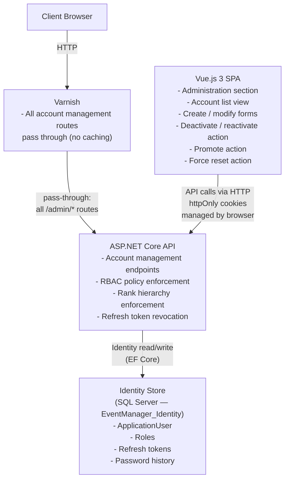

---

## 3. State Diagrams

### 3.1 Account status lifecycle

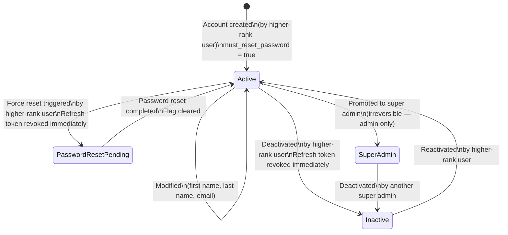

### 3.2 Rank hierarchy and permitted actions

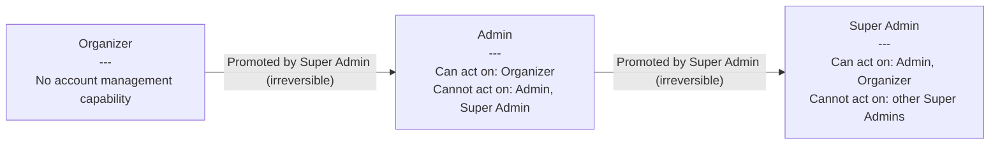

---

## 4. Activity Diagrams

### 4.1 Create account flow (admin or organizer)

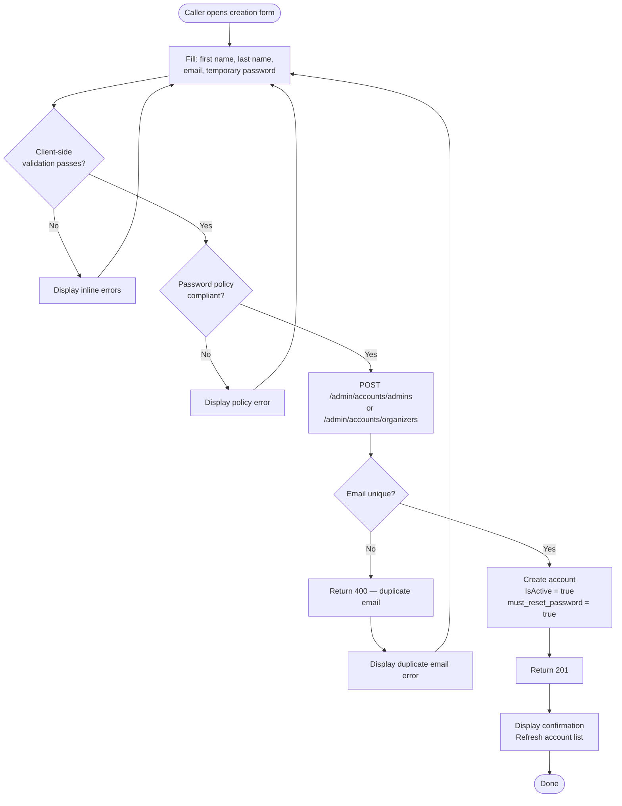

### 4.2 Modify account flow

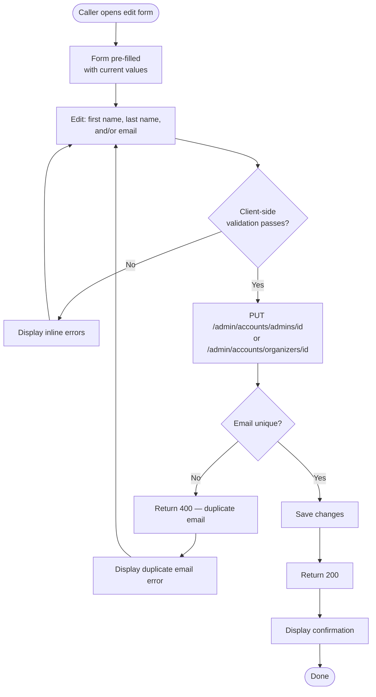

### 4.3 Deactivate / reactivate account flow

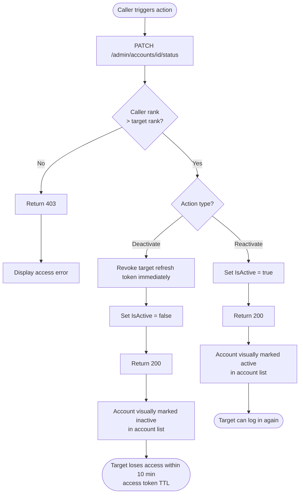

### 4.4 Promote to super admin flow

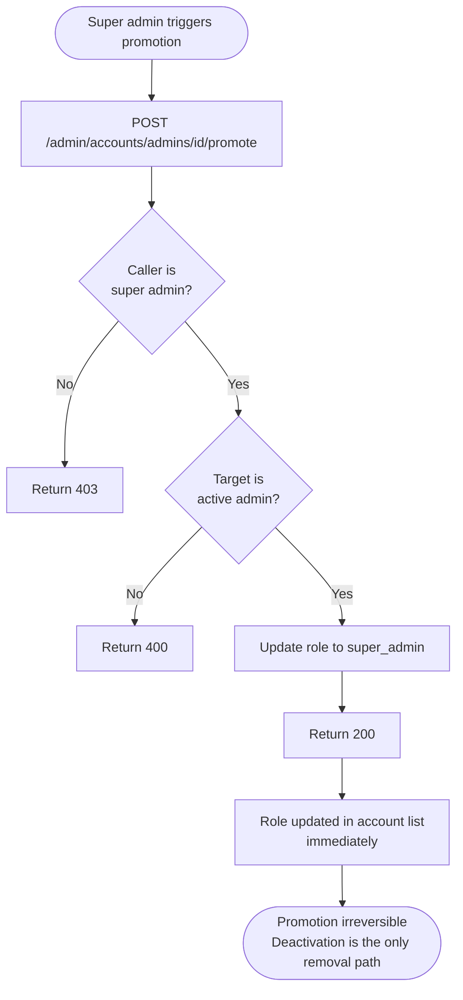

### 4.5 Super admin provisioning at startup

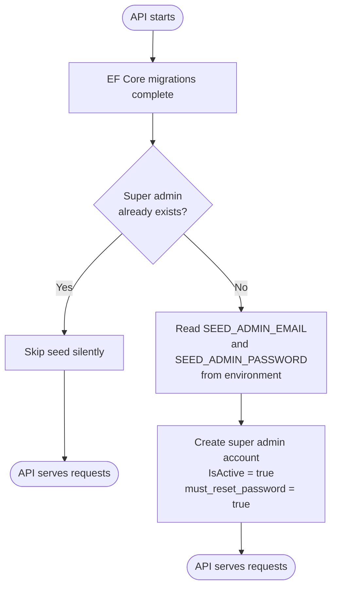

---

## 5. Sequence Diagrams

### 5.1 Create account

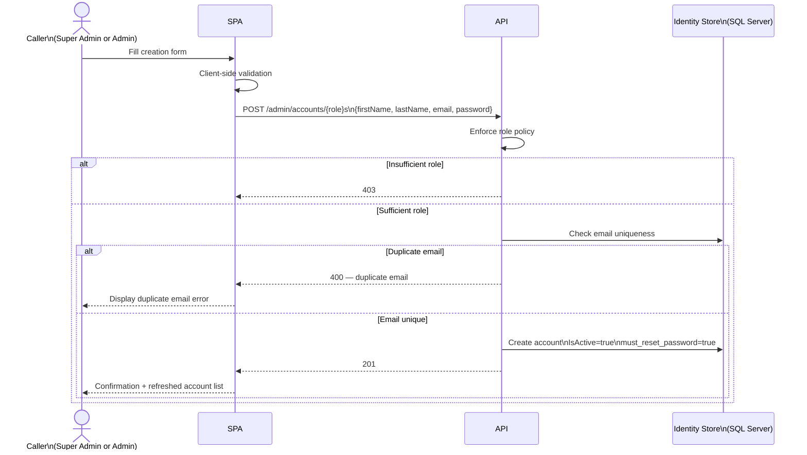

### 5.2 Modify account

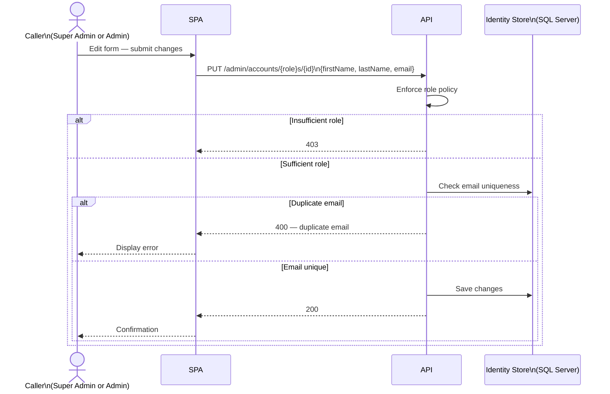

### 5.3 Deactivate account

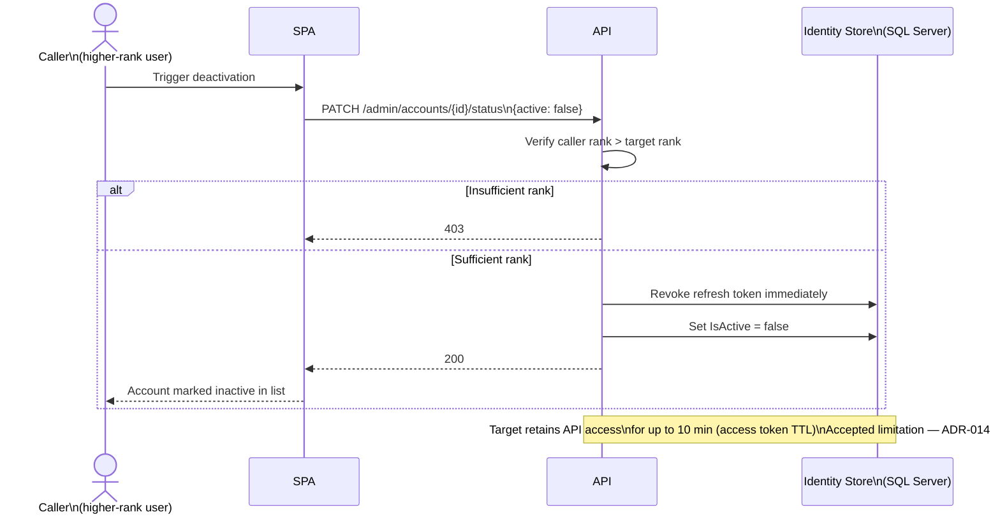

### 5.4 Promote to super admin

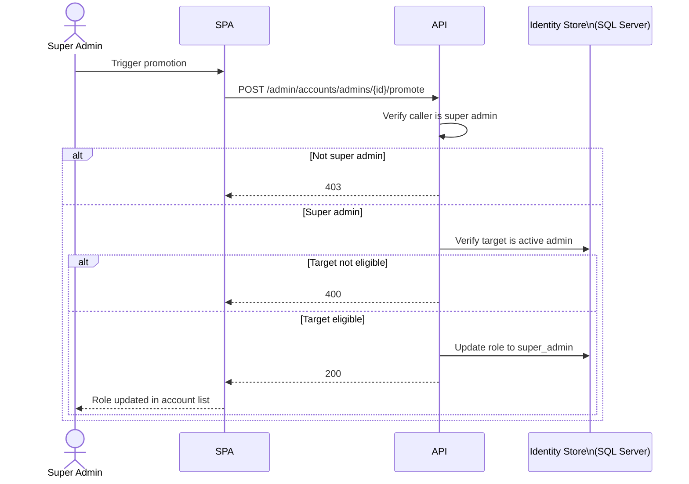

### 5.5 Super admin provisioning at startup

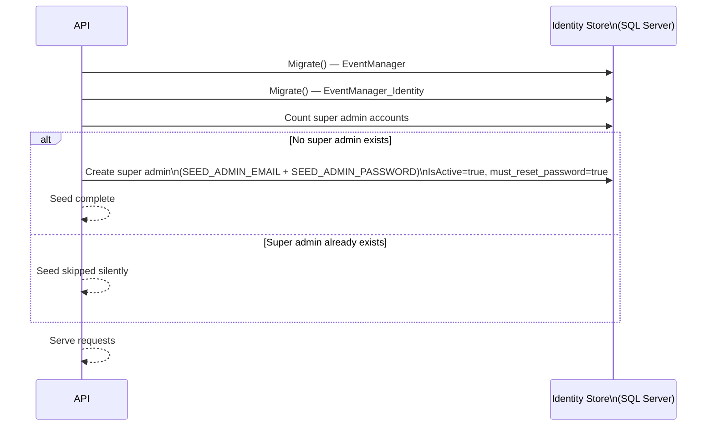

---

## 6. Interaction Overview Diagram

Full account management lifecycle — how the individual flows connect.

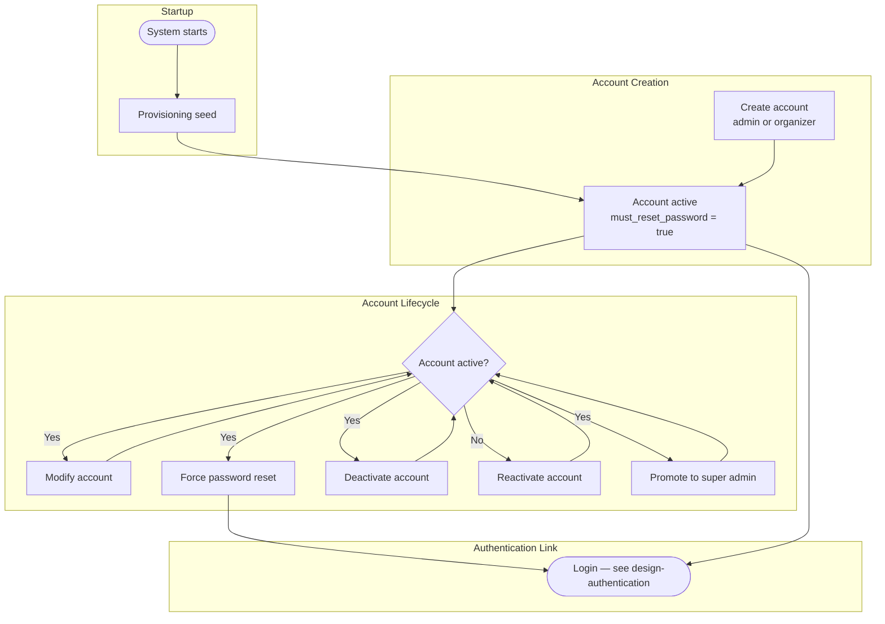

---

## Revision History

| Version | Date | Changes |
|---|---|---|
| 1.0 | 2026-08-18 | Document created — V1 account management flows |
