# Design — Authentication

**Reference:** design-authentication
**Status:** Validated
**Domain:** Cross-Cutting
**Version introduced:** V1
**Last updated:** 2026-08-18

**Architectural references:**
- [ADR-014 — Authentication mechanism](../adr/security/adr-014-authentication-mechanism.md)
- [ADR-015 — Identity schema isolation](../adr/architecture/adr-015-identity-schema-isolation.md)
- [ADR-016 — Authorisation model](../adr/security/adr-016-authorisation-model.md)
- [ADR-017 — First super admin provisioning](../adr/security/adr-017-first-super-admin-provisioning.md)
- [ADR-019 — Rate limiting on authentication endpoints](../adr/security/adr-019-rate-limiting-auth-endpoints.md)
- [ADR-020 — Session restoration endpoint (GET /auth/me)](../adr/architecture/adr-020-session-restoration-endpoint.md)

---

## 1. Use Case Diagrams

One diagram per actor, ordered by rank. Use cases are represented as ellipses `((use case))`, actors as rectangles, system boundary as a subgraph. `-.->|include|` denotes an include relationship. Higher-rank actors inherit lower-rank use cases and extend them with their own.

### 1.1 System

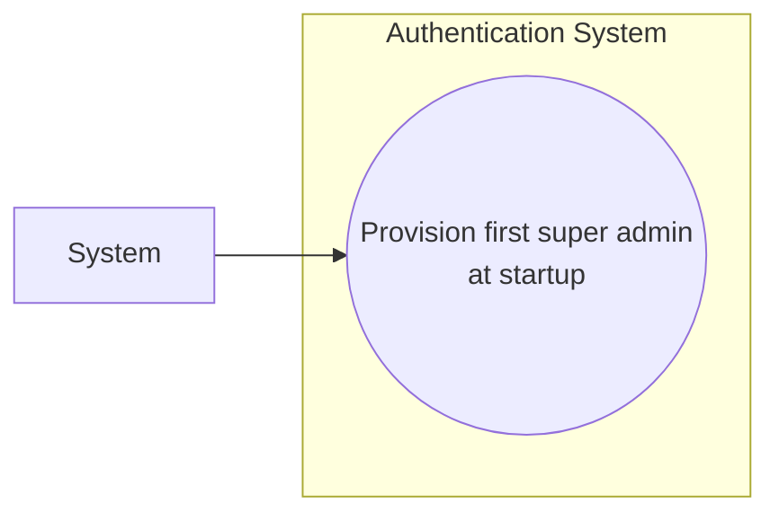
```mermaid
graph LR
    SYS[System]

    subgraph Auth["Authentication System"]
        UC10((Provision first super admin
at startup))
    end

    SYS --> UC10
```

### 1.2 Organizer

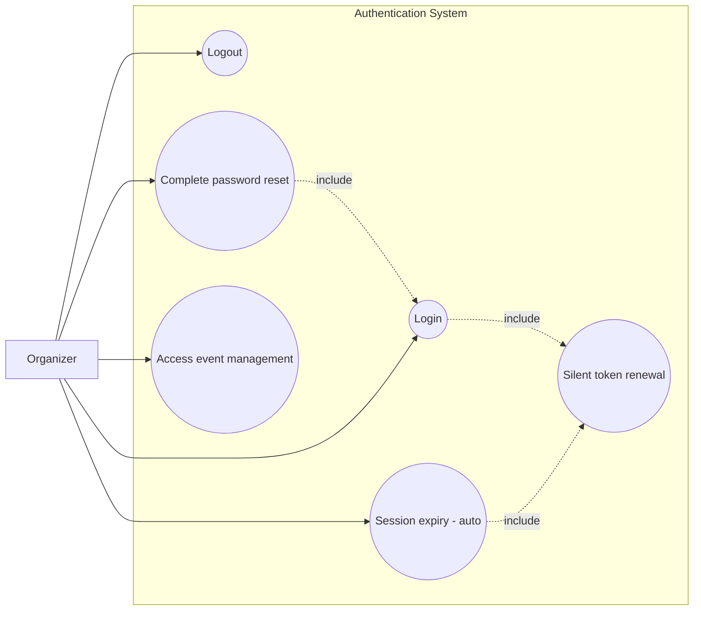
```mermaid
graph LR
    ORG[Organizer]

    subgraph Auth["Authentication System"]
        UC1((Login))
        UC2((Logout))
        UC3((Session expiry - auto))
        UC4((Silent token renewal))
        UC6((Complete password reset))
        UC8((Access event management))

        UC1 -.->|include| UC4
        UC3 -.->|include| UC4
        UC6 -.->|include| UC1
    end

    ORG --> UC1
    ORG --> UC2
    ORG --> UC3
    ORG --> UC6
    ORG --> UC8
```

### 1.3 Admin

Extends Organizer - inherits all Organizer use cases. Only additional use cases are shown.

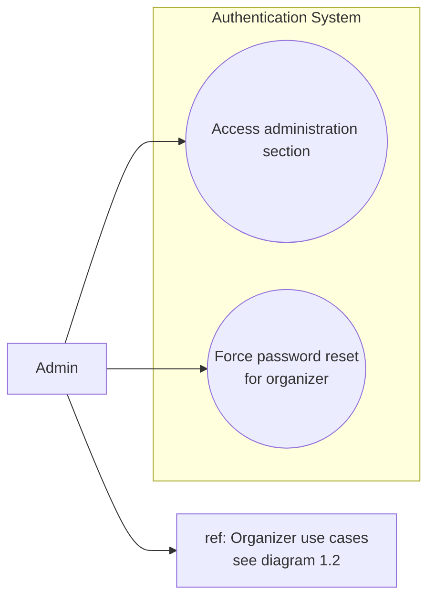
```mermaid
graph LR
    AD[Admin]
    ORG_REF["ref: Organizer use cases
see diagram 1.2"]

    subgraph Auth["Authentication System"]
        UC7((Access administration section))
        UC5((Force password reset
for organizer))
    end

    AD --> ORG_REF
    AD --> UC7
    AD --> UC5
```

### 1.4 Super Admin

Extends Admin - inherits all Admin use cases. Only additional use cases are shown.

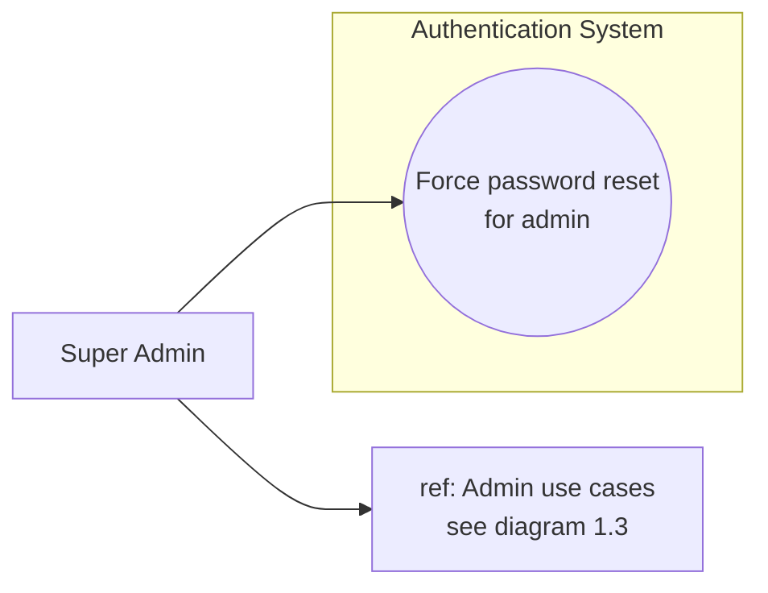
```mermaid
graph LR
    SA[Super Admin]
    AD_REF["ref: Admin use cases
see diagram 1.3"]

    subgraph Auth["Authentication System"]
        UC5_SA((Force password reset
for admin))
    end

    SA --> AD_REF
    SA --> UC5_SA
```

---

## 2. Component Diagram

How components interact for authentication in V1.

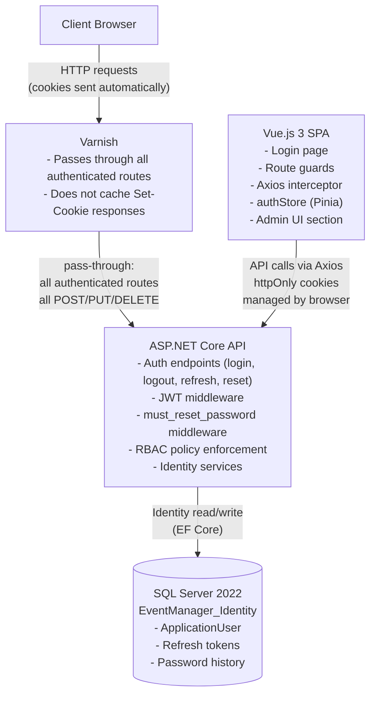
```mermaid
graph TD
    Browser["Client Browser"]
    SPA["Vue.js 3 SPA\n- Login page\n- Route guards\n- Axios interceptor\n- authStore (Pinia)\n- Admin UI section"]
    Varnish["Varnish\n- Passes through all authenticated routes\n- Does not cache Set-Cookie responses"]
    API["ASP.NET Core API\n- Auth endpoints (login, logout, refresh, reset)\n- JWT middleware\n- must_reset_password middleware\n- RBAC policy enforcement\n- Identity services"]
    SQL[("SQL Server 2022\nEventManager_Identity\n- ApplicationUser\n- Refresh tokens\n- Password history")]

    Browser -->|"HTTP requests\n(cookies sent automatically)"| Varnish
    Varnish -->|"pass-through:\nall authenticated routes\nall POST/PUT/DELETE"| API
    SPA -->|"API calls via Axios\nhttpOnly cookies\nmanaged by browser"| API
    API -->|"Identity read/write\n(EF Core)"| SQL
```

---

## 3. State Diagrams

### 3.1 Session lifecycle

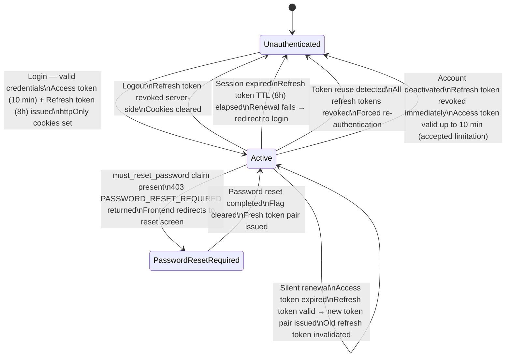
```mermaid
stateDiagram-v2
    [*] --> Unauthenticated

    Unauthenticated --> Active : Login — valid credentials\nAccess token (10 min) + Refresh token (8h) issued\nhttpOnly cookies set

    Active --> Active : Silent renewal\nAccess token expired\nRefresh token valid → new token pair issued\nOld refresh token invalidated

    Active --> PasswordResetRequired : must_reset_password claim present\n403 PASSWORD_RESET_REQUIRED returned\nFrontend redirects to reset screen

    PasswordResetRequired --> Active : Password reset completed\nFlag cleared\nFresh token pair issued

    Active --> Unauthenticated : Logout\nRefresh token revoked server-side\nCookies cleared

    Active --> Unauthenticated : Session expired\nRefresh token TTL (8h) elapsed\nRenewal fails → redirect to login

    Active --> Unauthenticated : Token reuse detected\nAll refresh tokens revoked\nForced re-authentication

    Active --> Unauthenticated : Account deactivated\nRefresh token revoked immediately\nAccess token valid up to 10 min (accepted limitation)
```

### 3.2 Account status lifecycle

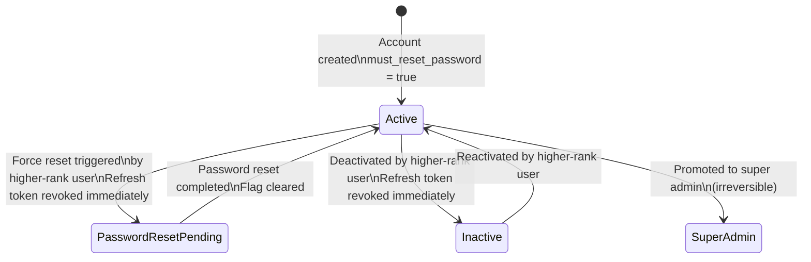
```mermaid
stateDiagram-v2
    [*] --> Active : Account created\nmust_reset_password = true

    Active --> PasswordResetPending : Force reset triggered\nby higher-rank user\nRefresh token revoked immediately

    PasswordResetPending --> Active : Password reset completed\nFlag cleared

    Active --> Inactive : Deactivated by higher-rank user\nRefresh token revoked immediately

    Inactive --> Active : Reactivated by higher-rank user

    Active --> SuperAdmin : Promoted to super admin\n(irreversible)
```

---

## 4. Activity Diagrams

### 4.1 Login flow

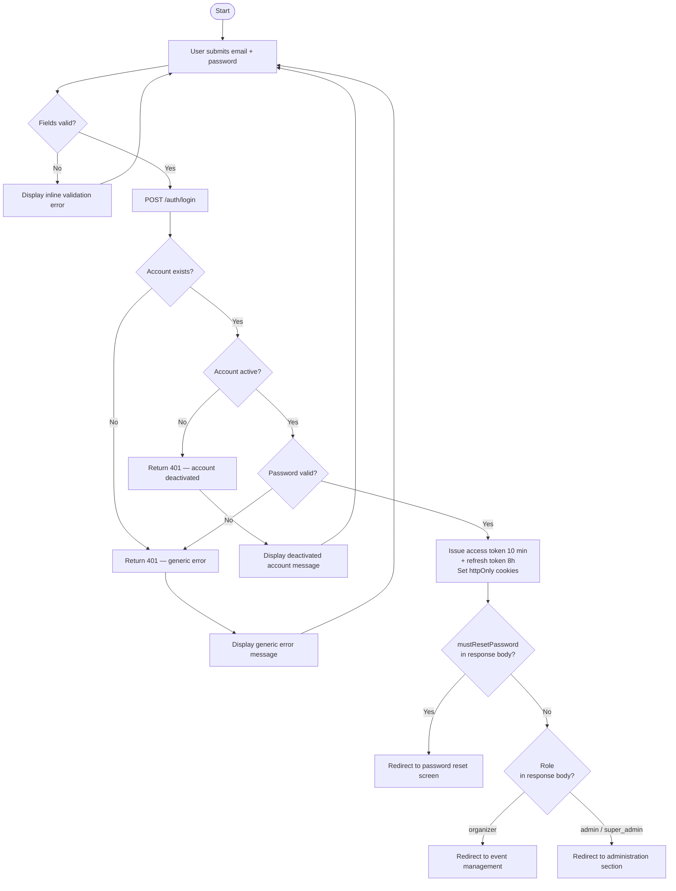
```mermaid
flowchart TD
    A([Start]) --> B[User submits email + password]
    B --> C{Fields valid?}
    C -- No --> D[Display inline validation error]
    D --> B
    C -- Yes --> E[POST /auth/login]
    E --> F{Account exists?}
    F -- No --> G[Return 401 — generic error]
    G --> H[Display generic error message]
    H --> B
    F -- Yes --> I{Account active?}
    I -- No --> J[Return 401 — account deactivated]
    J --> K[Display deactivated account message]
    K --> B
    I -- Yes --> L{Password valid?}
    L -- No --> G
    L -- Yes --> M[Issue access token 10 min\n+ refresh token 8h\nSet httpOnly cookies]
    M --> N{mustResetPassword\nin response body?}
    N -- Yes --> O[Redirect to password reset screen]
    N -- No --> P{Role\nin response body?}
    P -- organizer --> Q[Redirect to event management]
    P -- admin / super_admin --> R[Redirect to administration section]
```

### 4.2 Silent token renewal flow

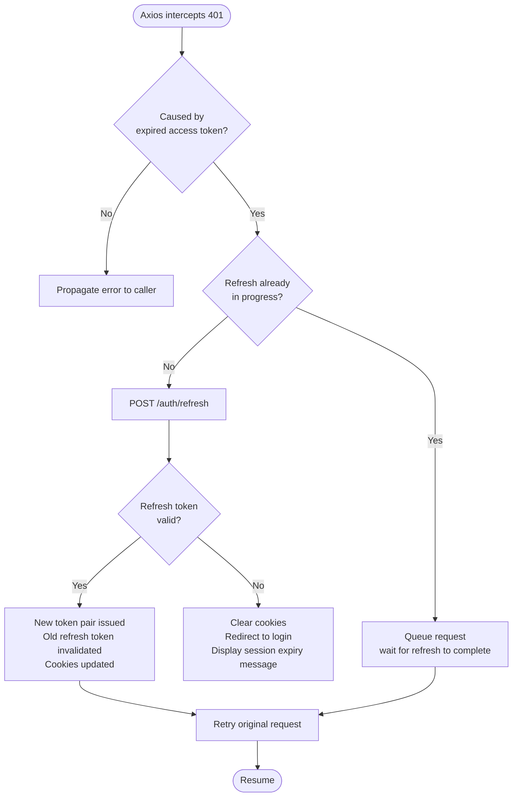
```mermaid
flowchart TD
    A([Axios intercepts 401]) --> B{Caused by\nexpired access token?}
    B -- No --> C[Propagate error to caller]
    B -- Yes --> D{Refresh already\nin progress?}
    D -- Yes --> E[Queue request\nwait for refresh to complete]
    D -- No --> F[POST /auth/refresh]
    F --> G{Refresh token\nvalid?}
    G -- No --> H[Clear cookies\nRedirect to login\nDisplay session expiry message]
    G -- Yes --> I[New token pair issued\nOld refresh token invalidated\nCookies updated]
    I --> J[Retry original request]
    E --> J
    J --> K([Resume])
```

### 4.3 Force password reset flow

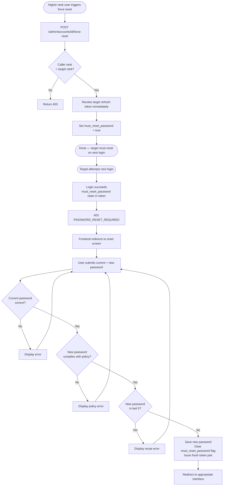
```mermaid
flowchart TD
    A([Higher-rank user triggers force reset]) --> B[POST /admin/accounts/id/force-reset]
    B --> C{Caller rank\n> target rank?}
    C -- No --> D[Return 403]
    C -- Yes --> E[Revoke target refresh token immediately]
    E --> F[Set must_reset_password = true]
    F --> G([Done — target must reset on next login])

    G --> H([Target attempts next login])
    H --> I[Login succeeds\nmust_reset_password claim in token]
    I --> J[403 PASSWORD_RESET_REQUIRED]
    J --> K[Frontend redirects to reset screen]
    K --> L[User submits current + new password]
    L --> M{Current password\ncorrect?}
    M -- No --> N[Display error]
    N --> L
    M -- Yes --> O{New password\ncomplies with policy?}
    O -- No --> P[Display policy error]
    P --> L
    O -- Yes --> Q{New password\nin last 5?}
    Q -- Yes --> R[Display reuse error]
    R --> L
    Q -- No --> S[Save new password\nClear must_reset_password flag\nIssue fresh token pair]
    S --> T[Redirect to appropriate interface]
```

### 4.4 Account deactivation flow

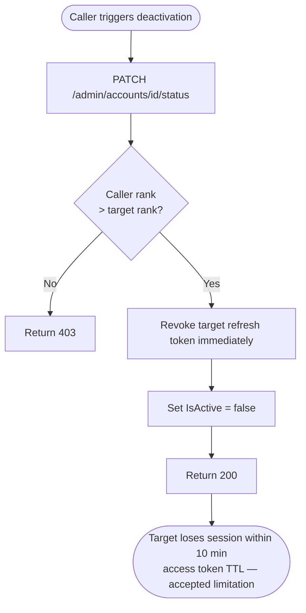
```mermaid
flowchart TD
    A([Caller triggers deactivation]) --> B[PATCH /admin/accounts/id/status]
    B --> C{Caller rank\n> target rank?}
    C -- No --> D[Return 403]
    C -- Yes --> E[Revoke target refresh token immediately]
    E --> F[Set IsActive = false]
    F --> G[Return 200]
    G --> H([Target loses session within 10 min\naccess token TTL — accepted limitation])
```

---

## 5. Sequence Diagrams

### 5.1 Login

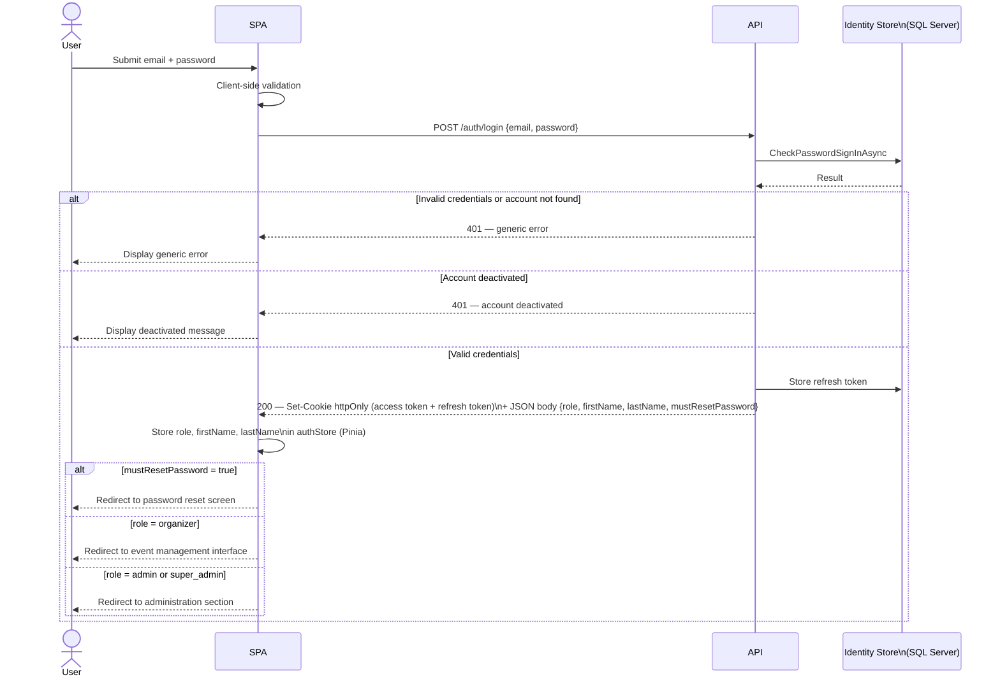
```mermaid
sequenceDiagram
    actor User
    participant SPA
    participant API
    participant Identity as Identity Store\n(SQL Server)

    User->>SPA: Submit email + password
    SPA->>SPA: Client-side validation
    SPA->>API: POST /auth/login {email, password}
    API->>Identity: CheckPasswordSignInAsync
    Identity-->>API: Result

    alt Invalid credentials or account not found
        API-->>SPA: 401 — generic error
        SPA-->>User: Display generic error
    else Account deactivated
        API-->>SPA: 401 — account deactivated
        SPA-->>User: Display deactivated message
    else Valid credentials
        API->>Identity: Store refresh token
        API-->>SPA: 200 — Set-Cookie httpOnly (access token + refresh token)\n+ JSON body {role, firstName, lastName, mustResetPassword}
        SPA->>SPA: Store role, firstName, lastName\nin authStore (Pinia)
        alt mustResetPassword = true
            SPA-->>User: Redirect to password reset screen
        else role = organizer
            SPA-->>User: Redirect to event management interface
        else role = admin or super_admin
            SPA-->>User: Redirect to administration section
        end
    end
```

> **Note on role detection:** The JWT access token is stored in an httpOnly cookie and is
> inaccessible to JavaScript. The role and user claims are returned in the JSON response body
> on login and stored in Pinia for the session lifetime. On page refresh, Pinia state is lost —
> the SPA must call a `/auth/me` endpoint (or equivalent) to restore the session context from
> a valid cookie. This endpoint is a candidate for a future technical task if not already covered.

### 5.2 Silent token renewal

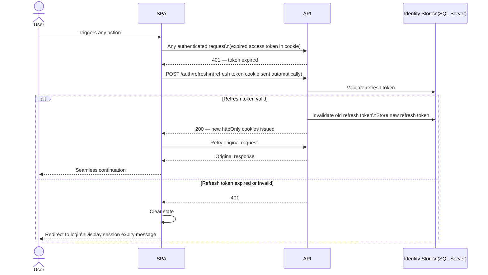
```mermaid
sequenceDiagram
    actor User
    participant SPA
    participant API
    participant Identity as Identity Store\n(SQL Server)

    User->>SPA: Triggers any action
    SPA->>API: Any authenticated request\n(expired access token in cookie)
    API-->>SPA: 401 — token expired
    SPA->>API: POST /auth/refresh\n(refresh token cookie sent automatically)
    API->>Identity: Validate refresh token

    alt Refresh token valid
        API->>Identity: Invalidate old refresh token\nStore new refresh token
        API-->>SPA: 200 — new httpOnly cookies issued
        SPA->>API: Retry original request
        API-->>SPA: Original response
        SPA-->>User: Seamless continuation
    else Refresh token expired or invalid
        API-->>SPA: 401
        SPA->>SPA: Clear state
        SPA-->>User: Redirect to login\nDisplay session expiry message
    end
```

### 5.3 Logout

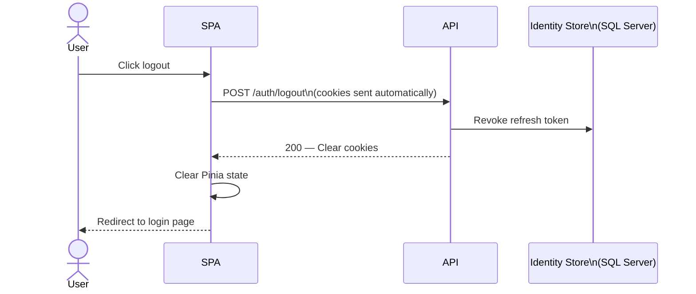
```mermaid
sequenceDiagram
    actor User
    participant SPA
    participant API
    participant Identity as Identity Store\n(SQL Server)

    User->>SPA: Click logout
    SPA->>API: POST /auth/logout\n(cookies sent automatically)
    API->>Identity: Revoke refresh token
    API-->>SPA: 200 — Clear cookies
    SPA->>SPA: Clear Pinia state
    SPA-->>User: Redirect to login page
```

### 5.4 Session restoration on page refresh — GET /auth/me

Called automatically by the SPA on every page load or refresh to restore session context
from the httpOnly cookie. Pinia state is lost on refresh — this endpoint is the only way
to recover the role and flags without re-authenticating.

**Rate limit:** Fixed window — 3 requests per minute per authenticated user.
Returns `429 Too Many Requests` with `Retry-After` header if exceeded.
This prevents frontend bugs or refresh loops from hammering the endpoint.

**Activity diagram:**

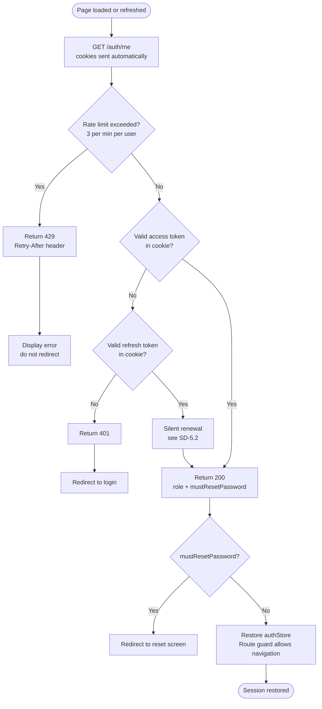
```mermaid
flowchart TD
    A([Page loaded or refreshed]) --> B[GET /auth/me
cookies sent automatically]
    B --> RL{Rate limit exceeded?
3 per min per user}
    RL -- Yes --> RL429[Return 429
Retry-After header]
    RL429 --> ERR[Display error
do not redirect]
    RL -- No --> C{Valid access token
in cookie?}
    C -- No --> D{Valid refresh token
in cookie?}
    D -- No --> E[Return 401]
    E --> F[Redirect to login]
    D -- Yes --> G[Silent renewal
see SD-5.2]
    G --> H[Return 200
role + mustResetPassword]
    C -- Yes --> H
    H --> I{mustResetPassword?}
    I -- Yes --> J[Redirect to reset screen]
    I -- No --> K[Restore authStore
Route guard allows navigation]
    K --> L([Session restored])
```

**Sequence diagram:**

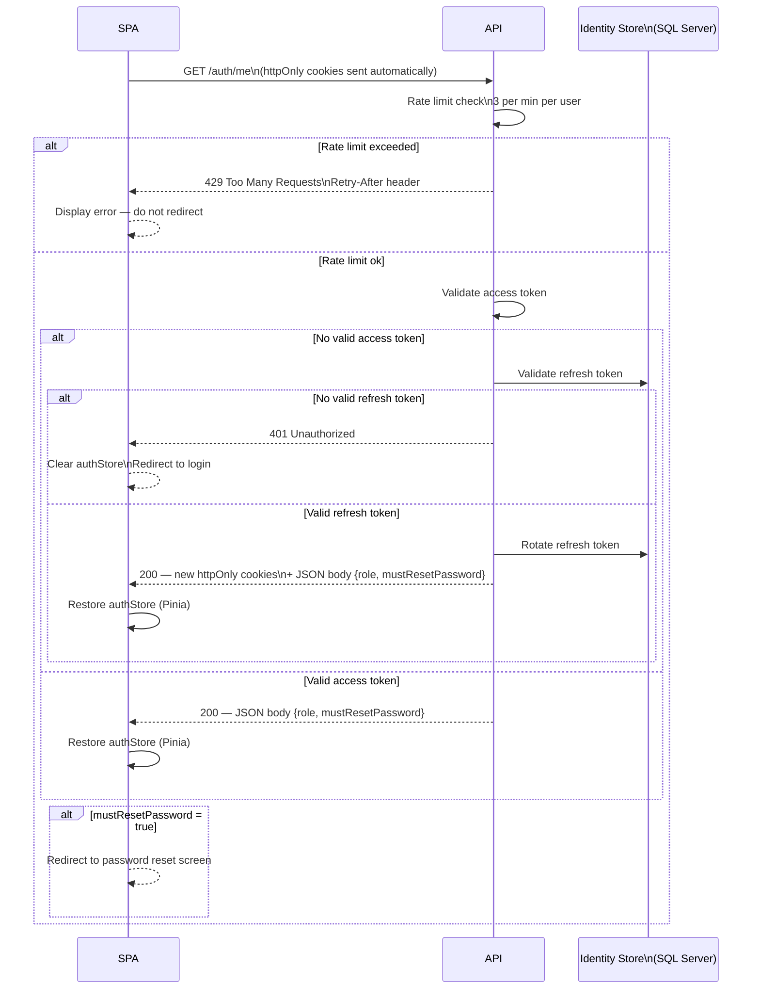
```mermaid
sequenceDiagram
    participant SPA
    participant API
    participant Identity as Identity Store\n(SQL Server)

    SPA->>API: GET /auth/me\n(httpOnly cookies sent automatically)
    API->>API: Rate limit check\n3 per min per user
    alt Rate limit exceeded
        API-->>SPA: 429 Too Many Requests\nRetry-After header
        SPA-->>SPA: Display error — do not redirect
    else Rate limit ok
        API->>API: Validate access token
        alt No valid access token
            API->>Identity: Validate refresh token
            alt No valid refresh token
                API-->>SPA: 401 Unauthorized
                SPA-->>SPA: Clear authStore\nRedirect to login
            else Valid refresh token
                API->>Identity: Rotate refresh token
                API-->>SPA: 200 — new httpOnly cookies\n+ JSON body {role, mustResetPassword}
                SPA->>SPA: Restore authStore (Pinia)
            end
        else Valid access token
            API-->>SPA: 200 — JSON body {role, mustResetPassword}
            SPA->>SPA: Restore authStore (Pinia)
        end
        alt mustResetPassword = true
            SPA-->>SPA: Redirect to password reset screen
        end
    end
```

### 5.5 Force password reset — trigger

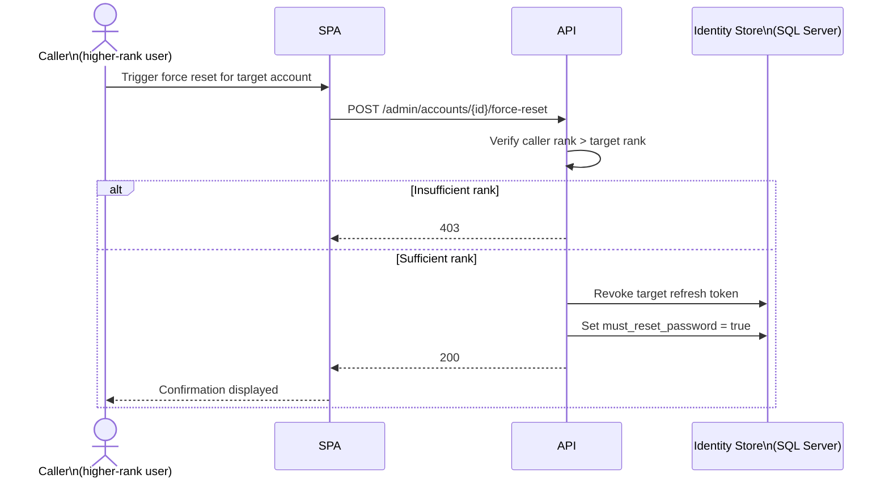
```mermaid
sequenceDiagram
    actor Caller as Caller\n(higher-rank user)
    participant SPA
    participant API
    participant Identity as Identity Store\n(SQL Server)

    Caller->>SPA: Trigger force reset for target account
    SPA->>API: POST /admin/accounts/{id}/force-reset
    API->>API: Verify caller rank > target rank
    alt Insufficient rank
        API-->>SPA: 403
    else Sufficient rank
        API->>Identity: Revoke target refresh token
        API->>Identity: Set must_reset_password = true
        API-->>SPA: 200
        SPA-->>Caller: Confirmation displayed
    end
```

### 5.5 Password reset completion

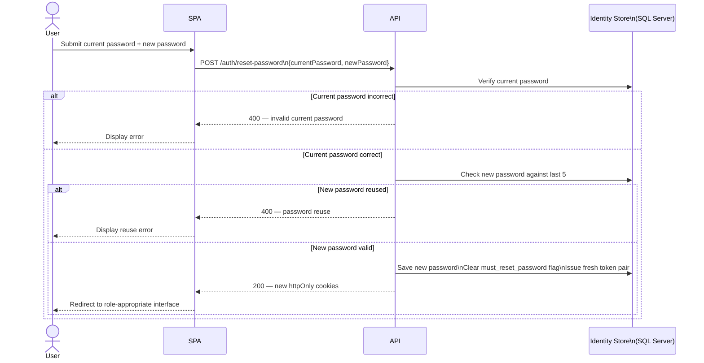
```mermaid
sequenceDiagram
    actor User
    participant SPA
    participant API
    participant Identity as Identity Store\n(SQL Server)

    User->>SPA: Submit current password + new password
    SPA->>API: POST /auth/reset-password\n{currentPassword, newPassword}
    API->>Identity: Verify current password
    alt Current password incorrect
        API-->>SPA: 400 — invalid current password
        SPA-->>User: Display error
    else Current password correct
        API->>Identity: Check new password against last 5
        alt New password reused
            API-->>SPA: 400 — password reuse
            SPA-->>User: Display reuse error
        else New password valid
            API->>Identity: Save new password\nClear must_reset_password flag\nIssue fresh token pair
            API-->>SPA: 200 — new httpOnly cookies
            SPA-->>User: Redirect to role-appropriate interface
        end
    end
```

---

## 6. Interaction Overview Diagram

UML activity diagram referencing the individual sequence diagrams as interaction fragments.
`ref` nodes represent references to named sequence diagrams in this document.

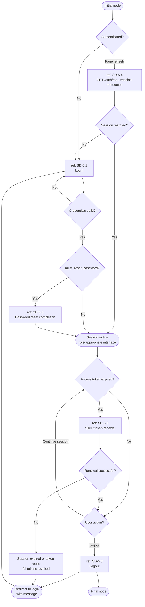
```mermaid
flowchart TD
    START([Initial node])
    START --> VISIT

    VISIT{Authenticated?}
    VISIT -->|No| LOGIN
    VISIT -->|Page refresh| AUTH_ME

    AUTH_ME["ref: SD-5.4
GET /auth/me - session restoration"]
    AUTH_ME --> AUTH_ME_OK{Session restored?}
    AUTH_ME_OK -->|Yes| ACTIVE
    AUTH_ME_OK -->|No| LOGIN

    LOGIN["ref: SD-5.1
Login"]
    LOGIN --> CREDS

    CREDS{Credentials valid?}
    CREDS -->|No| LOGIN
    CREDS -->|Yes| RESET_CHECK

    RESET_CHECK{must_reset_password?}
    RESET_CHECK -->|Yes| RESET
    RESET_CHECK -->|No| ACTIVE

    RESET["ref: SD-5.5
Password reset completion"]
    RESET --> ACTIVE

    ACTIVE([Session active
role-appropriate interface])
    ACTIVE --> TOKEN_CHECK

    TOKEN_CHECK{Access token expired?}
    TOKEN_CHECK -->|Yes| RENEWAL
    TOKEN_CHECK -->|No| ACTION

    RENEWAL["ref: SD-5.2
Silent token renewal"]
    RENEWAL --> RENEWAL_OK

    RENEWAL_OK{Renewal successful?}
    RENEWAL_OK -->|Yes| ACTION
    RENEWAL_OK -->|No| EXPIRED

    ACTION{User action?}
    ACTION -->|Logout| LOGOUT
    ACTION -->|Continue session| TOKEN_CHECK

    LOGOUT["ref: SD-5.3
Logout"]
    LOGOUT --> END_SESSION

    EXPIRED["Session expired or token reuse
All tokens revoked"]
    EXPIRED --> END_SESSION

    END_SESSION([Redirect to login
with message])
    END_SESSION --> LOGIN

    FINAL([Final node])
    LOGOUT --> FINAL
```

---

## Revision History

| Version | Date | Changes |
|---|---|---|
| 1.0 | 2026-08-18 | Document created — V1 authentication flows |
| 1.1 | 2026-08-18 | Login sequence updated — role and mustResetPassword returned in JSON response body alongside httpOnly cookie |
| 1.2 | 2026-08-18 | GET /auth/me flow added (activity + sequence) — session restoration on page refresh, rate limit 3/min/user; login rate limit added (5/min/IP + 5/min/email); interaction overview updated |
