# Design — Event Management Flows

**Reference:** DESIGN-V0-001
**Status:** Validated
**Version:** V1 — User Management & Containerisation
**Date:** 2026-08-18

**Related design documents:**
- [design-authentication.md](design-authentication.md) — authentication flows, token model, session lifecycle

> This document captures the technical flows and architecture diagrams for the Event Management domain.
> It describes how components interact on critical paths.
> For technology choices, see the ADRs referenced in [index.md](../adr/index.md).
> For API contracts, see [api-events.md](../../api/api-events.md).

---

## Target Architecture

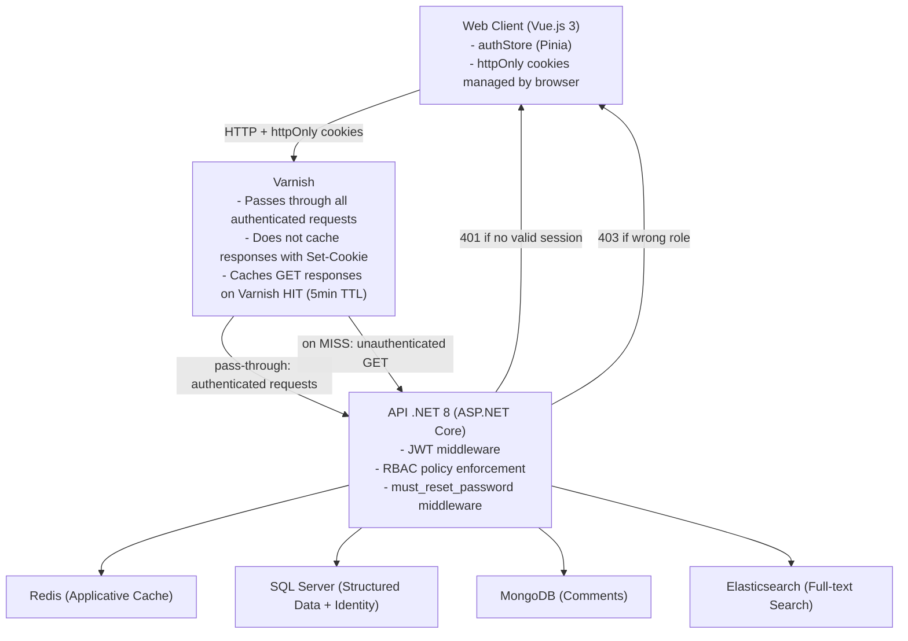

> **V1 authentication note:** All routes are protected behind authentication. Varnish passes through
> all requests carrying authentication cookies — no authenticated response is cached by Varnish.
> GET responses may be cached by Varnish only for unauthenticated requests, which do not exist in V1.
> In practice, Varnish acts as a pass-through for all V1 traffic and caching is handled by Redis only.

---

## Data Flows

### GET /api/events — Paginated event list

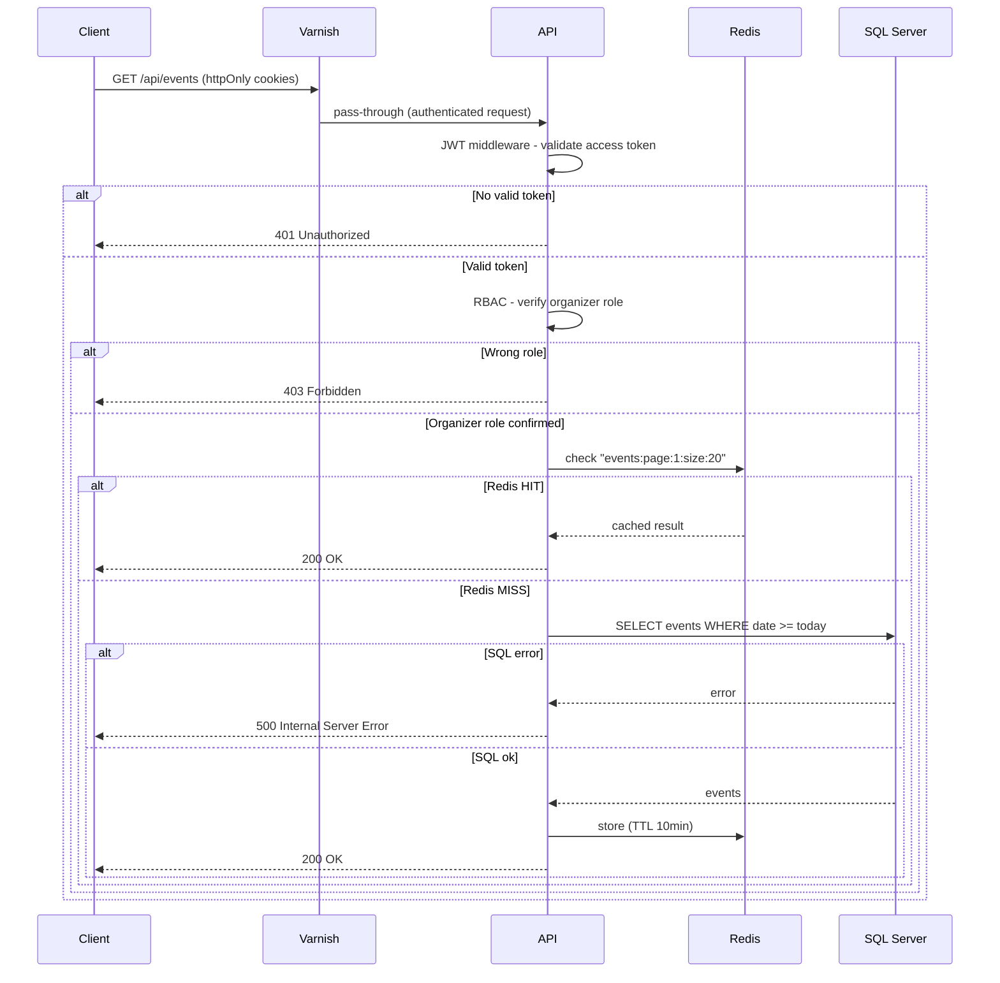

**Design notes:**
- Varnish passes through all authenticated requests — no caching of authenticated responses per VCL rule
- Redis remains the only cache layer for V1 event management traffic
- 401 is returned when no valid session exists — frontend redirects to login via Axios interceptor
- 403 is returned when the role is insufficient — admin and super admin cannot access event management endpoints

---

### GET /api/events/{id} — Event detail

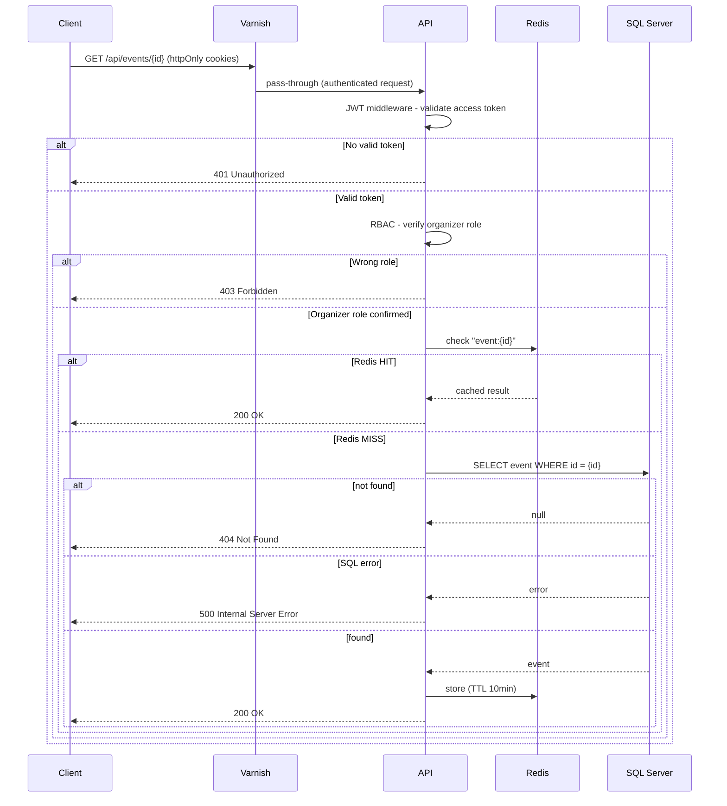

---

### GET /api/events/{id}/full — Event detail with comments

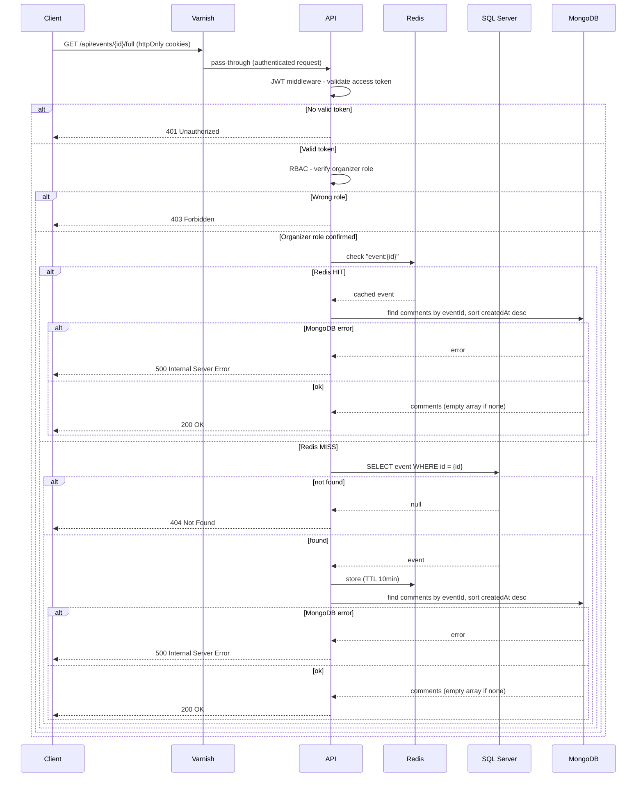

**Design notes:**
- Reuses the same Redis cache-aside path as `GET /api/events/{id}` — the event lookup is never duplicated logic, only extended with a comments fetch
- Comments are never cached — same rationale as `GET /api/events/{id}/comments` (user-generated, expected to be immediately consistent)
- Not served through Varnish — combining live comment data with a cacheable event would make the whole response effectively uncacheable

---

### POST /api/events — Create event

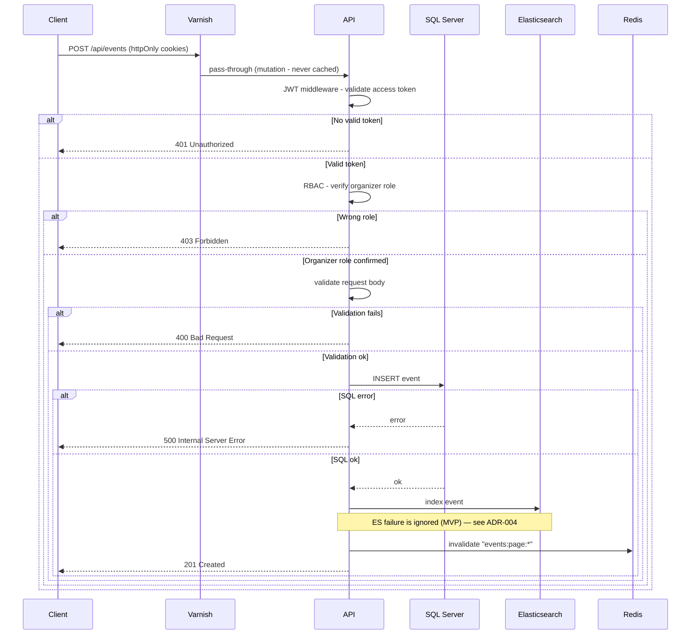

**Design notes:**
- SQL Server is the source of truth — written first
- Elasticsearch is indexed synchronously in the same handler — search results are immediately consistent with the database
- Redis cache is invalidated on write — next GET /api/events will reflect the new event
- If Elasticsearch indexing fails, the event is still created — search may be temporarily inconsistent (accepted for MVP, see ADR-004)

---

### PUT /api/events/{id} — Update event

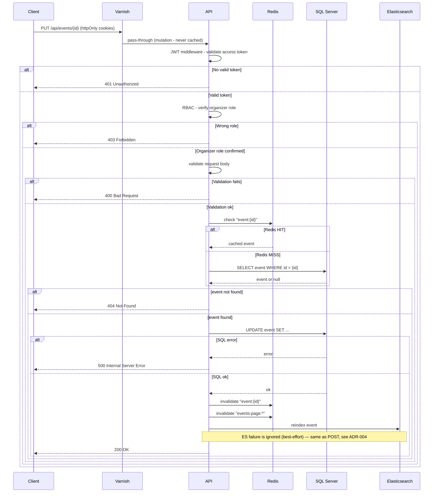

**Design notes:**
- SQL Server is updated first, then Redis is invalidated, then Elasticsearch is reindexed — same ordering as create, source of truth written before derived stores
- Elasticsearch reindexing failure never fails the update — consistent with the create flow's acceptance of temporary search inconsistency (ADR-004)
- Not served through Varnish — mutations bypass the HTTP cache entirely

---

### DELETE /api/events/{id} — Delete event

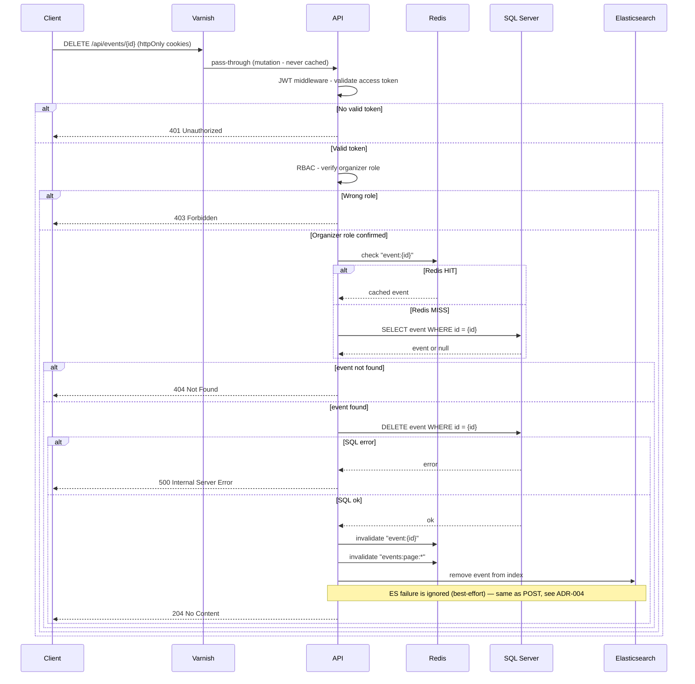

**Design notes:**
- MongoDB comments attached to the deleted event are **not** removed — they become orphaned documents. Accepted as a known gap for the MVP; no cleanup job exists yet.
- Existence check and delete both go through the same cache-aside `CachedEventRepository`, so a stale Redis hit on a concurrently-deleted event is possible but self-heals on the next cache TTL expiry

---

### GET /api/events/search?q={query} — Full-text search

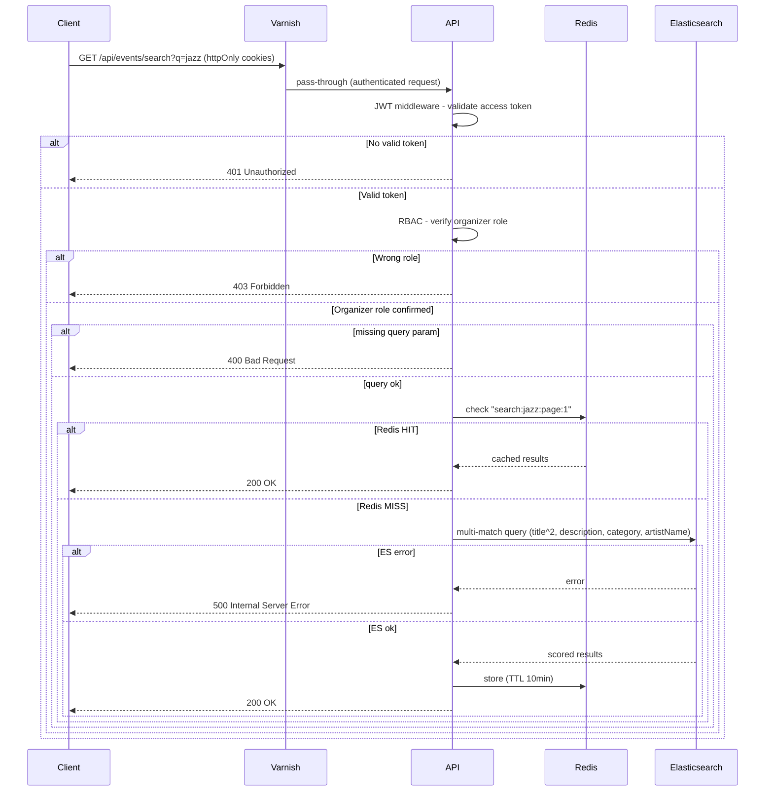

**Design notes:**
- Elasticsearch handles full-text scoring and tokenization — SQL Server `LIKE '%keyword%'` does not provide relevance ranking
- Redis caches frequent search queries — Elasticsearch queries are more expensive than SQL reads

---

### GET /api/events/{id}/comments — Event comments

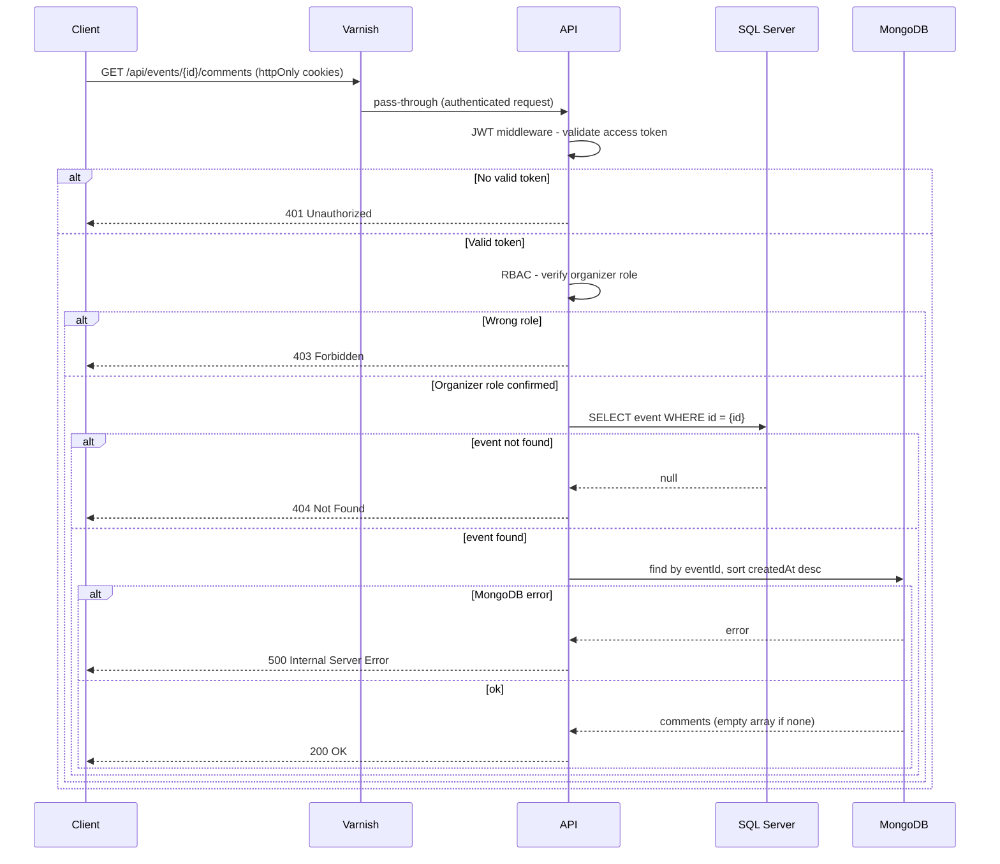

**Design notes:**
- Event existence is verified in SQL Server before querying MongoDB — avoids orphan comment queries
- No cache layer — comments are user-generated, change frequently, and consistency is expected

---

### POST /api/events/{id}/comments — Add comment

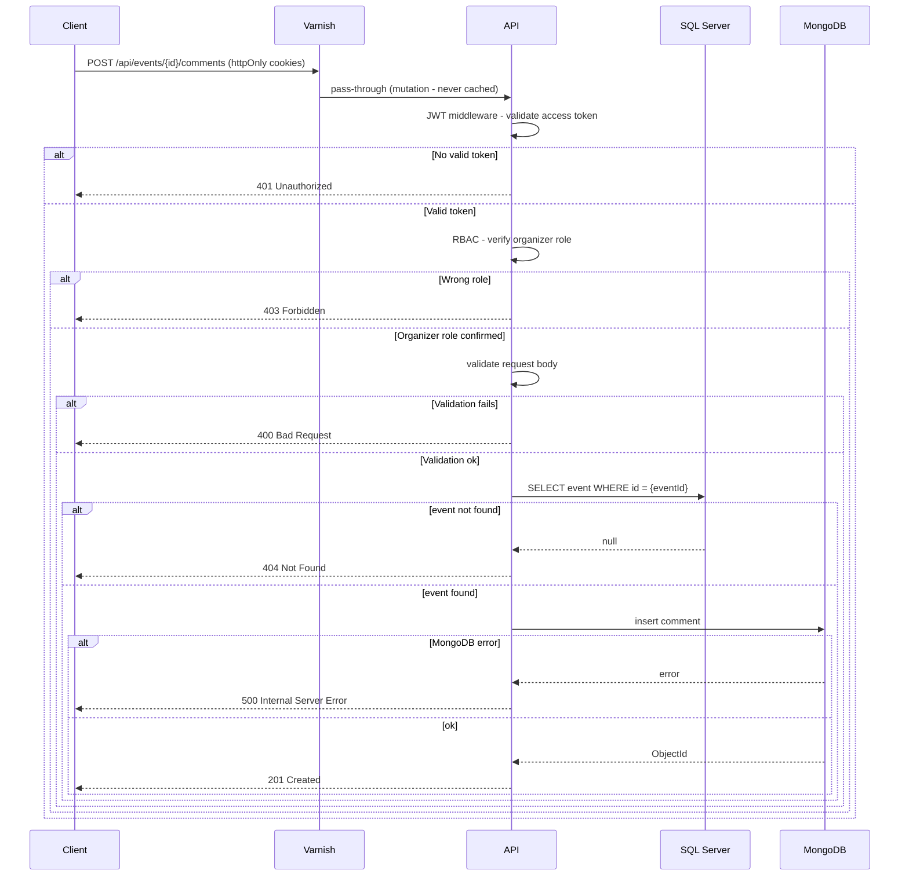

---

### POST /admin/search/reindex — Full search reindex

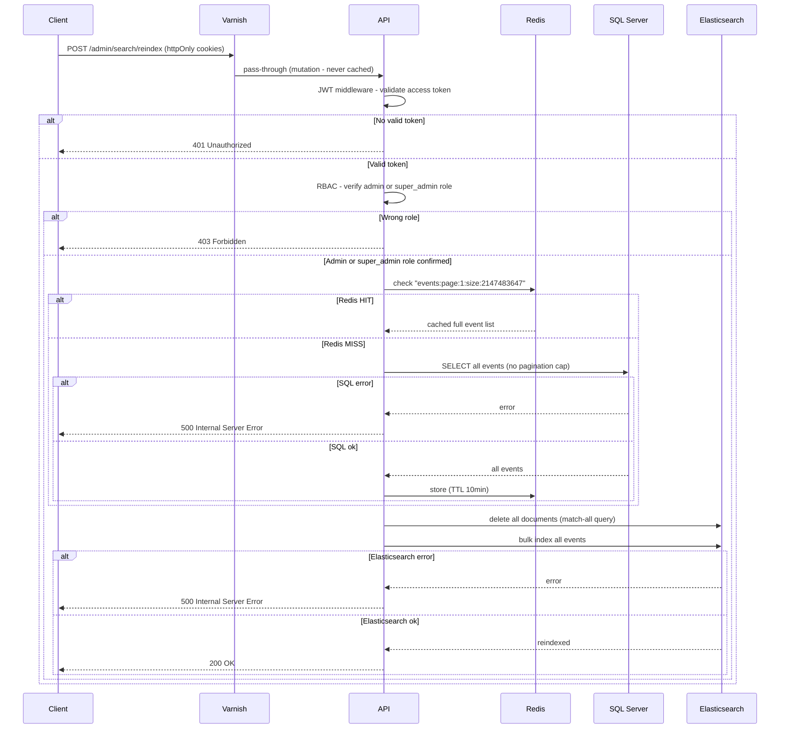

**Design notes:**
- Admin-only maintenance operation — not part of normal request flow. Used when SQL Server and Elasticsearch have diverged (failed incremental index after a mutation, manual DB correction, data migration)
- Rebuilds the index in two Elasticsearch calls: delete-by-query (match-all) followed by a single bulk index, not one request per event
- No error isolation here, unlike create/update/delete: since this endpoint's entire purpose is fixing the search index, an Elasticsearch failure is a real failure and surfaces as 500 rather than being swallowed
- Rate-limited like all other endpoints (`fixed` policy) — 429 if exceeded

---

## Cache Scenarios

### Scenario A — Applicative cache (Redis)

```
1. GET /api/events  →  MISS (~50ms)
2. GET /api/events  →  HIT (~5ms)
3. POST /api/events →  cache invalidated
4. GET /api/events  →  MISS, new event present (~50ms)
5. GET /api/events  →  HIT (~5ms)
```

### Scenario B — HTTP cache (Varnish)

```
1. GET http://localhost:8080/api/events  →  X-Cache: MISS (~50ms)
2. GET http://localhost:8080/api/events  →  X-Cache: HIT (~2ms)
3. Wait 5 minutes (TTL expired)
4. GET http://localhost:8080/api/events  →  X-Cache: MISS (~50ms)
```

### Scenario C — Double cache layer

```
1. GET /api/events (via Varnish)  →  Varnish MISS → Redis MISS → SQL  (~50ms)
2. GET /api/events (via Varnish)  →  Varnish HIT                       (~2ms)
3. POST /api/events (port 5000)   →  SQL + ES + Redis invalidation
4. GET /api/events after 5min     →  Varnish MISS → Redis MISS → SQL  (~50ms)
5. GET /api/events (via Varnish)  →  Varnish HIT                       (~2ms)
```

---

## Revision History

| Version | Date | Changes |
|---|---|---|
| 1.0 | 2026-04-19 | Document created from design.md |
| 1.1 | 2026-08-18 | Added missing flows: GET /api/events/{id}/full, PUT /api/events/{id}, DELETE /api/events/{id}, POST /admin/search/reindex |
| 1.2 | 2026-08-18 | V1 update: all flows updated with authentication (JWT middleware, RBAC), Varnish added consistently as entry point across all flows, POST /admin/search/reindex restricted to admin/super_admin role |
