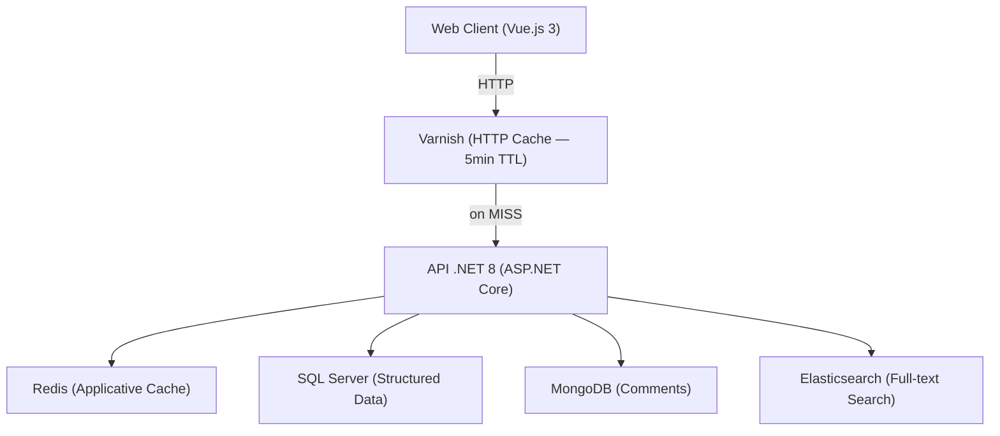
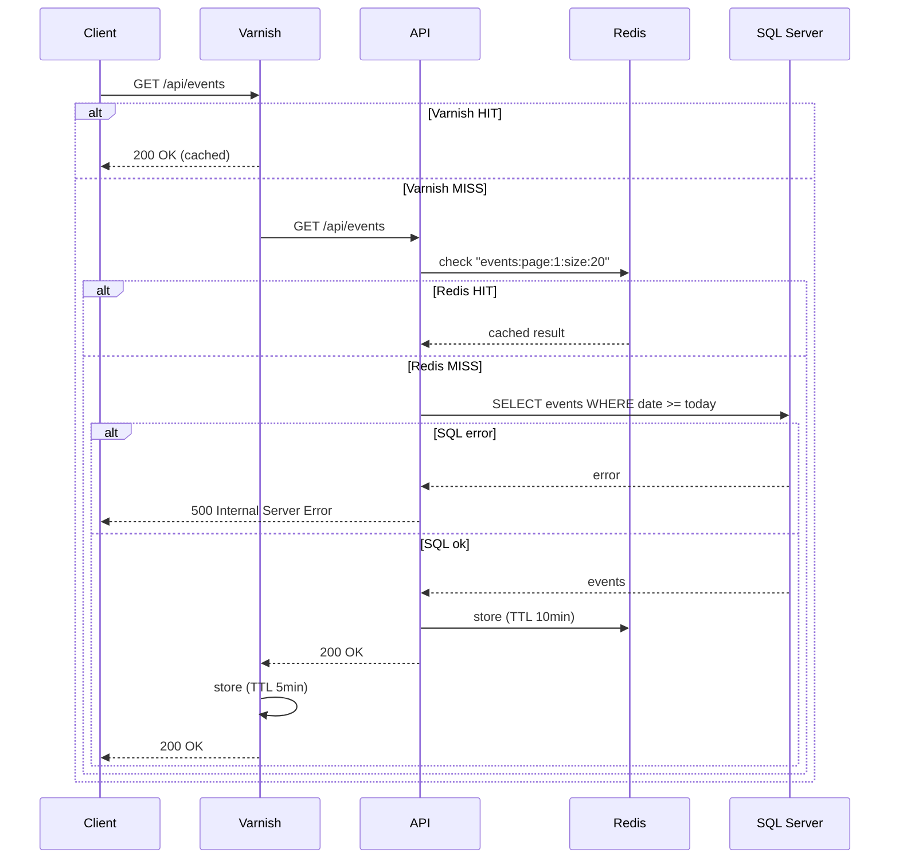
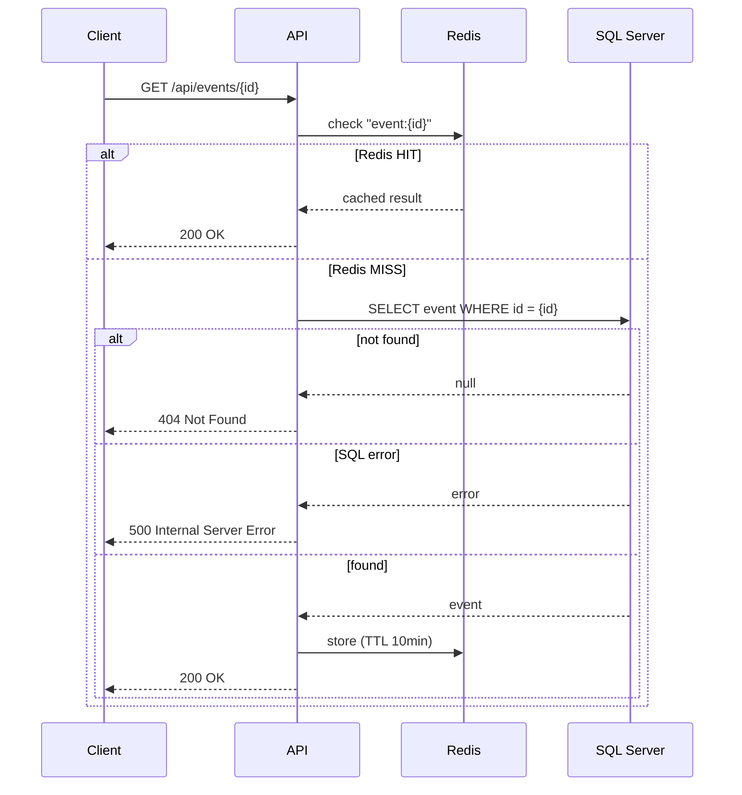
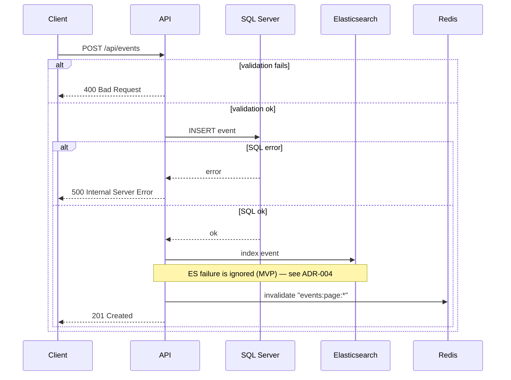
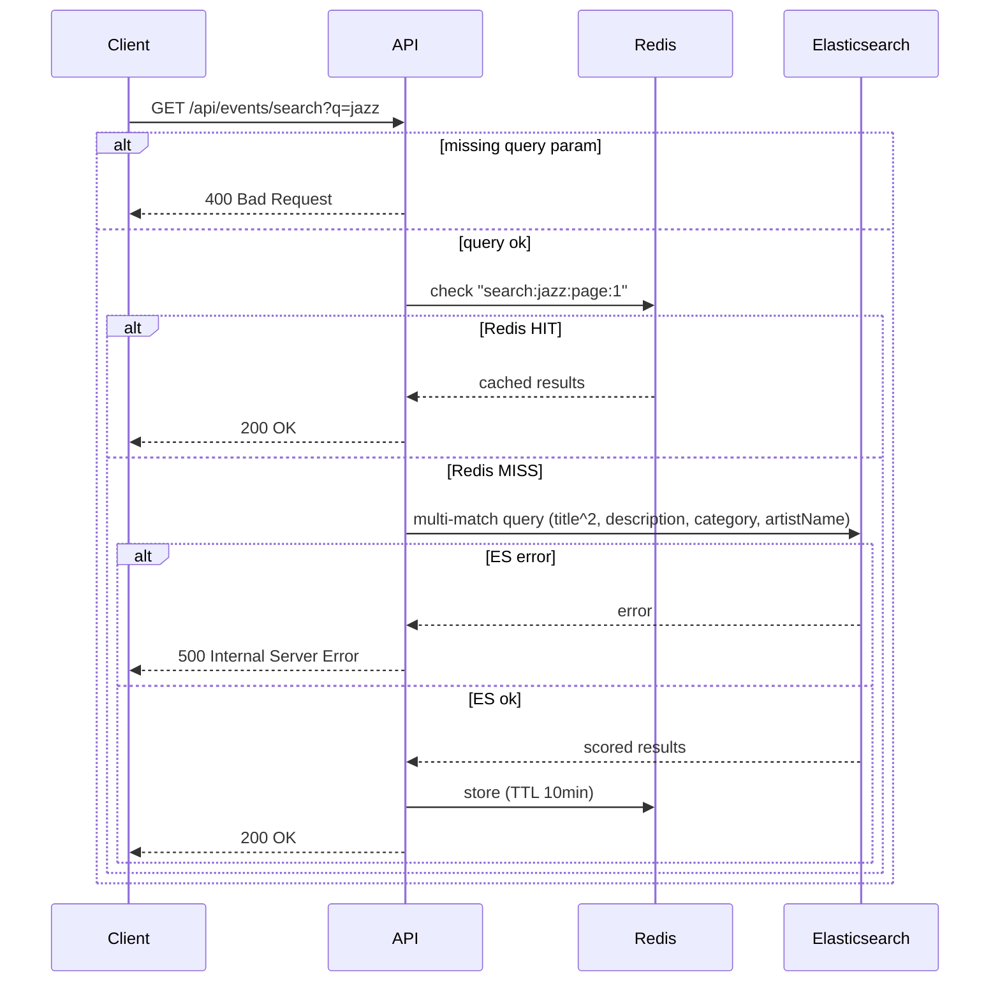
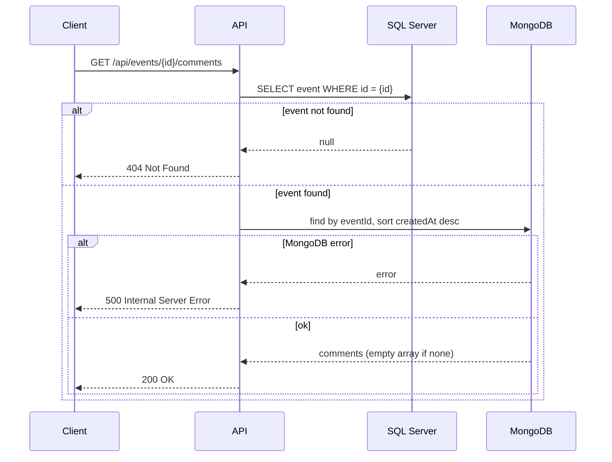
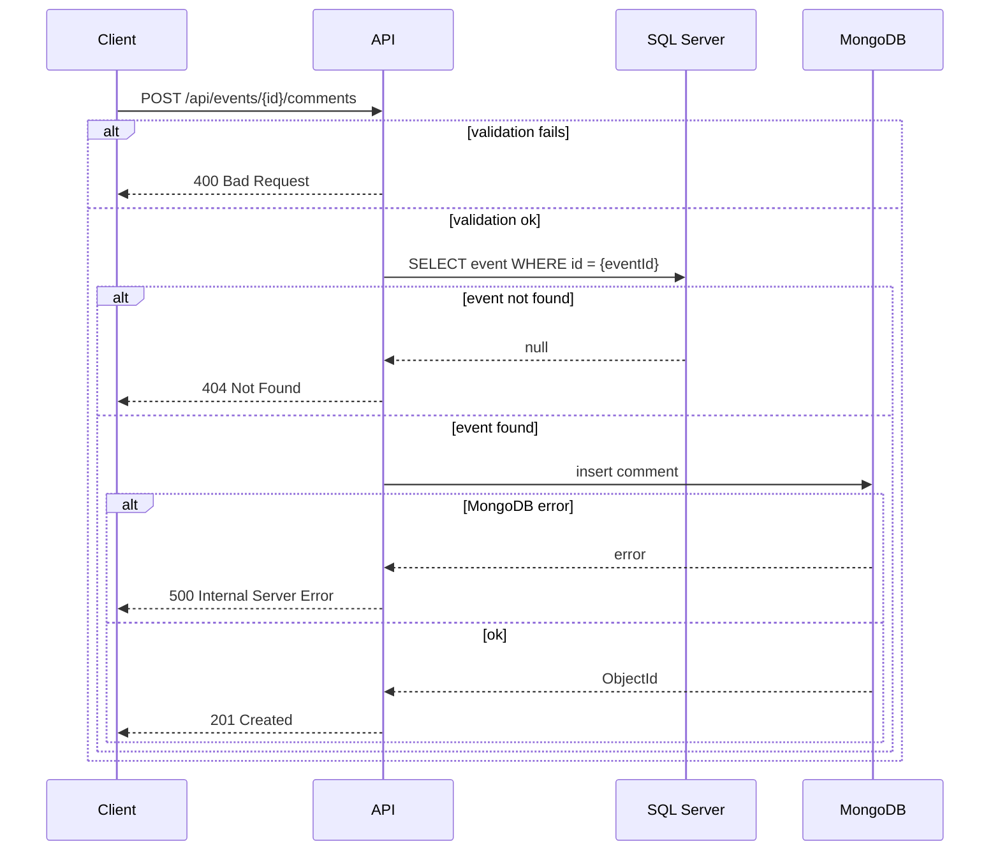

# Design — Event Management Flows

**Reference:** DESIGN-V0-001
**Status:** Validated
**Version:** V0 — POC
**Date:** 2026-04-19

> This document captures the technical flows and architecture diagrams for the Event Management domain.
> It describes how components interact on critical paths.
> For technology choices, see the ADRs referenced in [index.md](../adr/index.md).
> For API contracts, see [api-events.md](../../api/api-events.md).

---

## Target Architecture



---

## Data Flows

### GET /api/events — Paginated event list



**Design notes:**
- Varnish intercepts repeated identical HTTP requests before they reach the API — zero application cost on cache hit
- Redis caches the SQL result as a .NET object — avoids database round-trip on subsequent API calls
- Two cache levels serve different purposes: Varnish absorbs HTTP traffic, Redis absorbs database load

---

### GET /api/events/{id} — Event detail



---

### POST /api/events — Create event



**Design notes:**
- SQL Server is the source of truth — written first
- Elasticsearch is indexed synchronously in the same handler — search results are immediately consistent with the database
- Redis cache is invalidated on write — next GET /api/events will reflect the new event
- If Elasticsearch indexing fails, the event is still created — search may be temporarily inconsistent (accepted for MVP, see ADR-004)

---

### GET /api/events/search?q={query} — Full-text search



**Design notes:**
- Elasticsearch handles full-text scoring and tokenization — SQL Server `LIKE '%keyword%'` does not provide relevance ranking
- Redis caches frequent search queries — Elasticsearch queries are more expensive than SQL reads

---

### GET /api/events/{id}/comments — Event comments



**Design notes:**
- Event existence is verified in SQL Server before querying MongoDB — avoids orphan comment queries
- No cache layer — comments are user-generated, change frequently, and consistency is expected

---

### POST /api/events/{id}/comments — Add comment



---

## Cache Scenarios

### Scenario A — Applicative cache (Redis)

```
1. GET /api/events  →  MISS (~50ms)
2. GET /api/events  →  HIT (~5ms)
3. POST /api/events →  cache invalidated
4. GET /api/events  →  MISS, new event present (~50ms)
5. GET /api/events  →  HIT (~5ms)
```

### Scenario B — HTTP cache (Varnish)

```
1. GET http://localhost:8080/api/events  →  X-Cache: MISS (~50ms)
2. GET http://localhost:8080/api/events  →  X-Cache: HIT (~2ms)
3. Wait 5 minutes (TTL expired)
4. GET http://localhost:8080/api/events  →  X-Cache: MISS (~50ms)
```

### Scenario C — Double cache layer

```
1. GET /api/events (via Varnish)  →  Varnish MISS → Redis MISS → SQL  (~50ms)
2. GET /api/events (via Varnish)  →  Varnish HIT                       (~2ms)
3. POST /api/events (port 5000)   →  SQL + ES + Redis invalidation
4. GET /api/events after 5min     →  Varnish MISS → Redis MISS → SQL  (~50ms)
5. GET /api/events (via Varnish)  →  Varnish HIT                       (~2ms)
```

---

## Revision History

| Version | Date | Changes |
|---|---|---|
| 1.0 | 2026-04-19 | Document created from design.md |
