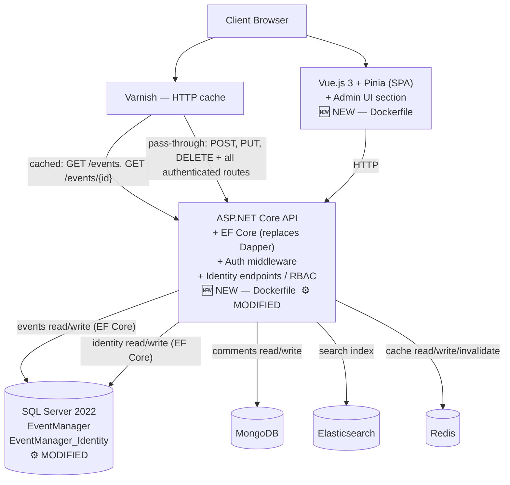

# Technical Architecture Document — EventManager

**Reference:** tad-eventmanager
**Status:** `Validated`
**Version:** V1 — User Management & Containerisation
**Date:** 10/08/2026

---

## Purpose and Scope

The Technical Architecture Document (TAD) is the architectural reference for the EventManager system. It is a single living document, updated at each version. It combines two reading levels:

- **System view** — description of the global architecture, components, their interactions, and structural technology choices. This view is stable between versions.
- **Version view** — description of architecture decisions specific to each version, their justifications, and accepted limitations. This view grows with each version.

> **Rules**
> - This document does not replace ADRs (Architecture Decision Records). ADRs trace each decision individually. The TAD synthesizes them into a coherent view.
> - Any architectural decision not documented here or in an ADR is considered unvalidated.
> - Previous version sections are immutable. Never modify a past version's section — add a new one.

---

## Part 1 — System View

*This section describes the overall system architecture as established at V1. It is updated only when a structural change is introduced.*

### 1.1 Context and Objectives

EventManager is a platform for cultural event management. Organizers create and manage events. The system is a modular monolith — a single deployable API backend and a separate frontend application.

V1 is the first production release. It establishes two foundations: a containerised runtime and an authentication and authorisation layer. The existing POC handled event management without any user concept — all routes were open. V1 closes that gap.

**Target scale (source: functional-overview.md):**

| Indicator | Value |
|---|---|
| Active organizers | 50–100 |
| Events per year | 500–1,000 |
| Comments per year | 5,000–10,000 |

No formal SLA or response time target is defined for V1. Baseline metrics will be established from production observation.

### 1.2 Component Overview

```
┌──────────────────────────┐
│      Client Browser      │
└────────────┬─────────────┘
             │ HTTP
             ▼
┌──────────────────────────┐
│   Varnish (HTTP Cache)   │
└────────────┬─────────────┘
             │ HTTP
      ┌──────┴──────┐
      ▼             ▼
┌───────────┐  ┌─────────────────┐
│ Vue.js 3  │  │ ASP.NET Core    │
│ SPA       │─▶│ API             │
└───────────┘  └──┬──┬──┬──┬────┘
                  │  │  │  │
          ┌───────┘  │  │  └────────┐
          ▼          │  │           ▼
┌──────────────┐     │  │  ┌──────────────┐
│  SQL Server  │     │  │  │     Redis    │
│  2022        │     │  │  │    (Cache)   │
│  EventMgr    │     │  │  └──────────────┘
│  EventMgr_   │     │  │
│  Identity    │     │  └────────────┐
└──────────────┘     │               ▼
                     │      ┌──────────────┐
                     │      │ Elasticsearch│
                     │      │   (Search)   │
                     │      └──────────────┘
                     ▼
              ┌──────────────┐
              │   MongoDB    │
              │  (Comments)  │
              └──────────────┘
```

| Component | Role | Technology |
|---|---|---|
| Vue.js SPA | UI — event management and administration | Vue.js 3, Vite, Pinia |
| ASP.NET Core API | Business logic, REST endpoints, auth | .NET 8, EF Core, FluentValidation, Serilog |
| SQL Server 2022 | Structured persistence — events and identity | SQL Server 2022 (two databases) |
| MongoDB | Document persistence — comments | MongoDB |
| Redis | Application cache (read-aside, TTL 10 min) | Redis |
| Elasticsearch | Full-text search — title, description, category, artist | Elasticsearch |
| Varnish | HTTP response cache upstream of the API | Varnish |

### 1.3 Business Domains and Ownership

Each business domain is isolated behind an interface. No business code depends directly on an infrastructure implementation (Clean Architecture, three layers, inward dependencies).

| Domain | Owner | Status |
|---|---|---|
| Event | Organizer | Active — routes protected in V1 |

### 1.4 Structural Architectural Principles

These principles apply to all versions without exception. Any waiver must be documented in an ADR.

| Principle | Description |
|---|---|
| ISO dev/prod | Same Docker image locally and in production. No environment-specific code paths. |
| Abstraction | Technology choices are isolated behind interfaces. Business code does not depend on infrastructure implementations. |
| Error handling | Every unhandled exception produces a unique, traceable error identifier. |
| Security | All endpoints are protected by RBAC. Public read endpoints are the explicit exception and must be explicitly scoped per version. |
| Secrets | No secret is hardcoded. Secrets are injected via environment variables at container startup. |

### 1.5 Technology Stack — Reference

| Layer | Technology | Version | Reference ADR |
|---|---|---|---|
| Backend framework | ASP.NET Core | 8.0 (LTS) | POC baseline |
| Data access — SQL Server | Microsoft.EntityFrameworkCore.SqlServer | 8.0.0 | ADR-018 |
| Data access — MongoDB | MongoDB.Driver | 3.8.0 | POC baseline |
| Data access — Redis | StackExchange.Redis | 2.12.14 | POC baseline |
| Data access — Elasticsearch | Elastic.Clients.Elasticsearch | 9.3.5 | POC baseline |
| Validation | FluentValidation.AspNetCore | 11.3.1 | POC baseline |
| Logging | Serilog.AspNetCore | 10.0.0 | POC baseline |
| DI / assembly scan | Scrutor | 5.0.0 | POC baseline |
| API documentation | Swashbuckle.AspNetCore | 10.1.7 | POC baseline |
| Frontend framework | Vue.js | 3.3.8 | POC baseline |
| Frontend routing | vue-router | 4.2.5 | POC baseline |
| Frontend build | Vite | 5.0.0 | POC baseline |
| State management | Pinia | 2.1.7 | POC baseline |
| Structured persistence | SQL Server | 2022-latest (Docker image) | POC baseline |
| Document persistence | MongoDB | 7 (Docker image) | POC baseline |
| Application cache | Redis | 7-alpine (Docker image) | POC baseline |
| Full-text search | Elasticsearch | 8.11.0 (Docker image) | POC baseline |
| HTTP cache | Varnish | 7 (Docker image) | POC baseline |
| Containerisation | Docker / Docker Compose | — | ADR-013 |
| Authentication | ASP.NET Core Identity + JWT | .NET 8 built-in | ADR-014 |

> **Note on POC baselines:** The POC stack was established without formal ADRs. All POC technology choices are accepted as-is for V1, with the exception of Dapper which is superseded by EF Core (ADR-018). Any future revision of a baseline technology must produce a superseding ADR.

---

## Part 2 — Version View

---

### Version 1 — User Management & Containerisation

**Based on:** EventManager POC (functional, not yet in production)
**Scoping note:** Scoping Note V1 — User Management & Containerisation
**Status:** `Validated`

#### 1.1 Architectural Scope of the Version

V1 introduces three architectural changes to the POC:

**Containerisation of the full runtime.**
SQL Server, MongoDB, Redis, Elasticsearch, and Varnish are already containerised in the POC. V1 completes the picture by adding a Dockerfile for the API and the frontend, then orchestrating all services via Docker Compose. A single `docker compose up` starts the entire system locally, using the same images as production. The `sql-init` service is removed — schema initialisation for both databases is handled by EF Core migrations applied at API startup (see ADR-018).

**Migration from Dapper to Entity Framework Core.**
Dapper is replaced by EF Core as the single data access layer across the entire codebase. This decision was made at V1, before first production deployment, to establish a consistent data access paradigm suited to the growing domain complexity ahead. Two independent `DbContext` instances are introduced: `EventManagerDbContext` and `IdentityDbContext` (see ADR-018).

**Authentication and authorisation layer.**
The POC had no user concept — all routes were open. V1 introduces ASP.NET Core Identity backed by SQL Server, with JWT access tokens and refresh tokens issued on login, both stored as httpOnly cookies. All existing API routes are protected. A role hierarchy (Super Admin → Admin → Organizer) is enforced via claims-based RBAC. A dedicated administration section is added to the existing frontend. Refresh tokens are rotated on every use (see ADR-014).

No new infrastructure component is added. Authentication state is persisted in a dedicated database on the existing SQL Server instance.

#### 1.2 Architecture Decisions (ADRs)

| ADR Reference | Subject | Decision retained |
|---|---|---|
| ADR-013 | Containerisation strategy | Docker + Docker Compose, one service per component, same image dev/prod. Updated by ADR-018: `sql-init` removed, startup sequence revised. |
| ADR-014 | Authentication mechanism | ASP.NET Core Identity + JWT (httpOnly cookies), refresh token rotation, `must_reset_password` claim enforced by middleware |
| ADR-015 | Identity schema isolation | Separate database on the existing SQL Server instance |
| ADR-016 | Authorisation model | Claims-based RBAC, ASP.NET Core policy-based authorisation |
| ADR-017 | First Super Admin provisioning | Idempotent seed at API startup via environment variables |
| ADR-018 | Migration from Dapper to EF Core | EF Core replaces Dapper as the single data access layer. `sql-init` removed. Supersedes POC baseline. |

#### 1.3 Version Architecture Diagram

`[NEW]` = Dockerfile created in V1. `[MODIFIED]` = existing service, modified in V1. Services without tag = already containerised, unchanged.



#### 1.4 Known Limitations and Accepted Technical Debt

| Limitation | Accepted impact | Target resolution version |
|---|---|---|
| SQL Server is a shared container for event data and identity | A container-level failure affects both databases simultaneously. Acceptable at current volume. | TBD |
| Secrets injected via environment variables (Docker Compose env file) | The env file must not be committed to version control. No encryption at rest. Acceptable for a first internal production release. | TBD |
| No rate limiting on the login endpoint | The login route is not rate-limited. Low risk for a closed user population. | TBD |
| Docker Compose is a single-node orchestrator | No multi-node deployment support. Acceptable for current volume. | TBD |
| Residual access window on account deactivation | A deactivated account retains API access for up to 10 minutes (access token TTL). Refresh token is revoked immediately. | TBD |
| EF Core abstraction over raw SQL | For complex queries, `FromSqlRaw` remains available. Performance characteristics to be assessed under load on high-frequency read paths. | TBD |

#### 1.5 Scalability Assessment

| Component / Decision | Current volume | x100 volume |
|---|---|---|
| ASP.NET Core API — single container | No issue at ~200 concurrent users. | Horizontal scaling requires a load balancer. JWT is stateless — compatible with horizontal scaling. |
| EF Core — two DbContexts, SQL Server | Fully adequate. Change tracking and query composition suit the current domain complexity. | Connection pool management to be reviewed. Raw SQL via `FromSqlRaw` available for hot paths if needed. |
| SQL Server — two databases, one container | Fully adequate. | Shared container becomes a contention point. Physical separation required. |
| Redis — read-aside, TTL 10 min | Effective. Reduces SQL Server read load significantly. | Redis scales well. Cache invalidation strategy to be reviewed if write volume increases. |
| Elasticsearch — 500–1,000 events/year | Fully adequate. | Index and shard strategy to be revisited at significantly higher document volume. |
| Varnish — HTTP cache | Effective for unauthenticated reads. Authenticated routes and mutating requests pass through correctly. | Single point of failure. Redundancy required at scale. |
| Docker Compose — single node | Appropriate for V1. | Migration to a multi-node orchestrator required. |

#### 1.6 Architectural Validation Checklist

| Criterion | Owner | ✓ |
|---|---|---|
| The proposed architecture covers the scoping note perimeter | CTO | ✓ |
| Every new service is containerizable | CTO | ✓ |
| The environment is ISO dev/prod | CTO | ✓ |
| Known limitations are documented | CTO | ✓ |
| Scalability impact is assessed (current volume + x100) | CTO | ✓ |
| Cloud service cost is estimated if applicable | CTO | ✓ |
| Corresponding ADRs are written and referenced | CTO | ✓ |

> Cloud cost: not applicable. V1 is a single-node Docker Compose deployment. No cloud services are introduced.

---

## Part 3 — ADRs

---

# ADR-013: Containerisation strategy

## Status
Accepted — updated by ADR-018

## Context

The POC already containerises SQL Server, MongoDB, Redis, Elasticsearch, and Varnish via official images, with health checks declared on each service. The API and frontend run as bare processes — there is no single-command startup and no guarantee that the local configuration matches a production deployment. The V1 acceptance criteria require a single-command startup via containers, with identical images locally and in production.

The API (ASP.NET Core) and the frontend (Vue.js 3 / Vite) have no official Docker image — they require a Dockerfile authored and maintained in the repository.

## Options considered

**Option A — Docker + Docker Compose**
Standard multi-container local orchestration. One service per component. Same images in dev and prod. Well-supported by the .NET and Vue.js ecosystems.
Disadvantages: single-node orchestrator only.

**Option B — Kubernetes (kind / minikube locally)**
Production-grade multi-node orchestration.
Disadvantages: significant operational overhead unjustified at current scale and team size; steep learning curve for a first production release.

**Option C — Bare Docker without Compose**
Possible, but requires manual container networking and startup ordering. No benefit over Compose at this scale.

## Decision

Docker + Docker Compose. One service per runtime component. A shared base `docker-compose.yml`, with `docker-compose.override.yml` for dev-specific settings (volume mounts, exposed ports) and `docker-compose.prod.yml` for production overrides. Infrastructure components use official images. The API and frontend each have a dedicated Dockerfile in the repository.

**Health checks and startup order.**
Health checks are declared on all infrastructure services in `docker-compose.yml` (SQL Server, Redis, MongoDB, Elasticsearch). They guarantee that `docker compose ps` reflects genuine service readiness, not merely process startup.

Following ADR-018, the `sql-init` service is removed. Schema initialisation for both databases (`EventManager` and `EventManager_Identity`) is handled by EF Core migrations applied at API startup. The `api` service declares the following dependencies:

```yaml
api:
  depends_on:
    sqlserver:
      condition: service_healthy
    redis:
      condition: service_healthy
```

**API startup sequence (updated by ADR-018):**

```
SQL Server healthy
  → API starts
    → Migrate() — EventManager
    → Migrate() — EventManager_Identity
      → Idempotent seed (ADR-017)
        → API serves requests
```

## Consequences

ISO dev/prod compliance: identical images in both environments. Operational overhead is proportionate to team size and current volume. Single-command startup is reliable — no race conditions on cold start. Topology is simplified: `sql-init` removed, schema ownership consolidated in the API.

## Accepted limitations

Docker Compose supports single-node deployment only.

---

# ADR-014: Authentication mechanism

## Status
Accepted

## Context

The POC has no authentication. All API routes are open. V1 requires that all routes be protected and that three roles be enforced: Super Admin, Admin, and Organizer. No new infrastructure component should be introduced for this purpose.

A token strategy must also address account deactivation: an admin must be able to deactivate an account with immediate practical effect. A fully stateless JWT approach with a long TTL is incompatible with this requirement.

Token storage must also be decided. The frontend is a Vue.js 3 SPA. The deployment topology for V1 is a single-node Docker Compose instance, with SPA and API exposed under the same base domain via a reverse proxy. CORS is already configured between the SPA and the API.

Additionally, a `must_reset_password` flag is required for provisioned accounts (ADR-017). Its enforcement mechanism must be defined.

## Options considered

**Option A — ASP.NET Core Identity + JWT (short TTL) + refresh token, tokens in httpOnly cookies**
Access token with a short TTL (10 min), emitted as an httpOnly; Secure; SameSite=Strict cookie. Refresh token with a session-duration TTL (8h), also emitted as an httpOnly; Secure; SameSite=Strict cookie, stored in the identity database and revocable. On account deactivation, the refresh token is deleted — the access token remains valid until natural expiry (max 10 min). The frontend never reads or writes tokens — the browser handles cookies automatically.
Disadvantages: requires a refresh token endpoint and database storage for refresh tokens. SameSite=Strict validity is tied to the single-domain topology — must be revisited if the topology evolves toward distinct domains.

**Option B — ASP.NET Core Identity + JWT, tokens in localStorage**
Simple implementation.
Disadvantages: tokens are accessible to JavaScript — exposed to XSS exfiltration. Rejected: the httpOnly cookie option is available without architectural overhead given the existing CORS configuration and single-domain topology.

**Option C — JWT + token whitelist (stateful)**
Every request checks the token against a whitelist (Redis). Covers both account deactivation and compromised token scenarios.
Disadvantages: introduces a synchronous read on every request; whitelist management complexity; unjustified at current scale and user population.

**Option D — Keycloak / managed cloud IdP**
Disadvantages: new infrastructure component, operational overhead not justified by V1 scope.

## Decision

Option A: ASP.NET Core Identity backed by SQL Server, with JWT access tokens (TTL 10 min) and refresh tokens (TTL 8h), both stored as httpOnly; Secure; SameSite=Strict cookies.

**Access token TTL:** 10 minutes. Silently refreshed by the client before expiry — no visible re-authentication for the user.

**Refresh token TTL:** 8 hours (working session duration). Stored in `EventManager_Identity`, one active refresh token per user.

**Refresh token rotation:** refresh tokens are rotated on every use. On each successful token refresh, a new refresh token is issued and the previous one is immediately invalidated. If a refresh request presents an already-rotated token (reuse detection), the entire session is invalidated and the user is forced to re-authenticate. This is the primary defence against refresh token theft.

**On account deactivation:** the refresh token cookie is invalidated immediately server-side. The current access token remains valid until its natural expiry (max 10 min) — this residual window is the accepted limitation.

**On logout:** the refresh token is deleted server-side and both cookies are cleared.

**`must_reset_password` enforcement:** the flag is included as a boolean claim in the JWT at token issuance. A middleware checks for this claim on every authenticated request. If present and true, the middleware returns `403` with a specific error code (`PASSWORD_RESET_REQUIRED`). The frontend intercepts this code and redirects to the password reset screen. On successful password change, the flag is cleared server-side and a fresh token pair is issued without the claim. Reading a claim from an already-parsed token is a memory operation — no additional I/O per request.

**SameSite=Strict validity:** guaranteed by the single-node Docker Compose topology with SPA and API under the same base domain.

**Varnish interaction:** Varnish must not cache any response carrying a `Set-Cookie` header. All authenticated routes pass through to the API without caching. This is standard Varnish behaviour and must be verified in the Varnish VCL configuration before V1 goes to production.

## Consequences

No new infrastructure component. Tokens are never accessible to JavaScript — XSS cannot exfiltrate credentials. Refresh tokens are persisted in the existing SQL Server identity database. Account deactivation has practical effect within 10 minutes. Refresh token rotation provides detection and containment of stolen tokens.

## Accepted limitations

- A deactivated account retains API access for up to 10 minutes (residual access token window). Consciously accepted: the window is bounded, predictable, and proportionate to the internal user population.
- SameSite=Strict is valid for the V1 single-domain topology. If the deployment topology evolves toward distinct domains, this decision must be revisited.

---

# ADR-015: Identity schema isolation

## Status
Accepted

## Context

ASP.NET Core Identity requires a SQL Server persistence store. The system already runs a SQL Server instance for event data (managed by EF Core — see ADR-018). The placement of identity tables relative to event data must be decided.

## Options considered

**Option A — Same database as events (EventManager)**
Zero additional configuration.
Disadvantages: identity and event schema share the same migration surface; a schema change on one side risks the other.

**Option B — Separate database on the same SQL Server instance**
Identity in `EventManager_Identity`, events in `EventManager`. Logical isolation, no new container, minimal configuration overhead.

**Option C — Separate SQL Server container**
Full physical isolation.
Disadvantages: additional container, additional resource consumption, unjustified at current scale.

## Decision

Two distinct databases on the same SQL Server container: `EventManager` (events) and `EventManager_Identity` (identity). Each has its own EF Core `DbContext`, its own connection string, and an independent migration surface.

## Consequences

Identity and event schema migrations are independent. Operational cost is zero — same container, two connection strings, two `DbContext` instances managed by EF Core.

## Accepted limitations

Both databases share the same SQL Server container. A container-level failure affects both simultaneously. Acceptable at current scale.

---

# ADR-016: Authorisation model

## Status
Accepted

## Context

V1 introduces three roles with strictly separated access perimeters: Super Admin and Admin access the administration interface only; Organizers access event management features only. No role has access to both perimeters. All API routes must be protected.

## Options considered

**Option A — ASP.NET Core policy-based authorisation with claims**
Roles stored as JWT claims. Named policies declared at startup (`Program.cs`), applied via `[Authorize(Policy = "...")]` attributes. Standard .NET approach, auditable, zero additional dependency.

**Option B — Custom middleware**
Bespoke role-checking logic per route. Disadvantages: reinvents the framework; harder to audit; risk of inconsistent enforcement across controllers.

**Option C — External policy engine (OPA)**
Unjustified at this role count and scale.

## Decision

ASP.NET Core claims-based identity with named policy-based authorisation. Role is a claim in the JWT. Policies are declared at startup and applied declaratively via attributes.

## Consequences

Consistent, auditable enforcement across all controllers. Policy changes require redeployment — acceptable for a static role set.

## Accepted limitations

No resource-level authorisation (e.g. an organizer restricted to their own events). Not required by the V1 scoping note.

---

# ADR-017: First Super Admin provisioning

## Status
Accepted

## Context

There is no self-registration. The first Super Admin must exist before anyone can use the administration interface. This is a bootstrapping problem that must be solved at deployment time, without manual database intervention, and reproducibly across environments.

## Options considered

**Option A — Idempotent seed at API startup via environment variables**
The API reads `SEED_ADMIN_EMAIL` and `SEED_ADMIN_PASSWORD` at startup. If no Super Admin exists, it creates one and sets `must_reset_password = true`. If one already exists, the seed is skipped. Credentials are injected via Docker Compose env file, never hardcoded.
Disadvantages: initial password exists in plaintext in the env file.

**Option B — Separate CLI seed command**
A dedicated `dotnet run --seed` invocation after deployment.
Disadvantages: manual step, error-prone, not reproducible.

**Option C — Manual SQL insert**
Fragile, not reproducible, violates the abstraction principle.

## Decision

Option A: idempotent seed at API startup. Environment variables: `SEED_ADMIN_EMAIL` and `SEED_ADMIN_PASSWORD`. The provisioned account carries `must_reset_password = true`. Enforcement of this flag is defined in ADR-014.

The seed runs after EF Core migrations have completed, guaranteeing the identity schema is in place before the insert is attempted.

## Consequences

Zero manual steps at deployment. Fully reproducible across environments. The env file containing seed credentials must not be committed to version control (`.gitignore`).

## Accepted limitations

The seed password is in plaintext in the env file at rest on the server. Acceptable for a first internal production release.

---

# ADR-018: Migration from Dapper to Entity Framework Core

## Status
Accepted

## Context

The POC established Dapper as the data access layer, justified by ease of use and a short functional perimeter limited to event management. The justification was valid at POC stage.

V1 introduces ASP.NET Core Identity, which integrates natively with EF Core via `Microsoft.AspNetCore.Identity.EntityFrameworkCore`. Implementing Identity against a custom Dapper-based `IUserStore` / `IRoleStore` would require significant boilerplate for marginal benefit, and would result in two competing data access paradigms in the same codebase — an architectural inconsistency with no long-term justification.

Additionally, the domain complexity ahead (reservations, artists, venues, cancellation workflows, status machines) makes EF Core's migration management, change tracking, and query composition increasingly valuable as the schema evolves. Dapper's friction grows with schema complexity and relationship density.

V1 is the last moment before first production deployment — the lowest-risk window to make a stack-level change cleanly.

## Options considered

**Option A — EF Core for Identity only, Dapper for events**
Minimal change. Identity uses the standard EF Core integration; event data access remains on Dapper.
Disadvantages: two ORM paradigms permanently coexist in the codebase. Inconsistent patterns across domains. The problem is deferred, not solved.

**Option B — Full migration to EF Core**
EF Core replaces Dapper as the single data access layer across all domains. Identity uses `Microsoft.AspNetCore.Identity.EntityFrameworkCore`. The event schema migrates to EF Core migrations. Dapper is removed from the stack entirely.
Disadvantages: migration effort on the existing event schema. Accepted: the codebase is pre-production, the event schema is small, and the effort is proportionate.

**Option C — Retain Dapper, custom Identity store**
Implement `IUserStore` and `IRoleStore` manually against Dapper. Maintains stack consistency without introducing EF Core.
Disadvantages: significant boilerplate, no framework support, high maintenance surface for a solved problem. Rejected.

## Decision

Option B: full migration to EF Core. Dapper is removed from the stack. EF Core becomes the single data access layer for all domains.

- Two `DbContext` instances: `EventManagerDbContext` (`EventManager` database) and `IdentityDbContext` (`EventManager_Identity` database), each with its own connection string and independent migration surface — consistent with ADR-015.
- Identity uses `Microsoft.AspNetCore.Identity.EntityFrameworkCore` — no custom store implementation required.
- The `sql-init` service is removed. Schema initialisation for both databases is handled by EF Core migrations applied at API startup via `Migrate()`.
- Both `Migrate()` calls execute at startup before the idempotent seed (ADR-017) and before the API begins serving requests.

**Startup sequence:**
```
SQL Server healthy
  → API starts
    → Migrate() — EventManager
    → Migrate() — EventManager_Identity
      → Idempotent seed (ADR-017)
        → API serves requests
```

**Impact on ADR-013:** `sql-init` service removed from Docker Compose. The `api` service `depends_on` is updated to retain `sqlserver: service_healthy` and remove the `sql-init` dependency.

## Consequences

- Single data access paradigm across the entire codebase.
- `sql-init` service removed — startup topology simplified.
- Dapper and `Microsoft.Data.SqlClient` removed from the technology stack reference.
- `Microsoft.EntityFrameworkCore.SqlServer` added to the technology stack reference.
- ADR-013 startup sequence updated accordingly.

## Accepted limitations

- EF Core adds abstraction over raw SQL. For complex queries, `FromSqlRaw` remains available without reintroducing Dapper.
- Performance characteristics differ from Dapper on high-frequency read paths. Acceptable at current volume. To be reassessed if read-heavy endpoints show measurable latency under load.

## Supersedes

POC baseline — Dapper as data access layer (`Microsoft.Data.SqlClient` and `Dapper` packages removed).

---

## Part 4 — Global TAD Validation Checklist

*To be completed before declaring the TAD validated for V1.*

| Criterion | Owner | ✓ |
|---|---|---|
| The system view is up to date (components, interactions, stack) | CTO | ✓ |
| The global architecture diagram is updated | CTO | ✓ |
| The corresponding version section is complete | CTO | ✓ |
| All ADRs for the version are referenced | CTO | ✓ |
| Known limitations are documented | CTO | ✓ |
| The scalability assessment is complete | CTO | ✓ |
| The version architectural validation checklist is checked | CTO | ✓ |
| The document is versioned and archived | CTO | ✓ |

---

## Revision History

| Doc version | Date | Project version | Changes |
|---|---|---|---|
| 1.0 | 10/08/2026 | V1 | Document created |
| 1.1 | 14/08/2026 | V1 | ADR-018 added (EF Core replaces Dapper); ADR-013 updated (sql-init removed, startup sequence revised); ADR-014 updated (refresh token rotation, must_reset_password claim enforcement, Varnish interaction documented); stale localStorage limitation removed |
| 1.2 | 14/08/2026 | V1 | TAD validated — all checklists signed off |
