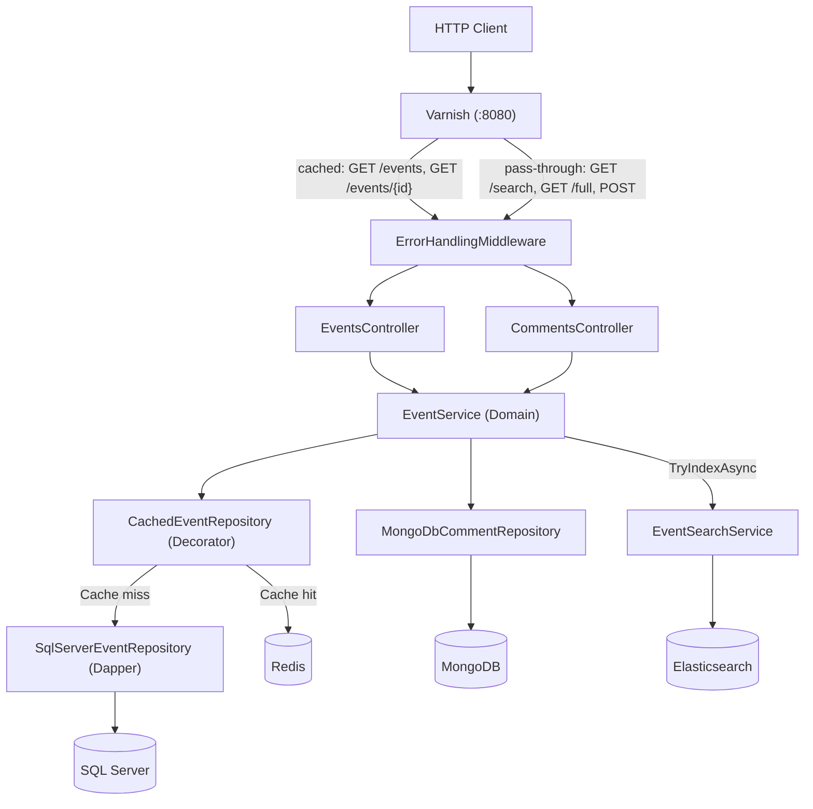
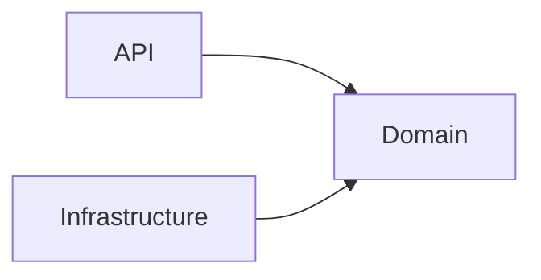
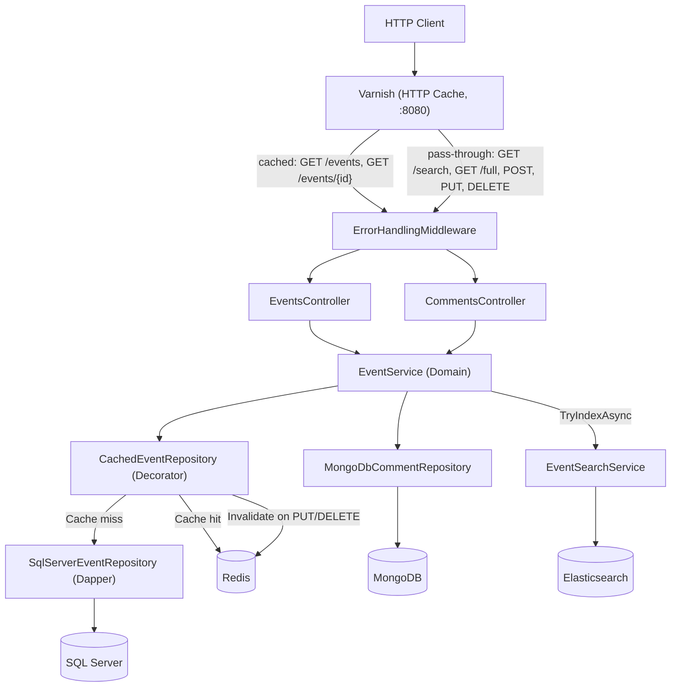

# Architecture

## Current state

### Components

### Clean Architecture layers

| Layer | Project | Responsibility |
|-------|---------|----------------|
| API | `EventManager.Api` | Controllers, validators, middleware, configuration |
| Domain | `EventManager.Domain` | Entities, interfaces, DTOs, services, exceptions |
| Infrastructure | `EventManager.Infrastructure` | Repositories, data access, cache, search |

**Error handling:** `ErrorHandlingMiddleware` intercepts all unhandled exceptions before they reach the client. It logs the full details server-side (exception type, message, stack trace, requestId) and returns a minimal response — no internal details exposed in production.

Project dependency diagram

---

## Data flows

### GET /api/events?page=&size=

see [Get events sequence diagram](./flows/GET-events.md)

### GET /api/events/{id}

see [Get event sequence diagram](./flows/GET-event.md)

### GET /api/events/{id}/full

see [Get event with comments sequence diagram](./flows/GET-full.md)

### POST /api/events

see [POST event sequence diagram](./flows/POST-event.md)

### GET /api/events/{id}/comments

see [GET comments sequence diagram](./flows/GET-comments.md)

### POST /api/events/{id}/comments

see [POST comment sequence diagram](./flows/POST-comment.md)

---

## Technical decisions

| Technology | Role | Justification |
|------------|------|---------------|
| SQL Server | Event data | Structured data, ACID constraints |
| Redis | Application cache | Configurable TTL, fine-grained key invalidation |
| MongoDB | Comments | Semi-structured data, free text |
| Elasticsearch | Search | Full-text, per-field boost, relevance scoring |
| Varnish | HTTP cache | Transparent caching of full GET responses at HTTP layer |

---

## Target

Next planned evolution: `PUT /api/events/{id}` and `DELETE /api/events/{id}` endpoints, with cache invalidation on mutation.

### Components

### Changes from current state

| Endpoint | Action | Cache impact |
|---|---|---|
| `PUT /api/events/{id}` | Update event in SQL Server + reindex in ES | Invalidate `event:{id}` and list version in Redis — Varnish TTL expires naturally |
| `DELETE /api/events/{id}` | Delete from SQL Server + remove from ES | Invalidate `event:{id}` and list version in Redis — Varnish TTL expires naturally |
