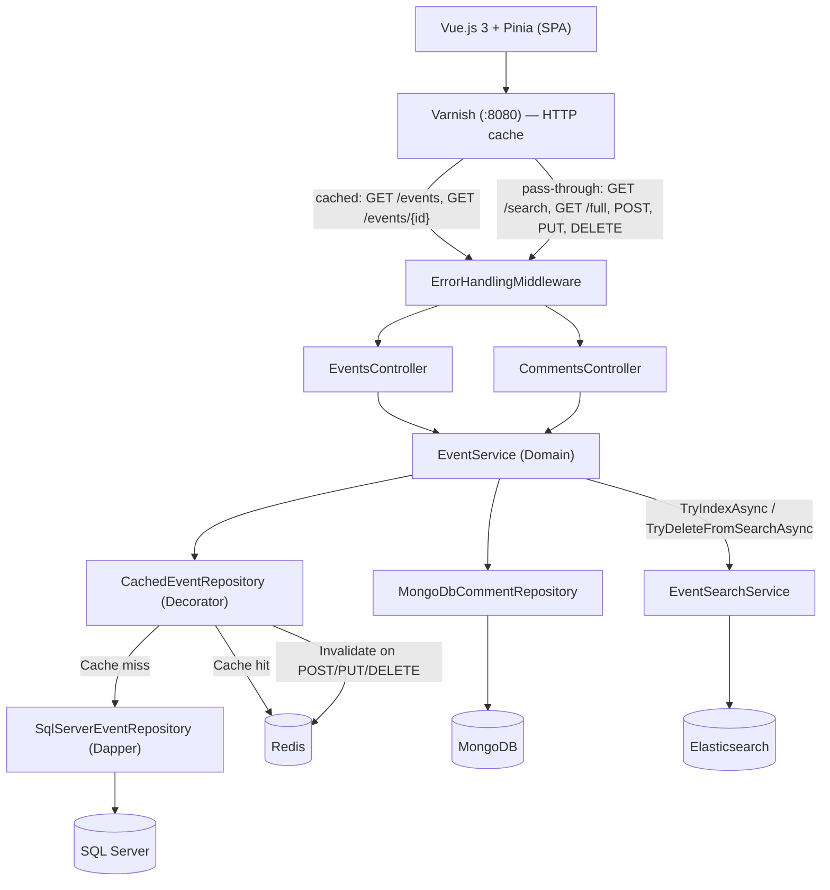
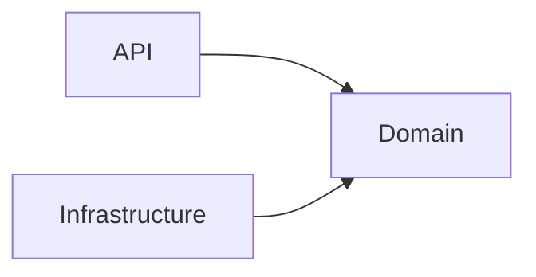
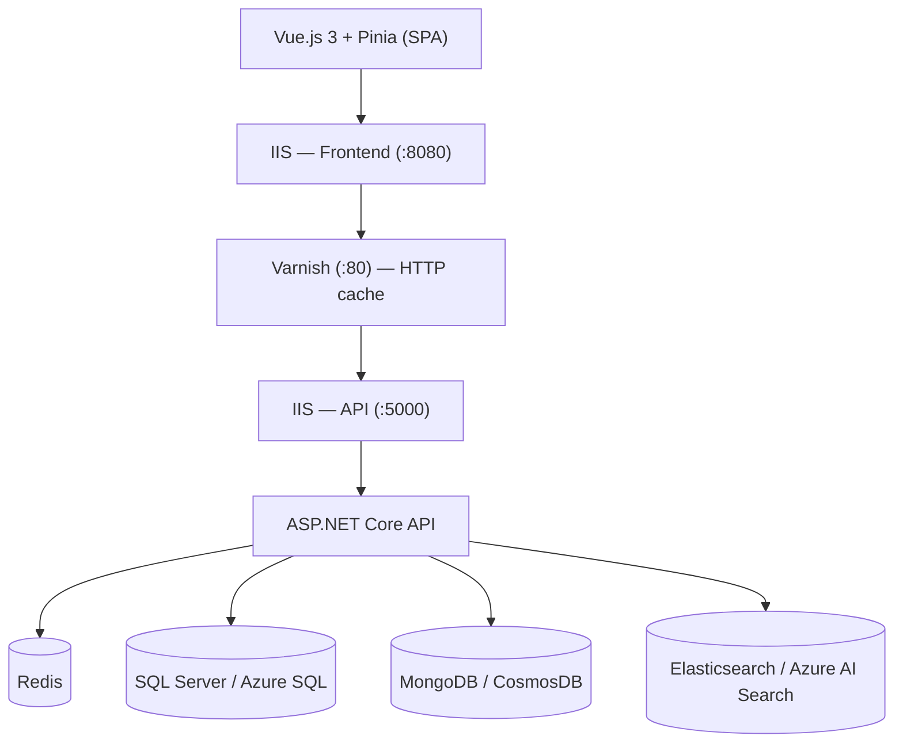

# Architecture

## Current state

### Components

### Cache layers

| Layer | Scope | Invalidation on mutation |
|---|---|---|
| Pinia | Client — SPA session | `updateEvent` / `deleteEvent` update store in-place immediately |
| Varnish | Network edge — full HTTP response | Passive TTL expiry (5 min lists, 10 min detail) — see ADR-011 |
| Redis | Application — deserialized objects | `event:{id}` deleted + `events:list:version` incremented — see ADR-006 |
| SQL Server | Source of truth | Always consistent |

### Clean Architecture layers

| Layer | Project | Responsibility |
|-------|---------|----------------|
| API | `EventManager.Api` | Controllers, validators, middleware, configuration |
| Domain | `EventManager.Domain` | Entities, interfaces, DTOs, services, exceptions |
| Infrastructure | `EventManager.Infrastructure` | Repositories, data access, cache, search |

**Error handling:** `ErrorHandlingMiddleware` intercepts all unhandled exceptions before they reach the client. It logs the full details server-side (exception type, message, stack trace, requestId) and returns a minimal response — no internal details exposed in production.

Project dependency diagram

---

## Data flows

### GET /api/events?page=&size=

see [Get events sequence diagram](./flows/GET-events.md)

### GET /api/events/{id}

see [Get event sequence diagram](./flows/GET-event.md)

### GET /api/events/{id}/full

see [Get event with comments sequence diagram](./flows/GET-full.md)

### GET /api/events/search?q=

see [Search events sequence diagram](./flows/GET-search.md)

### POST /api/events

see [POST event sequence diagram](./flows/POST-event.md)

### PUT /api/events/{id}

see [PUT event sequence diagram](./flows/PUT-event.md)

### DELETE /api/events/{id}

see [DELETE event sequence diagram](./flows/DELETE-event.md)

### GET /api/events/{id}/comments

see [GET comments sequence diagram](./flows/GET-comments.md)

### POST /api/events/{id}/comments

see [POST comment sequence diagram](./flows/POST-comment.md)

---

## Technical decisions

| Technology | Role | Justification |
|------------|------|---------------|
| SQL Server | Event data | Structured data, ACID constraints |
| Redis | Application cache | Configurable TTL, fine-grained key invalidation |
| MongoDB | Comments | Semi-structured data, free text |
| Elasticsearch | Search | Full-text, per-field boost, relevance scoring |
| Varnish | HTTP cache | Transparent caching of full GET responses at HTTP layer |
| Vue.js 3 + Pinia | SPA frontend | Composition API, reactive store with immediate mutation sync |

---

## Target

Next planned evolution: IIS deployment, CI/CD pipelines (Azure DevOps), Infrastructure as Code (Terraform), and Azure cloud deployment.

### Components

### Planned additions

| Component | Description |
|---|---|
| IIS hosting | API published via `dotnet publish`, frontend SPA with URL Rewrite for client-side routing |
| Azure DevOps pipelines | 3 path-scoped pipelines: `backend/**`, `frontend/**`, `terraform/**` — build, test, publish artifacts |
| Terraform (local) | null provider — validates resource structure and naming without touching Azure |
| Terraform (Azure) | azurerm provider — 9 resources: App Service, Azure SQL, CosmosDB, Redis Cache, AI Search, Storage, App Insights |
| Azure deployment | Full stack deployed, tested, then destroyed (`terraform destroy`) |
