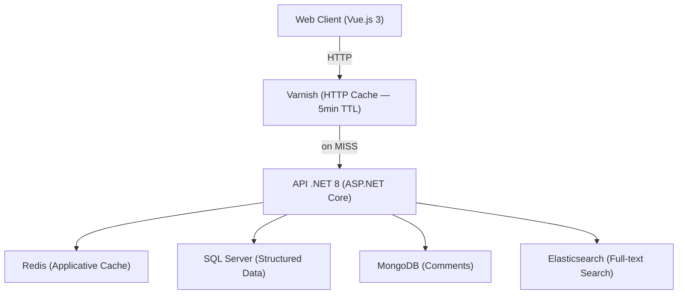
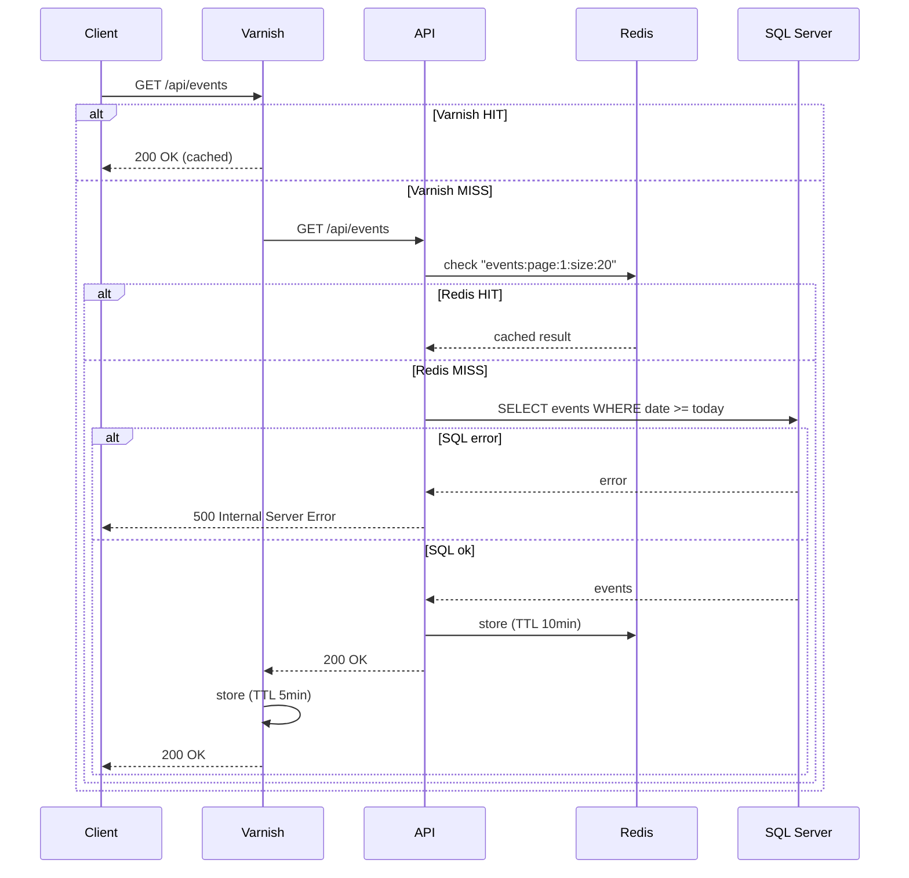
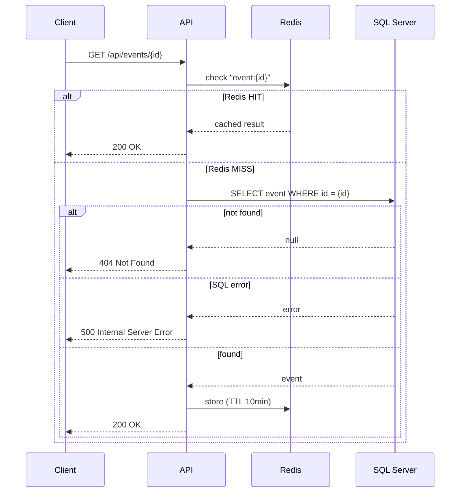
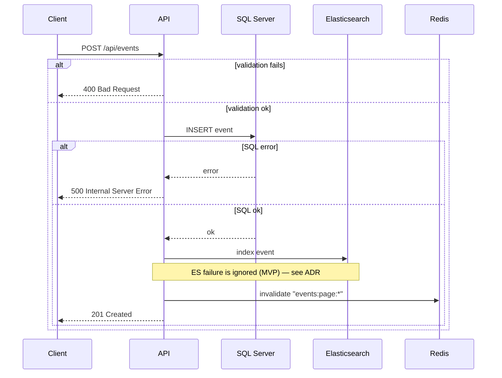
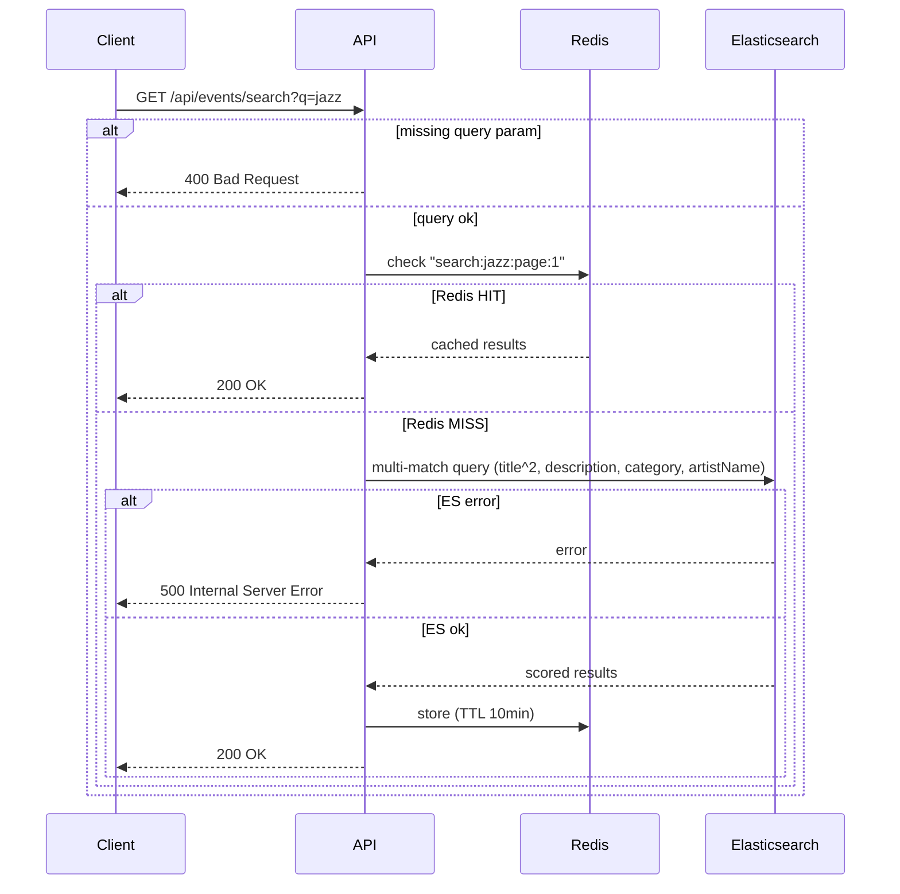
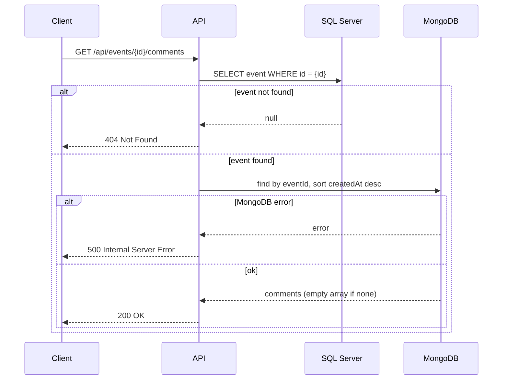
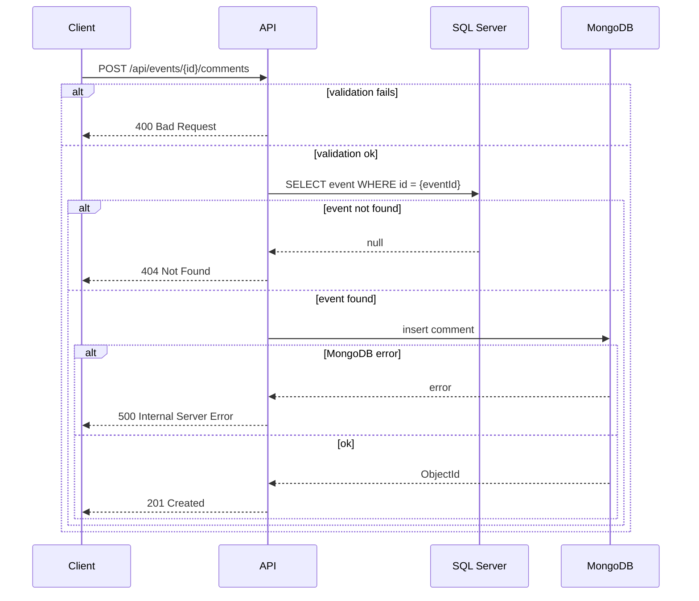

# Technical Design — Events Management

**Version:** 1.0  
**Date:** 2026-04-19  
**Status:** Draft — updated before each development phase

---

## Target Architecture



---

## Data Flows

### GET /api/events — Paginated event list



**Why this path:**
- Varnish intercepts repeated identical HTTP requests before they reach the API — zero application cost on cache hit
- Redis caches the SQL result as a .NET object — avoids database round-trip on subsequent API calls
- Two cache levels serve different purposes: Varnish absorbs HTTP traffic, Redis absorbs database load

---

### GET /api/events/{id} — Event detail



---

### POST /api/events — Create event



**Why this path:**
- SQL Server is the source of truth — written first
- Elasticsearch is indexed synchronously in the same handler — search results are immediately consistent with the database
- Redis cache is invalidated on write — next GET /api/events will reflect the new event
- If Elasticsearch indexing fails, the event is still created — search may be temporarily inconsistent (accepted for MVP, addressed in ADR)

---

### GET /api/events/search?q={query} — Full-text search



**Why this path:**
- Elasticsearch handles full-text scoring and tokenization — SQL Server `LIKE '%keyword%'` does not provide relevance ranking
- Redis caches frequent search queries — Elasticsearch queries are more expensive than SQL reads

---

### GET /api/events/{id}/comments — Event comments



**Why this path:**
- Event existence is verified in SQL Server before querying MongoDB — avoids orphan comment queries
- No cache layer — comments are user-generated, change frequently, and consistency is expected

---

### POST /api/events/{id}/comments — Add comment



---

## Technical Choices

### SQL Server — Structured event data

**Why SQL Server:**
- Strongly structured data (fixed schema: Event, User)
- Predictable future relations (Event ↔ Reservation ↔ User)
- ACID transactions required for future reservations
- Complex queries (joins, statistical aggregations)
- Referential integrity guaranteed

**Rejected alternative:** Document-oriented NoSQL (MongoDB) — insufficient structure for event data

---

### MongoDB — Semi-structured comments

**Why MongoDB:**
- Semi-structured data (free text, variable length)
- Flexible schema (easy evolution: likes, nested replies, metadata)
- No complex relations needed (simple eventId → Event link)
- Read performance (denormalized userName avoids join)
- No strict ACID transactions needed (comment = isolated atomic operation)

**Rejected alternative:** SQL Server — schema rigidity, over-engineering for simple comments

---

### Redis — Applicative cache

**Why Redis:**
- Caches Elasticsearch search results (expensive queries)
- Caches event list (frequent query, slow-changing data)
- Configured TTL (10 minutes) — acceptable freshness
- Targeted invalidation on writes (pattern "events:page:*")
- Performance: reduced latency + lower SQL Server load

**Pattern:** Cache-aside (read: check cache → miss → DB → store cache)

| Criterion | Redis | Memcached |
|-----------|-------|-----------|
| Data structures | Rich (strings, lists, sets, hashes) | Simple (key-value strings only) |
| Persistence | Optional (snapshot, AOF) | None (RAM only) |
| Eviction | Configurable policies (LRU, LFU) | LRU only |
| Invalidation | Complex patterns possible (pub/sub) | Basic invalidation |
| Use case | Cache + pub/sub + queues | Pure cache |

**Rejected alternative:** Memcached — sufficient for MVP volume but Redis offers richer invalidation patterns and broader .NET ecosystem adoption

---

### Elasticsearch — Full-text search

**Why Elasticsearch:**
- Performant full-text search across multiple fields (Title + Description + Category + ArtistName)
- Configured boost (Title ×2) for relevance
- Automatic tokenization and lemmatization ("concert" matches "concerts")
- Relevance scoring (better-ranked results)
- Near-instant search even at higher volumes

**Rejected alternative:** SQL Server `LIKE '%keyword%'` — poor performance, no relevance scoring

---

### Varnish — HTTP cache

**Why Varnish:**
- Caches complete HTTP responses (GET /api/events)
- Transparent to the API (no code changes required)
- Reduces API hits (server load reduced)
- Configurable via VCL (fine-grained cache rules)
- Complementary to Redis (2 cache levels: HTTP + applicative)

**Pattern:** HTTP cache with 5-minute TTL

**Rejected alternative:** Redis only — HTTP cache provides an additional gain for read-intensive endpoints without any application-level code

---

## Cache Demonstration Scenarios

### Scenario A — Applicative cache (Redis)

```
1. GET /api/events  →  MISS (~50ms)
2. GET /api/events  →  HIT (~5ms)
3. POST /api/events →  cache invalidated
4. GET /api/events  →  MISS, new event present (~50ms)
5. GET /api/events  →  HIT (~5ms)
```

### Scenario B — HTTP cache (Varnish)

```
1. GET http://localhost:8080/api/events  →  X-Cache: MISS (~50ms)
2. GET http://localhost:8080/api/events  →  X-Cache: HIT (~2ms)
3. Wait 5 minutes (TTL expired)
4. GET http://localhost:8080/api/events  →  X-Cache: MISS (~50ms)
```

### Scenario C — Double cache layer

```
1. GET /api/events (via Varnish)  →  Varnish MISS → Redis MISS → SQL  (~50ms)
2. GET /api/events (via Varnish)  →  Varnish HIT                       (~2ms)
3. POST /api/events (port 5000)   →  SQL + ES + Redis invalidation
4. GET /api/events after 5min     →  Varnish MISS → Redis MISS → SQL  (~50ms)
5. GET /api/events (via Varnish)  →  Varnish HIT                       (~2ms)
```

---

## API Endpoints

### GET /api/events

**Description:** Retrieve paginated list of upcoming events

**Query parameters:**
- `page` (int, optional, default=1)
- `pageSize` (int, optional, default=20, max=50)

**Response 200 OK:**
```json
[
  {
    "id": "3fa85f64-5717-4562-b3fc-2c963f66afa6",
    "title": "Concert Jazz au Sunset",
    "description": "Soirée jazz avec quartet exceptionnel...",
    "date": "2026-05-15T20:00:00Z",
    "location": "Sunset Jazz Club, Paris",
    "capacity": 150,
    "price": 25.00,
    "category": "Concert",
    "artistName": "Miles Quartet",
    "createdAt": "2026-04-15T10:30:00Z",
    "updatedAt": null
  }
]
```

**Cache headers:** `Cache-Control: public, max-age=300`

---

### GET /api/events/{id}

**Description:** Retrieve event details

**Path parameters:**
- `id` (GUID, required)

**Response 200 OK:**
```json
{
  "id": "3fa85f64-5717-4562-b3fc-2c963f66afa6",
  "title": "Concert Jazz au Sunset",
  "description": "Soirée jazz avec quartet exceptionnel...",
  "date": "2026-05-15T20:00:00Z",
  "location": "Sunset Jazz Club, Paris",
  "capacity": 150,
  "price": 25.00,
  "category": "Concert",
  "artistName": "Miles Quartet",
  "createdAt": "2026-04-15T10:30:00Z",
  "updatedAt": null
}
```

**Response 404 Not Found:**
```json
{ "error": "Event not found" }
```

**Response 500 Internal Server Error:**
```json
{ "status": 500, "message": "An unexpected error occurred.", "requestId": "<guid>" }
```

---

### POST /api/events

**Description:** Create a new event

**Request body:**
```json
{
  "title": "Concert Jazz au Sunset",
  "description": "Soirée jazz avec quartet exceptionnel...",
  "date": "2026-05-15T20:00:00Z",
  "location": "Sunset Jazz Club, Paris",
  "capacity": 150,
  "price": 25.00,
  "category": "Concert",
  "artistName": "Miles Quartet"
}
```

**Response 201 Created:** full event object  
**Header:** `Location: /api/events/{id}`

**Response 400 Bad Request:**
```json
{
  "errors": {
    "Date": ["La date de l'événement doit être aujourd'hui ou dans le futur"],
    "Capacity": ["La capacité doit être supérieure à 0"]
  }
}
```

**Response 500 Internal Server Error:**
```json
{ "status": 500, "message": "An unexpected error occurred.", "requestId": "<guid>" }
```

---

### GET /api/events/search?q={query}

**Description:** Search events by keyword

**Query parameters:**
- `q` (string, required)
- `page` (int, optional, default=1)
- `pageSize` (int, optional, default=20, max=50)

**Note:** Search applies to Title, Description, Category, and ArtistName

**Response 200 OK:** array of event objects, empty array if no results

**Response 400 Bad Request:** missing or empty `q` parameter

**Response 500 Internal Server Error:**
```json
{ "status": 500, "message": "An unexpected error occurred.", "requestId": "<guid>" }
```

---

### GET /api/events/stats/by-category

**Description:** Retrieve event count by category (for chart)

**Response 200 OK:**
```json
[
  { "category": "Concert", "count": 15 },
  { "category": "Théâtre", "count": 8 },
  { "category": "Exposition", "count": 12 },
  { "category": "Conférence", "count": 5 },
  { "category": "Spectacle", "count": 6 },
  { "category": "Autre", "count": 3 }
]
```

---

### POST /api/events/{eventId}/comments

**Description:** Add a comment to an event

**Path parameters:**
- `eventId` (GUID, required)

**Request body:**
```json
{
  "userId": "7c9e6679-7425-40de-944b-e07fc1f90ae7",
  "userName": "Thomas Martin",
  "text": "Excellente soirée, ambiance chaleureuse !",
  "rating": 5
}
```

**Response 201 Created:**
```json
{
  "id": "507f1f77bcf86cd799439011",
  "eventId": "3fa85f64-5717-4562-b3fc-2c963f66afa6",
  "userId": "7c9e6679-7425-40de-944b-e07fc1f90ae7",
  "userName": "Thomas Martin",
  "text": "Excellente soirée, ambiance chaleureuse !",
  "rating": 5,
  "createdAt": "2026-05-16T22:30:00Z"
}
```

**Response 400 Bad Request:**
```json
{
  "errors": {
    "Rating": ["La note doit être entre 1 et 5"],
    "Text": ["Le commentaire ne doit pas dépasser 1000 caractères"]
  }
}
```

**Response 404 Not Found:** event does not exist

**Response 500 Internal Server Error:**
```json
{ "status": 500, "message": "An unexpected error occurred.", "requestId": "<guid>" }
```

---

### GET /api/events/{eventId}/comments

**Description:** Retrieve comments for an event

**Path parameters:**
- `eventId` (GUID, required)

**Response 200 OK:**
```json
[
  {
    "id": "507f1f77bcf86cd799439011",
    "eventId": "3fa85f64-5717-4562-b3fc-2c963f66afa6",
    "userId": "7c9e6679-7425-40de-944b-e07fc1f90ae7",
    "userName": "Thomas Martin",
    "text": "Excellente soirée, ambiance chaleureuse !",
    "rating": 5,
    "createdAt": "2026-05-16T22:30:00Z"
  }
]
```

**Empty array if no comments:**
```json
[]
```

**Response 404 Not Found:** event does not exist

**Response 500 Internal Server Error:**
```json
{ "status": 500, "message": "An unexpected error occurred.", "requestId": "<guid>" }
```

---

## MVP Success Criteria

1. ✅ All 6 MVP User Stories implemented and functional
2. ✅ All business rules enforced (validations)
3. ✅ All 7 API endpoints respond correctly (appropriate HTTP codes)
4. ✅ Multi-technology architecture operational (SQL Server + MongoDB + Redis + Elasticsearch + Varnish)
5. ✅ Test coverage minimum 80%
6. ✅ Application deployable locally via `docker-compose up`
7. ✅ Documentation complete (TECHNICAL_DESIGN.md, ARCHITECTURE.md, README.md)

**Bonus:**
- ✅ Statistics chart by category (Chart.js)
- ✅ ArtistName searchable in Elasticsearch
