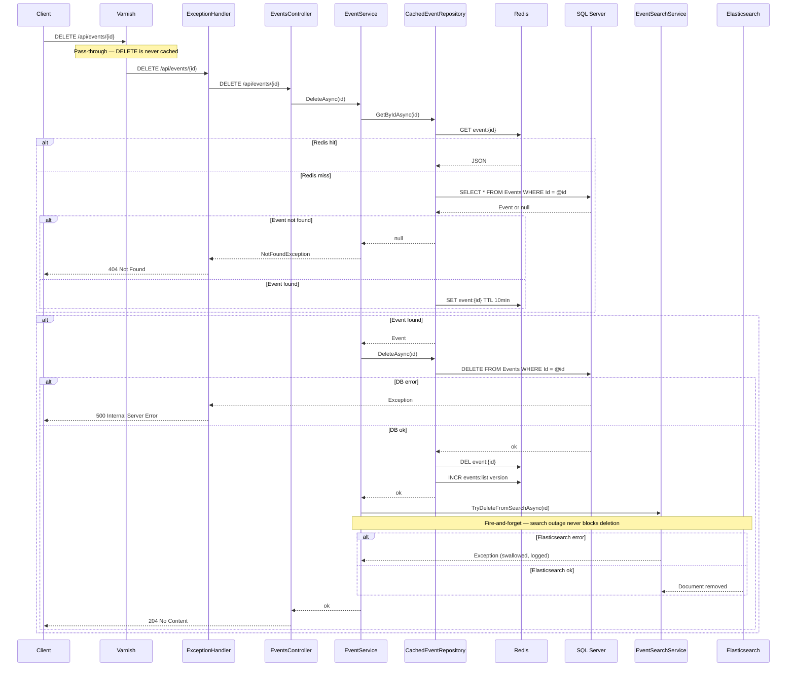

```mermaid
sequenceDiagram
    participant Client
    participant Varnish
    participant EH as ExceptionHandler
    participant API as EventsController
    participant Service as EventService
    participant Cache as CachedEventRepository
    participant Redis
    participant DB as SQL Server
    participant Search as EventSearchService
    participant ES as Elasticsearch

    Client->>Varnish: DELETE /api/events/{id}
    note over Varnish: Pass-through — DELETE is never cached
    Varnish->>EH: DELETE /api/events/{id}
    EH->>API: DELETE /api/events/{id}
    API->>Service: DeleteAsync(id)
    Service->>Cache: GetByIdAsync(id)
    Cache->>Redis: GET event:{id}
    alt Redis hit
        Redis-->>Cache: JSON
    else Redis miss
        Cache->>DB: SELECT * FROM Events WHERE Id = @id
        DB-->>Cache: Event or null
        alt Event not found
            Cache-->>Service: null
            Service-->>EH: NotFoundException
            EH-->>Client: 404 Not Found
        else Event found
            Cache->>Redis: SET event:{id} TTL 10min
        end
    end
    alt Event found
        Cache-->>Service: Event
        Service->>Cache: DeleteAsync(id)
        Cache->>DB: DELETE FROM Events WHERE Id = @id
        alt DB error
            DB-->>EH: Exception
            EH-->>Client: 500 Internal Server Error
        else DB ok
            DB-->>Cache: ok
            Cache->>Redis: DEL event:{id}
            Cache->>Redis: INCR events:list:version
            Cache-->>Service: ok
            Service->>Search: TryDeleteFromSearchAsync(id)
            note over Service,ES: Fire-and-forget — search outage never blocks deletion
            alt Elasticsearch error
                Search-->>Service: Exception (swallowed, logged)
            else Elasticsearch ok
                ES-->>Search: Document removed
            end
            Service-->>API: ok
            API-->>Client: 204 No Content
        end
    end
```
