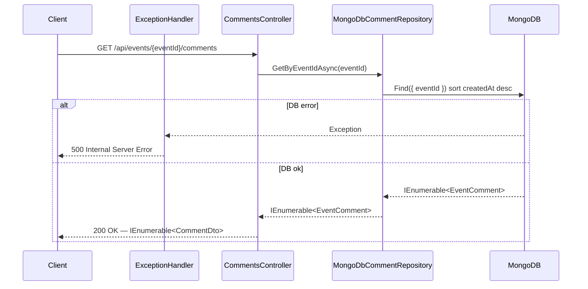

```mermaid
sequenceDiagram
    participant Client
    participant EH as ExceptionHandler
    participant API as CommentsController
    participant Repo as MongoDbCommentRepository
    participant Mongo as MongoDB

    Client->>API: GET /api/events/{eventId}/comments
    API->>Repo: GetByEventIdAsync(eventId)
    Repo->>Mongo: Find({ eventId }) sort createdAt desc
    alt DB error
        Mongo-->>EH: Exception
        EH-->>Client: 500 Internal Server Error
    else DB ok
        Mongo-->>Repo: IEnumerable<EventComment>
        Repo-->>API: IEnumerable<EventComment>
        API-->>Client: 200 OK — IEnumerable<CommentDto>
    end
```
