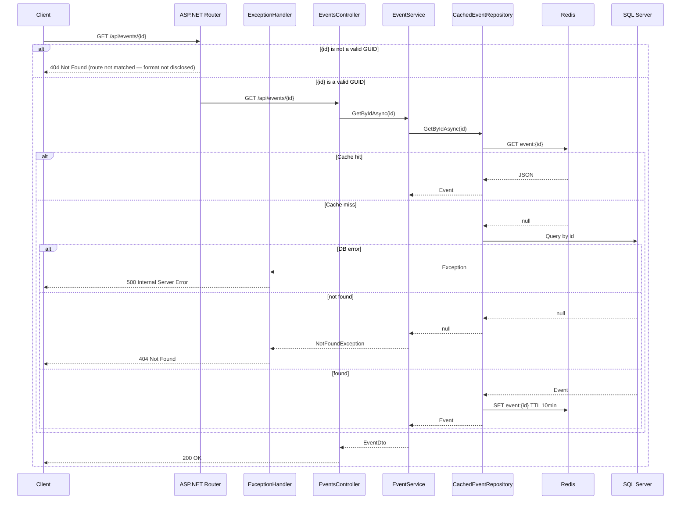

```mermaid
sequenceDiagram
    participant Client
    participant Router as ASP.NET Router
    participant EH as ExceptionHandler
    participant API as EventsController
    participant Service as EventService
    participant Cache as CachedEventRepository
    participant Redis
    participant DB as SQL Server

    Client->>Router: GET /api/events/{id}
    alt {id} is not a valid GUID
        Router-->>Client: 404 Not Found (route not matched — format not disclosed)
    else {id} is a valid GUID
        Router->>API: GET /api/events/{id}
        API->>Service: GetByIdAsync(id)
        Service->>Cache: GetByIdAsync(id)
        Cache->>Redis: GET event:{id}
        alt Cache hit
            Redis-->>Cache: JSON
            Cache-->>Service: Event
        else Cache miss
            Redis-->>Cache: null
            Cache->>DB: Query by id
            alt DB error
                DB-->>EH: Exception
                EH-->>Client: 500 Internal Server Error
            else not found
                DB-->>Cache: null
                Cache-->>Service: null
                Service-->>EH: NotFoundException
                EH-->>Client: 404 Not Found
            else found
                DB-->>Cache: Event
                Cache->>Redis: SET event:{id} TTL 10min
                Cache-->>Service: Event
            end
        end
        Service-->>API: EventDto
        API-->>Client: 200 OK
    end
```
