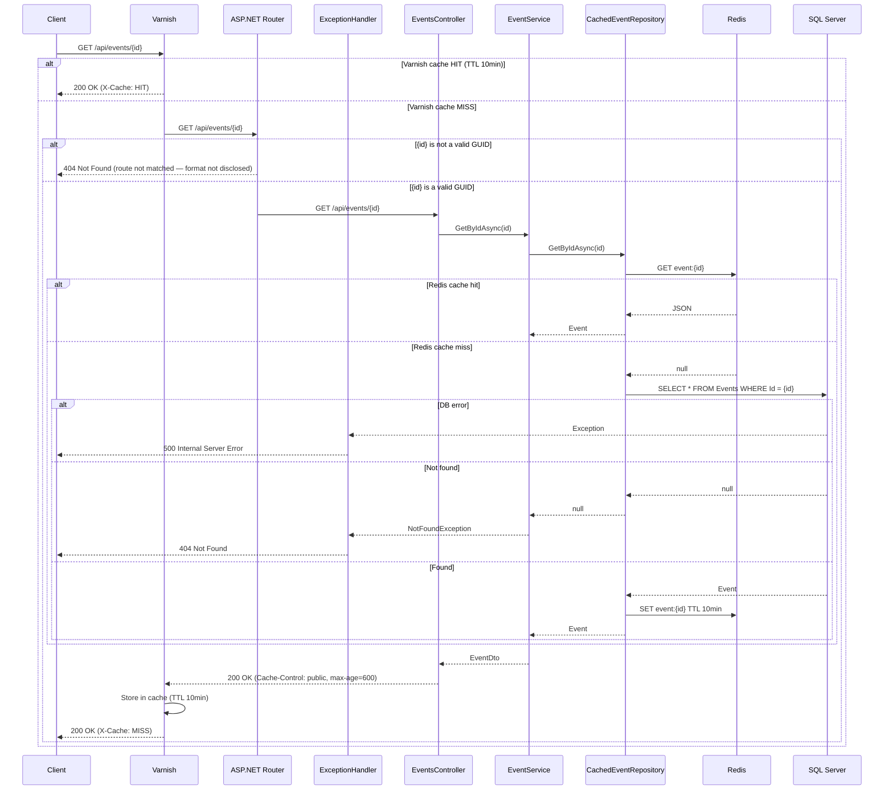

```mermaid
sequenceDiagram
    participant Client
    participant Varnish
    participant Router as ASP.NET Router
    participant EH as ExceptionHandler
    participant API as EventsController
    participant Service as EventService
    participant Cache as CachedEventRepository
    participant Redis
    participant DB as SQL Server

    Client->>Varnish: GET /api/events/{id}
    alt Varnish cache HIT (TTL 10min)
        Varnish-->>Client: 200 OK (X-Cache: HIT)
    else Varnish cache MISS
        Varnish->>Router: GET /api/events/{id}
        alt {id} is not a valid GUID
            Router-->>Client: 404 Not Found (route not matched — format not disclosed)
        else {id} is a valid GUID
            Router->>API: GET /api/events/{id}
            API->>Service: GetByIdAsync(id)
            Service->>Cache: GetByIdAsync(id)
            Cache->>Redis: GET event:{id}
            alt Redis cache hit
                Redis-->>Cache: JSON
                Cache-->>Service: Event
            else Redis cache miss
                Redis-->>Cache: null
                Cache->>DB: SELECT * FROM Events WHERE Id = {id}
                alt DB error
                    DB-->>EH: Exception
                    EH-->>Client: 500 Internal Server Error
                else Not found
                    DB-->>Cache: null
                    Cache-->>Service: null
                    Service-->>EH: NotFoundException
                    EH-->>Client: 404 Not Found
                else Found
                    DB-->>Cache: Event
                    Cache->>Redis: SET event:{id} TTL 10min
                    Cache-->>Service: Event
                end
            end
            Service-->>API: EventDto
            API-->>Varnish: 200 OK (Cache-Control: public, max-age=600)
            Varnish->>Varnish: Store in cache (TTL 10min)
            Varnish-->>Client: 200 OK (X-Cache: MISS)
        end
    end
```
