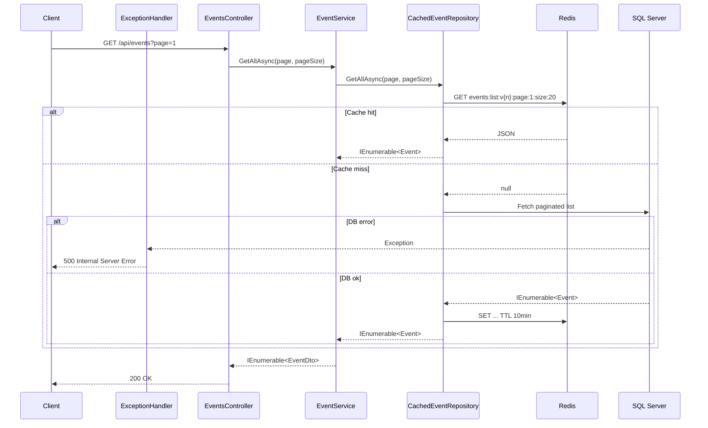

```mermaid
sequenceDiagram
    participant Client
    participant EH as ExceptionHandler
    participant API as EventsController
    participant Service as EventService
    participant Cache as CachedEventRepository
    participant Redis
    participant DB as SQL Server

    Client->>API: GET /api/events?page=1
    API->>Service: GetAllAsync(page, pageSize)
    Service->>Cache: GetAllAsync(page, pageSize)
    Cache->>Redis: GET events:list:v{n}:page:1:size:20
    alt Cache hit
        Redis-->>Cache: JSON
        Cache-->>Service: IEnumerable<Event>
    else Cache miss
        Redis-->>Cache: null
        Cache->>DB: Fetch paginated list
        alt DB error
            DB-->>EH: Exception
            EH-->>Client: 500 Internal Server Error
        else DB ok
            DB-->>Cache: IEnumerable<Event>
            Cache->>Redis: SET ... TTL 10min
            Cache-->>Service: IEnumerable<Event>
        end
    end
    Service-->>API: IEnumerable<EventDto>
    API-->>Client: 200 OK
```
