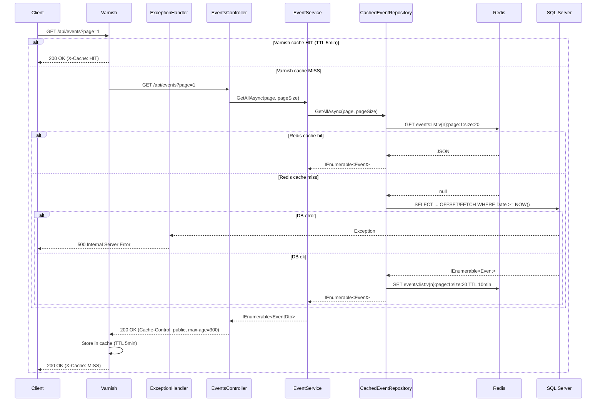

```mermaid
sequenceDiagram
    participant Client
    participant Varnish
    participant EH as ExceptionHandler
    participant API as EventsController
    participant Service as EventService
    participant Cache as CachedEventRepository
    participant Redis
    participant DB as SQL Server

    Client->>Varnish: GET /api/events?page=1
    alt Varnish cache HIT (TTL 5min)
        Varnish-->>Client: 200 OK (X-Cache: HIT)
    else Varnish cache MISS
        Varnish->>API: GET /api/events?page=1
        API->>Service: GetAllAsync(page, pageSize)
        Service->>Cache: GetAllAsync(page, pageSize)
        Cache->>Redis: GET events:list:v{n}:page:1:size:20
        alt Redis cache hit
            Redis-->>Cache: JSON
            Cache-->>Service: IEnumerable<Event>
        else Redis cache miss
            Redis-->>Cache: null
            Cache->>DB: SELECT ... OFFSET/FETCH WHERE Date >= NOW()
            alt DB error
                DB-->>EH: Exception
                EH-->>Client: 500 Internal Server Error
            else DB ok
                DB-->>Cache: IEnumerable<Event>
                Cache->>Redis: SET events:list:v{n}:page:1:size:20 TTL 10min
                Cache-->>Service: IEnumerable<Event>
            end
        end
        Service-->>API: IEnumerable<EventDto>
        API-->>Varnish: 200 OK (Cache-Control: public, max-age=300)
        Varnish->>Varnish: Store in cache (TTL 5min)
        Varnish-->>Client: 200 OK (X-Cache: MISS)
    end
```
