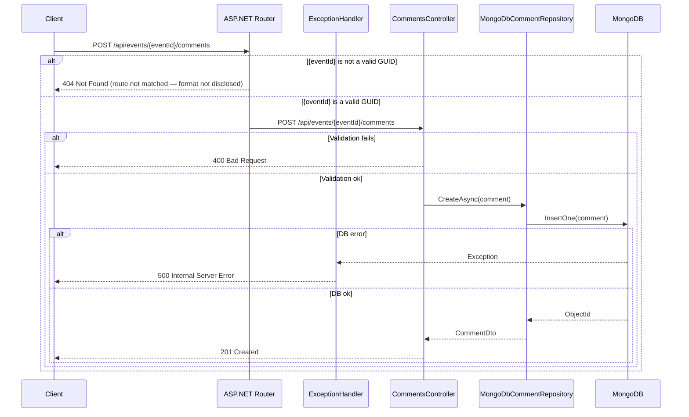

```mermaid
sequenceDiagram
    participant Client
    participant Router as ASP.NET Router
    participant EH as ExceptionHandler
    participant API as CommentsController
    participant Repo as MongoDbCommentRepository
    participant Mongo as MongoDB

    Client->>Router: POST /api/events/{eventId}/comments
    alt {eventId} is not a valid GUID
        Router-->>Client: 404 Not Found (route not matched — format not disclosed)
    else {eventId} is a valid GUID
        Router->>API: POST /api/events/{eventId}/comments
        alt Validation fails
            API-->>Client: 400 Bad Request
        else Validation ok
            API->>Repo: CreateAsync(comment)
            Repo->>Mongo: InsertOne(comment)
            alt DB error
                Mongo-->>EH: Exception
                EH-->>Client: 500 Internal Server Error
            else DB ok
                Mongo-->>Repo: ObjectId
                Repo-->>API: CommentDto
                API-->>Client: 201 Created
            end
        end
    end
```
