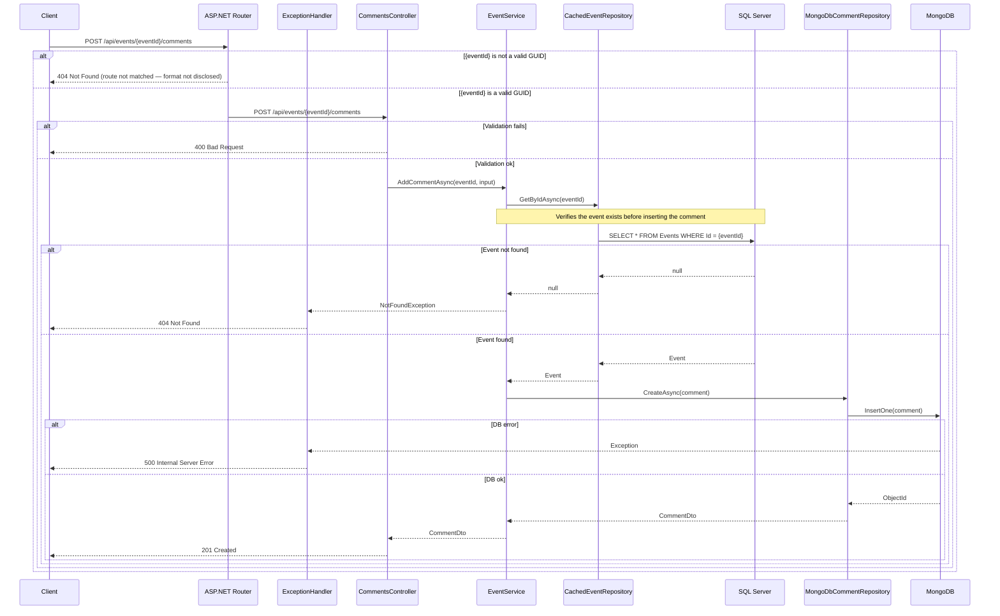

```mermaid
sequenceDiagram
    participant Client
    participant Router as ASP.NET Router
    participant EH as ExceptionHandler
    participant API as CommentsController
    participant Service as EventService
    participant Cache as CachedEventRepository
    participant DB as SQL Server
    participant Repo as MongoDbCommentRepository
    participant Mongo as MongoDB

    Client->>Router: POST /api/events/{eventId}/comments
    alt {eventId} is not a valid GUID
        Router-->>Client: 404 Not Found (route not matched — format not disclosed)
    else {eventId} is a valid GUID
        Router->>API: POST /api/events/{eventId}/comments
        alt Validation fails
            API-->>Client: 400 Bad Request
        else Validation ok
            API->>Service: AddCommentAsync(eventId, input)
            Service->>Cache: GetByIdAsync(eventId)
            note over Service,DB: Verifies the event exists before inserting the comment
            Cache->>DB: SELECT * FROM Events WHERE Id = {eventId}
            alt Event not found
                DB-->>Cache: null
                Cache-->>Service: null
                Service-->>EH: NotFoundException
                EH-->>Client: 404 Not Found
            else Event found
                DB-->>Cache: Event
                Cache-->>Service: Event
                Service->>Repo: CreateAsync(comment)
                Repo->>Mongo: InsertOne(comment)
                alt DB error
                    Mongo-->>EH: Exception
                    EH-->>Client: 500 Internal Server Error
                else DB ok
                    Mongo-->>Repo: ObjectId
                    Repo-->>Service: CommentDto
                    Service-->>API: CommentDto
                    API-->>Client: 201 Created
                end
            end
        end
    end
```
