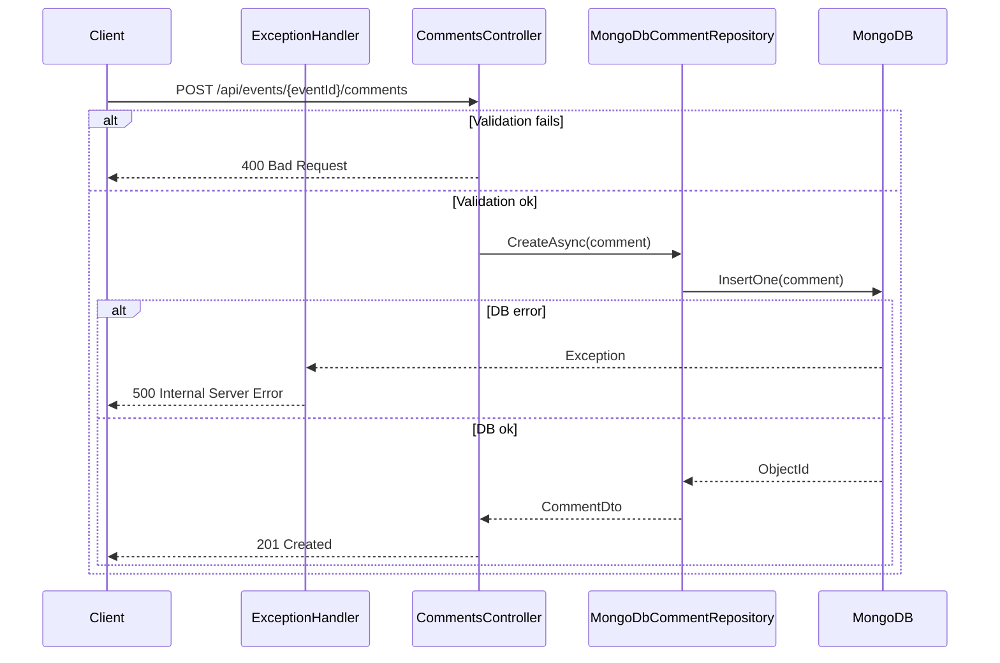

```mermaid
sequenceDiagram
    participant Client
    participant EH as ExceptionHandler
    participant API as CommentsController
    participant Repo as MongoDbCommentRepository
    participant Mongo as MongoDB

    Client->>API: POST /api/events/{eventId}/comments
    alt Validation fails
        API-->>Client: 400 Bad Request
    else Validation ok
        API->>Repo: CreateAsync(comment)
        Repo->>Mongo: InsertOne(comment)
        alt DB error
            Mongo-->>EH: Exception
            EH-->>Client: 500 Internal Server Error
        else DB ok
            Mongo-->>Repo: ObjectId
            Repo-->>API: CommentDto
            API-->>Client: 201 Created
        end
    end
```
