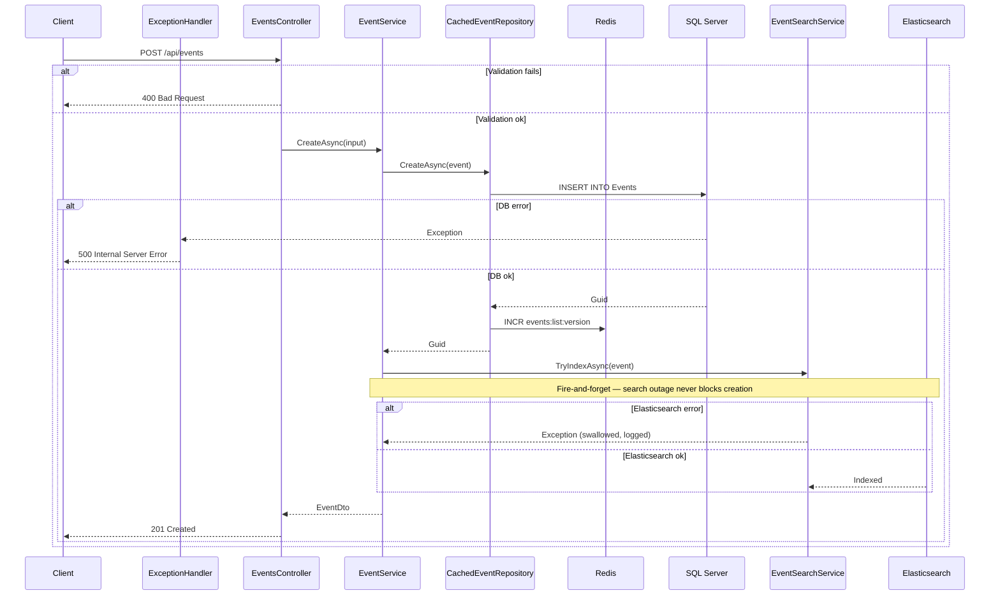

```mermaid
sequenceDiagram
    participant Client
    participant EH as ExceptionHandler
    participant API as EventsController
    participant Service as EventService
    participant Cache as CachedEventRepository
    participant Redis
    participant DB as SQL Server
    participant Search as EventSearchService
    participant ES as Elasticsearch

    Client->>API: POST /api/events
    alt Validation fails
        API-->>Client: 400 Bad Request
    else Validation ok
        API->>Service: CreateAsync(input)
        Service->>Cache: CreateAsync(event)
        Cache->>DB: INSERT INTO Events
        alt DB error
            DB-->>EH: Exception
            EH-->>Client: 500 Internal Server Error
        else DB ok
            DB-->>Cache: Guid
            Cache->>Redis: INCR events:list:version
            Cache-->>Service: Guid
            Service->>Search: TryIndexAsync(event)
            note over Service,ES: Fire-and-forget — search outage never blocks creation
            alt Elasticsearch error
                Search-->>Service: Exception (swallowed, logged)
            else Elasticsearch ok
                ES-->>Search: Indexed
            end
            Service-->>API: EventDto
            API-->>Client: 201 Created
        end
    end
```
