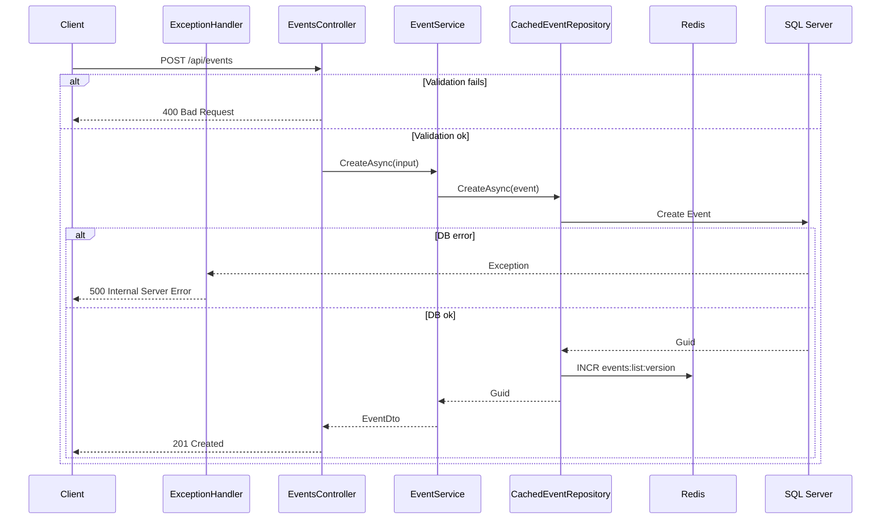

```mermaid
sequenceDiagram
    participant Client
    participant EH as ExceptionHandler
    participant API as EventsController
    participant Service as EventService
    participant Cache as CachedEventRepository
    participant Redis
    participant DB as SQL Server

    Client->>API: POST /api/events
    alt Validation fails
        API-->>Client: 400 Bad Request
    else Validation ok
        API->>Service: CreateAsync(input)
        Service->>Cache: CreateAsync(event)
        Cache->>DB: Create Event
        alt DB error
            DB-->>EH: Exception
            EH-->>Client: 500 Internal Server Error
        else DB ok
            DB-->>Cache: Guid
            Cache->>Redis: INCR events:list:version
            Cache-->>Service: Guid
            Service-->>API: EventDto
            API-->>Client: 201 Created
        end
    end
```
