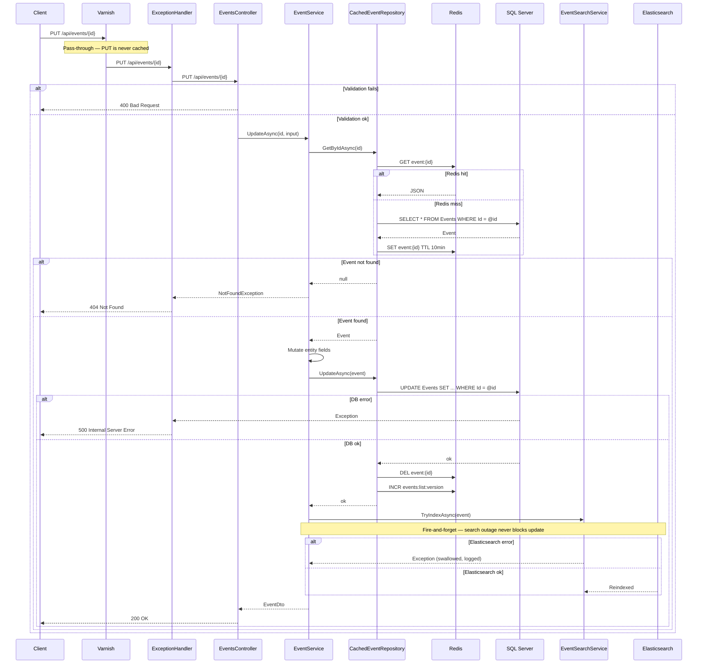

```mermaid
sequenceDiagram
    participant Client
    participant Varnish
    participant EH as ExceptionHandler
    participant API as EventsController
    participant Service as EventService
    participant Cache as CachedEventRepository
    participant Redis
    participant DB as SQL Server
    participant Search as EventSearchService
    participant ES as Elasticsearch

    Client->>Varnish: PUT /api/events/{id}
    note over Varnish: Pass-through — PUT is never cached
    Varnish->>EH: PUT /api/events/{id}
    EH->>API: PUT /api/events/{id}
    alt Validation fails
        API-->>Client: 400 Bad Request
    else Validation ok
        API->>Service: UpdateAsync(id, input)
        Service->>Cache: GetByIdAsync(id)
        Cache->>Redis: GET event:{id}
        alt Redis hit
            Redis-->>Cache: JSON
        else Redis miss
            Cache->>DB: SELECT * FROM Events WHERE Id = @id
            DB-->>Cache: Event
            Cache->>Redis: SET event:{id} TTL 10min
        end
        alt Event not found
            Cache-->>Service: null
            Service-->>EH: NotFoundException
            EH-->>Client: 404 Not Found
        else Event found
            Cache-->>Service: Event
            Service->>Service: Mutate entity fields
            Service->>Cache: UpdateAsync(event)
            Cache->>DB: UPDATE Events SET ... WHERE Id = @id
            alt DB error
                DB-->>EH: Exception
                EH-->>Client: 500 Internal Server Error
            else DB ok
                DB-->>Cache: ok
                Cache->>Redis: DEL event:{id}
                Cache->>Redis: INCR events:list:version
                Cache-->>Service: ok
                Service->>Search: TryIndexAsync(event)
                note over Service,ES: Fire-and-forget — search outage never blocks update
                alt Elasticsearch error
                    Search-->>Service: Exception (swallowed, logged)
                else Elasticsearch ok
                    ES-->>Search: Reindexed
                end
                Service-->>API: EventDto
                API-->>Client: 200 OK
            end
        end
    end
```
