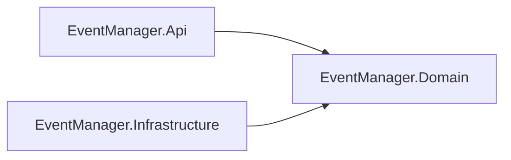

# ADR-003: Clean Architecture for .NET Solution Structure

## Status
Accepted

## Context
The `EventManager` .NET solution requires a structural decision before development starts. The chosen architecture directly impacts testability, maintainability, and the ability to demonstrate clear separation of concerns in a technical interview context.

Three options were considered:

**Layered Architecture (N-tier)** — organizes code by technical layer: Presentation → Business → Data Access → Database. Each layer depends on the one below. Simple to understand but introduces strong coupling: business logic depends on data access, making unit testing difficult without a real database.

**Minimal / Flat Architecture** — no layering, all code in a single project. Appropriate for simple APIs or prototypes but does not demonstrate separation of responsibilities, and becomes difficult to maintain as complexity grows.

**Clean Architecture** — organizes code around the domain. Dependencies point inward: `Infrastructure` depends on `Domain`, `Api` depends on `Domain`. `Domain` has no external dependencies. Business logic is isolated and fully testable without infrastructure concerns.

The project is a technical demonstration targeting senior developer interviews. Testability (80% coverage target) and the ability to explain architectural decisions are explicit goals.

## Decision
The .NET solution follows Clean Architecture with three projects:

```
backend/
├── EventManager.Domain/          # Entities, interfaces, exceptions — no external dependencies
├── EventManager.Infrastructure/  # Repository implementations, data access (SQL Server, MongoDB, Redis, Elasticsearch)
└── EventManager.Api/             # Controllers, DTOs, validators, middleware — depends on Domain
```

Dependency rules:
- `Domain` → no dependencies
- `Infrastructure` → depends on `Domain`
- `Api` → depends on `Domain`
- `Api` → does NOT depend on `Infrastructure` directly (injected via DI)



## Consequences
- `Domain` is fully testable without any infrastructure — unit tests run without database or external services.
- Adding a second consumer (e.g. a partner API) requires only a new project depending on `Domain` — `Infrastructure` is reused without modification.
- `Infrastructure` is decoupled from the delivery mechanism — swapping SQL Server for another database only affects `Infrastructure`.
- More initial structure than Layered or Flat — justified by the testability requirement and the demonstration goals.
- MediatR and Vertical Slice Architecture were considered but excluded — see `tech-choices.md`.
