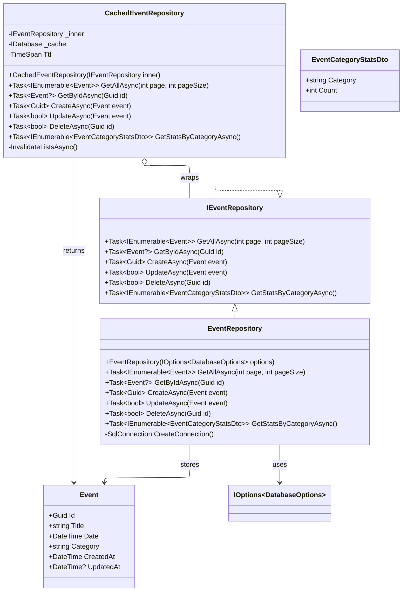

# ADR 005: Decorator Pattern for Caching Layer

## Status
Accepted

## Context
In the EventManager project, we need to add Redis caching capabilities to our data access layer without implement it in database repository . The application uses multiple data sources (SQL Server for events, MongoDB for comments, Elasticsearch for search) and requires a consistent caching strategy.

Key requirements:
- Add caching transparently without changing existing repository interfaces
- Maintain separation of concerns between data access and caching logic
- Enable easy testing and mocking of cache behavior
- Allow runtime configuration changes (enable/disable cache)
- Support multiple cache implementations if needed

### Alternatives Considered
#### Alternative 1: Cache Logic Inside Repository
**Approach:** Add caching logic directly in repository classes.

```csharp
public class EventRepository : IEventRepository
{
    public EventRepository(IOptions<DatabaseOptions> options)
    {
        // Mix data access + caching in same class
    }
}
```

**Rejected because:**
- Violates Single Responsibility Principle
- Makes repositories harder to test
- Couples infrastructure concerns with business logic
- Cannot easily disable caching

#### Alternative 2: AOP/Attributes
**Approach:** Use attributes or middleware for caching.

```csharp
[Cached("event:{id}", ttl: 600)]
public async Task<Event?> GetByIdAsync(Guid id) { ... }
```

**Rejected because:**
- "Magic" behavior that's hard to debug
- Limited flexibility for complex invalidation logic
- Requires additional frameworks (AspectCore, Castle Windsor)
- Cache logic scattered across methods

#### Alternative 3: Cache in Service Layer
**Approach:** Add caching in application services.

```csharp
public class EventService : IEventService
{
    public EventService(IEventRepository repo) { }
}
```

**Rejected because:**
- Services should focus on business logic, not infrastructure
- Creates tight coupling between business and caching layers
- Makes service testing more complex
- Less reusable across different service implementations

#### Alternative 4: Proxy Pattern
**Approach:** Use dynamic proxies to intercept method calls.

**Rejected because:**
- Requires additional libraries (Castle DynamicProxy)
- Runtime performance overhead
- Complex debugging and maintenance
- Less explicit than decorator pattern


## Decision
We will implement the Decorator pattern to wrap existing repository implementations with caching functionality. Specifically:

1. **Create decorator classes** that implement the same interfaces as the repositories they wrap
2. **Use constructor injection** to receive both the inner repository and cache dependencies
3. **Apply cache-aside pattern** for read operations (check cache first, fallback to repository)
4. **Implement cache invalidation** on write operations to maintain data consistency
5. **Register decorators in DI container** using factory methods for flexibility

### Schema example



### Implementation Example

```csharp
public class CachedEventRepository(IEventRepository inner) 
    : IEventRepository
{
    private readonly IEventRepository _inner = inner;


    public async Task<Event?> GetByIdAsync(Guid id)
    {
        //Get cache
        
        if (cached.HasValue)
            //return cache
        
        //Select from database
        if (@event != null)
            //Set cache
        
        return @event;
    }

    public async Task<bool> UpdateAsync(Event @event)
    {
        //Update database
        if (updated)
            //Invalidate cache
        return updated;
    }
}
```

### Dependency Injection Configuration

```csharp
// Register concrete implementations
builder.Services.AddScoped<EventRepository>();

// Register decorators
builder.Services.AddScoped<IEventRepository>(sp => 
    new CachedEventRepository(
        sp.GetRequiredService<EventRepository>()));
```

## Consequences

### Positive Consequences

1. **Separation of Concerns**
   - Cache logic isolated in dedicated classes
   - Repository classes remain focused on data access
   - Easy to understand and maintain

2. **Testability**
   - Each layer (repository, cache decorator) testable independently
   - Can mock cache behavior without affecting repository tests
   - Integration tests can use real repositories with mocked cache

3. **Flexibility**
   - Cache can be enabled/disabled by changing DI registration
   - Different cache implementations possible (Redis, Memory, None)
   - Easy to add additional decorators (logging, metrics, etc.)

4. **Transparency**
   - Controllers and services unaware of caching
   - No changes required to existing code using repositories
   - Interface contracts maintained

5. **Performance**
   - Cache hits provide sub-millisecond response times
   - No performance impact when cache misses
   - Lazy loading prevents unnecessary cache population

### Negative Consequences

1. **Increased Complexity**
   - Additional classes and interfaces to maintain
   - More complex dependency injection setup
   - Learning curve for new developers

2. **Debugging Challenges**
   - Harder to trace execution flow through decorators
   - Cache behavior may mask underlying issues
   - Requires understanding of decorator pattern

3. **Memory Overhead**
   - Decorator instances add to object graph
   - Each decorator holds references to inner implementation
   - Potential for memory leaks if not managed properly

4. **Cache Consistency Risks**
   - Requires careful invalidation logic
   - Race conditions possible in high-concurrency scenarios
   - Stale data possible if invalidation fails

### Mitigation Strategies

1. **Testing:** Comprehensive unit and integration tests for decorators
2. **Monitoring:** Cache hit/miss metrics and performance monitoring
3. **Documentation:** Clear documentation of decorator behavior
4. **Configuration:** Environment-specific cache settings
5. **Fallback:** Graceful degradation when cache is unavailable

## Related Decisions

- ADR 001: Primary Key Strategy (GUID vs INT)
- ADR 004: Cache-Aside Pattern for Application Caching

## Notes
The decorator pattern provides a solid foundation for adding cross-cutting concerns like caching, logging, and metrics to our data access layer while maintaining clean architecture principles.