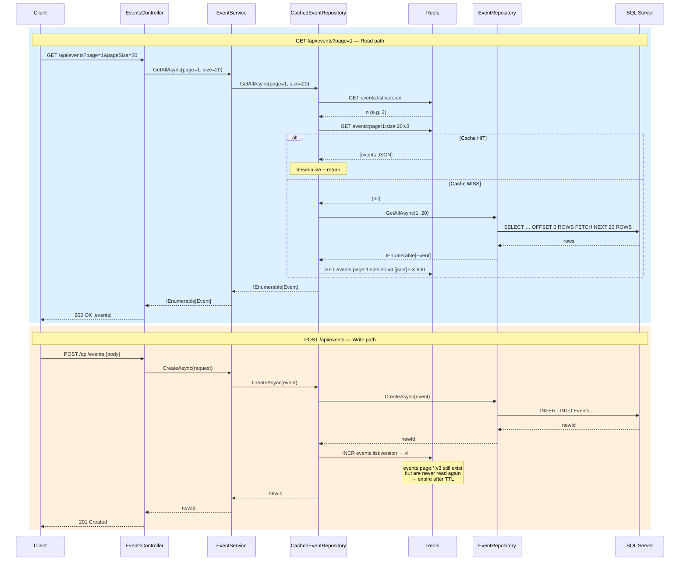

# ADR 006: Redis List Cache Invalidation Strategy

## Status
Accepted

## Context

`CachedEventRepository` caches two kinds of data:

- **Single events** — keyed `event:{id}`, invalidated by deleting the exact key on write. O(1), works on Redis Cluster.
- **Paginated lists** — keyed `events:page:{page}:size:{pageSize}`. Any write operation (create, update, delete) must invalidate **all** pages, because page N shifts when an event is added or removed.

The ADR 004 adressed this two kind as one. The implementation of `InvalidateListsAsync` used Redis `SCAN` to find and delete every key matching the pattern `events:page:*`:

```csharp
// Broken — commented out in production
private async Task InvalidateListsAsync()
{
    var server = _redis.GetServers().First();           // breaks on Redis Cluster
    var keys = server.KeysAsync(pattern: "events:page:*"); // O(N) full keyspace scan
    await foreach (var key in keys)
        await _cache.KeyDeleteAsync(key);
}
```

Two production problems:

1. **O(N) keyspace scan.**  Using the glob-style pattern "events:page:*", `SCAN` iterates the full keyspace. Under load, or with a large key count, this blocks other operations and adds latency proportional to database size rather than the number of pages cached.
2. **Redis Cluster incompatibility.** `IServer.KeysAsync` requires a connection to a specific node. `GetServers().First()` returns one node; keys hashed to other slots are silently missed.

## Alternatives Considered

### Alternative 1: SCAN pattern (current, rejected)

Iterate all Redis keys matching `events:page:*` and delete them.

**Rejected because:** O(N) scan, breaks on Redis Cluster (see above).

### Alternative 2: Short TTL, no active invalidation

Set list TTL to 30–60 seconds and accept eventual consistency — no invalidation code at all.

**Rejected because:** TTL tuning does not solve the problem, he moves it to users' perception. A user who creates an event and immediately reloads the list will not see it for up to 60 seconds; that will be considered as but rather than be an acceptable window. Reducing TTL to limit the staleness window degrades the cache hit rate, which defeats the purpose of caching. No TTL value gives both good hit rate and acceptable freshness after a write. Active invalidation on write is the correct answer.

### Alternative 3: Versioned cache key (chosen)

Store a version counter in Redis at key `events:list:version`. Include the current version in every list cache key:

```
events:page:{page}:size:{pageSize}:v{version}
```

On any write, atomically increment the counter (`INCR events:list:version`). The next list read fetches the new version, builds a new key, and finds a cache miss. The old keys (old version) are never accessed again and expire naturally via TTL.

**Properties:**
- Invalidation is a single `INCR` command — O(1), no keyspace scan.
- Works on Redis Cluster: the version key and the page keys can all reside on the same logical keyspace without coordination across nodes (all keys are accessed by exact key, never by pattern).
- Old keys are cleaned up automatically by TTL — no active deletion needed.

### Alternative 4: Redis Tags / client-side tagging (e.g. FusionCache)

Associate cache entries with logical tags (`events:list`), then invalidate all entries sharing a tag in one call.

**Rejected for this project:** requires a third-party library (FusionCache, CacheTower) or a Redis module (RedisJSON with tagging). Adds a dependency for a problem the versioned key solves natively. Worth considering if the project adopts a full cache abstraction layer in the future.

## Decision

List cache keys embed a version counter retrieved from Redis before each read:

```
events:list:version          → integer counter (INCR on write)
events:page:{p}:size:{s}:v{n} → cached page result (TTL 10 min)
```

**Read path:**
1. `GET events:list:version` → `n` (defaults to 0 if absent)
2. Build key `events:page:{page}:size:{pageSize}:v{n}`
3. Cache hit → return. Cache miss → query DB, store with TTL 10 min.

**Write path (CreateAsync / UpdateAsync / DeleteAsync):**
1. Execute the write against the inner repository.
2. `INCR events:list:version` — invalidates all pages at once, O(1).

The `INCR` is not transactional with the SQL write. A brief window exists where the old page is still cached after the DB has changed. This is the same window that exists with any cache-aside pattern and is acceptable given the 10-minute TTL fallback.

## Data Flows



## Consequences

### Positive

- **O(1) invalidation** — single `INCR`, no scan, no pipeline.
- **Redis Cluster compatible** — no `IServer`, no pattern matching.
- **No orphan key accumulation** — old versioned keys expire via TTL.
- **Testable** — no `IServer` dependency; `IDatabase` is sufficient for all operations.

### Negative
- **Orphaned keys until TTL** — after a write, the previous version's page keys remain in Redis until their TTL expires (max 10 minutes). These keys are never read, but they consume memory. Acceptable for typical page sizes and traffic; monitor if memory pressure becomes an issue.
- **Higher memory footprint** — at any point, Redis may hold several generations of page keys simultaneously (one per version increment within the TTL window). With active deletion (SCAN approach), old pages were removed immediately; here they accumulate until expiry. In the worst case, the number of live page keys is `num_pages × (TTL / avg_write_interval)`. Acceptable for typical traffic, but worth monitoring if write frequency is high or page count is large. The total number of cached pages per version is predictable: `⌈total_events / page_size⌉`, derivable from the event count available at write time. This value can drive a configuration threshold — below it, orphaned keys are left to expire naturally (standard Redis practice); above it, the previous version's keys are explicitly deleted after each `INCR`, using `INCR result - 1` to identify the exact version to purge without a keyspace scan. Note that reaching this threshold requires either a `COUNT(*)` on SQL Server at each write or a dedicated Redis counter — an additional cost to weigh against the memory saving.
- **Extra round trip on list read** — one `GET events:list:version` before the page lookup. At Redis latency, this is negligible.
- **Version counter is never reset** — the counter grows monotonically. At one increment per write, it would take years of continuous writes to overflow a 64-bit integer. Not a practical concern.

## Related Decisions

- ADR-004: Cache-Aside Pattern for Application Caching
- ADR-005: Decorator Pattern for Caching Layer
