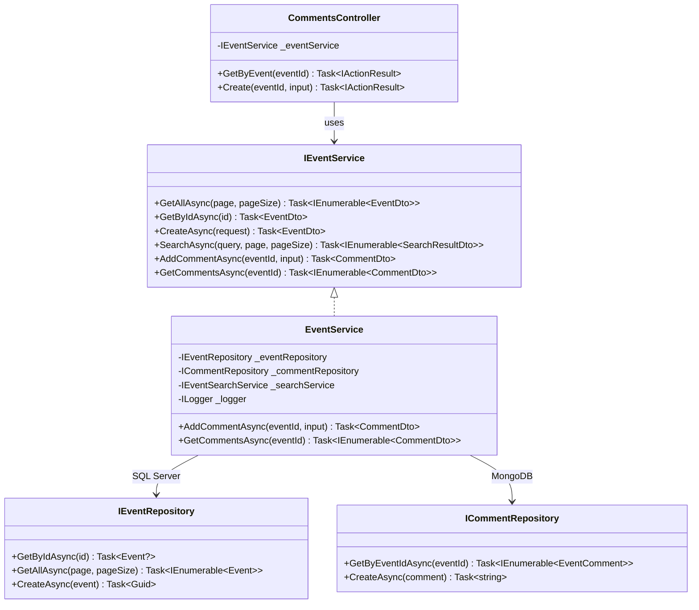
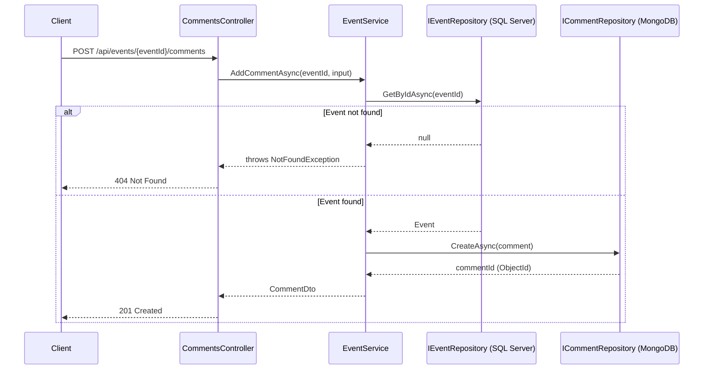

# ADR 007: Cross-Database Orchestration for Event and Comment Operations

## Status
Accepted

## Context

Events are persisted in SQL Server via `IEventRepository`. Comments are persisted in MongoDB via `ICommentRepository`. No distributed transaction mechanism spans both databases: a failure after the SQL write but before (or after) the MongoDB write cannot be atomically rolled back.

Several operations require data from both stores:

- **Create comment**: must verify the target event exists (SQL Server) before persisting the comment (MongoDB).
- **Get event with comments**: must fetch the event (SQL Server) and its comments (MongoDB) and return a combined response.

The initial implementation placed `CommentService` as an independent service that injects `ICommentRepository` directly. `EventService` had no knowledge of comments. This produced one structural problem: `CommentService.CreateAsync` received an `eventId` it could not validate, because it had no access to `IEventRepository`. The eventId was trusted blindly; a comment could be created for a non-existent event without raising an error.

## Alternatives Considered

### Alternative 1: Unit of Work spanning both repositories (rejected)

Define `IEventUnitOfWork` wrapping both `IEventRepository` and `ICommentRepository`, exposing composite operations such as `GetEventWithCommentsAsync`.

```csharp
public interface IEventUnitOfWork
{
    IEventRepository Events { get; }
    ICommentRepository Comments { get; }
    Task<EventWithComments> GetEventWithCommentsAsync(Guid eventId);
}
```

**Rejected because:** the Unit of Work pattern exists to coordinate operations within a single transactional scope. SQL Server and MongoDB do not share a transaction scope, so the pattern's defining benefit — atomicity — does not apply. The interface would be a naming convention over two unrelated calls with no rollback guarantee. The pattern adds a coordination abstraction that provides less value than its added indirection: callers still have no transactional safety, but now depend on a non-standard interface instead of a well-understood service.

### Alternative 2: Independent CommentService (current, rejected)

`CommentService` is a standalone service that injects `ICommentRepository`. `EventService` is a standalone service that injects `IEventRepository`. Neither knows about the other.

```csharp
// CommentService never validates that the event exists
public async Task<CommentDto> CreateAsync(Guid eventId, CreateCommentInput input) { ... }
```

**Rejected because:** this architecture removes the ability to validate `eventId` before persisting a comment. A comment can reference a non-existent event, which is a data integrity violation. The only alternative would be to move the validation into the controller, making the controller responsible for business rules — a violation of the layering model established in ADR-003.

### Alternative 3: Controller as orchestrator (rejected)

The controller calls `EventService.GetByIdAsync` to validate the event exists, then calls `CommentService.CreateAsync`.

```csharp
// EventsController
await eventService.GetByIdAsync(eventId);          // validate
await commentService.CreateAsync(eventId, input);  // persist
```

**Rejected because:** business rule enforcement (event must exist before a comment is accepted) belongs in the domain/service layer, not in the HTTP layer. Controllers should translate HTTP requests to service calls, not enforce domain invariants. This would also duplicate the validation logic in every future caller of `CommentService`.

### Alternative 4: Comment operations consolidated into EventService (chosen)

`EventService` injects both `IEventRepository` and `ICommentRepository`. Comment-related methods (`AddCommentAsync`, `GetCommentsAsync`) are added to `IEventService` and implemented in `EventService`. `CommentService` is removed.

```csharp
public class EventService(
    IEventRepository eventRepository,
    ICommentRepository commentRepository,
    IEventSearchService searchService,
    ILogger<EventService> logger) : IEventService
{
    public async Task<CommentDto> AddCommentAsync(Guid eventId, CreateCommentInput input)
    {
        // Validates event existence before persisting the comment.
        _ = await eventRepository.GetByIdAsync(eventId)
            ?? throw new NotFoundException(nameof(Event), eventId);

        var comment = new EventComment { EventId = eventId, ... };
        var id = await commentRepository.CreateAsync(comment);
        return MapToDto(comment, id);
    }
}
```

**Chosen because:**
- `EventService` already owns `IEventRepository` and can call `GetByIdAsync` to validate the event before accepting a comment.
- All operations related to an event — creation, retrieval, search, and comment management — are handled in one place, which is consistent with the concept of an *aggregate root* from domain-driven design: the `Event` is the root, and `EventComment` is a dependent entity accessible only through `Event`.
- No new abstraction is introduced. The interface grows, but the structure remains flat and navigable.
- The cross-database nature of the operation is still visible in the implementation — the two repositories are explicit constructor parameters — without hiding it behind an artificial Unit of Work.

## Decision

Comment operations are moved into `EventService` / `IEventService`. `CommentService` and `ICommentService` are removed. `EventService` injects `ICommentRepository` alongside `IEventRepository`.

`IEventService` exposes:

```csharp
Task<CommentDto>              AddCommentAsync(Guid eventId, CreateCommentInput input);
Task<IEnumerable<CommentDto>> GetCommentsAsync(Guid eventId);
```

`CommentsController` continues to exist as the HTTP entry point for comment endpoints, but it injects `IEventService` rather than `ICommentService`.

The absence of a distributed transaction is documented as a known constraint: if `commentRepository.CreateAsync` succeeds but the enclosing request fails afterward (e.g. serialization error before the HTTP response is sent), the comment persists in MongoDB. This is acceptable for a comment system where eventual consistency is tolerable and the risk of data loss is low.

### Schema Example

#### Class Diagram



#### Sequence Diagram — Add Comment



### Implementation Example

```csharp
// IEventService — extended with comment operations
public interface IEventService
{
    //Added exposed methods
    Task<CommentDto>               AddCommentAsync(Guid eventId, CreateCommentInput input);
    Task<IEnumerable<CommentDto>>  GetCommentsAsync(Guid eventId);
}

// EventService — orchestrates SQL Server + MongoDB
public class EventService(
    IEventRepository eventRepository,
    ICommentRepository commentRepository,
    IEventSearchService searchService,
    ILogger<EventService> logger) : IEventService
{
    public async Task<CommentDto> AddCommentAsync(Guid eventId, CreateCommentInput input)
    {
        //Check Comment

        var comment = new EventComment
        {
            EventId  = eventId,
            UserId   = input.UserId,
            UserName = input.UserName,
            Text     = input.Text,
            Rating   = input.Rating,
            CreatedAt = DateTime.UtcNow
        };

        var id = await commentRepository.CreateAsync(comment);
        return new CommentDto(id, eventId, comment.UserId, comment.UserName,
                              comment.Text, comment.Rating, comment.CreatedAt);
    }

    public async Task<IEnumerable<CommentDto>> GetCommentsAsync(Guid eventId)
    {
        var comments = await commentRepository.GetByEventIdAsync(eventId);
        return comments.Select(c => new CommentDto(
            c.Id, c.EventId, c.UserId, c.UserName, c.Text, c.Rating, c.CreatedAt));
    }
}

// CommentsController — injects IEventService instead of ICommentService
public class CommentsController(IEventService eventService, ILogger<CommentsController> logger)
    : ControllerBase
{
    [HttpGet]
    public async Task<IActionResult> GetByEvent(Guid eventId)
        => Ok(await eventService.GetCommentsAsync(eventId));

    [HttpPost]
    public async Task<IActionResult> Create(Guid eventId, [FromBody] CreateCommentInput request)
    {
        var dto = await eventService.AddCommentAsync(eventId, request);
        return CreatedAtAction(nameof(GetByEvent), new { eventId }, dto);
    }
}

### Dependency Injection Configuration

// Program.cs — ICommentService registration removed
builder.Services.AddScoped<ICommentRepository, MongoDbCommentRepository>();
// IEventService already registered — no additional registration needed for comments
```

## Consequences

### Positive

- **Event existence validated before comment creation.** `NotFoundException` is raised at the service layer if the `eventId` does not resolve to a known event.
- **Single service for all event-related operations.** Controllers and future clients call one interface for anything concerning an event and its comments.
- **No unecessary abstraction.** The Unit of Work interface, which offered transaction semantics it could not deliver, is not introduced.
- **Consistent with existing pattern.** `EventService` already aggregates repository, search, and logging dependencies. Adding `ICommentRepository` follows the same model.

### Negative

- **`EventService` grows.** The class now owns four injected dependencies and covers search, CRUD, and comments. If comment logic becomes significantly more complex (moderation, reactions, threading), the natural evolution is the **Mediator pattern** (MediatR): each use case becomes an isolated `Command`/`Query` handler that injects only its own dependencies, eliminating the central service entirely.
- **`IEventService` is a larger interface.** Callers that only need event CRUD (e.g. a background indexing job) must take a dependency on a contract that includes comment methods. Mitigated by the small number of callers in this project.
- **No rollback across databases.** A comment created successfully in MongoDB cannot be undone if a subsequent operation in the same request fails. Accepted as a known constraint for this use case.

## Related Decisions

- ADR-003: Clean Architecture — domain rules enforced in the service layer, not in controllers
- ADR-004: Cache-Aside Pattern — `CachedEventRepository` wraps only the SQL read path; MongoDB comments are not cached at this stage
